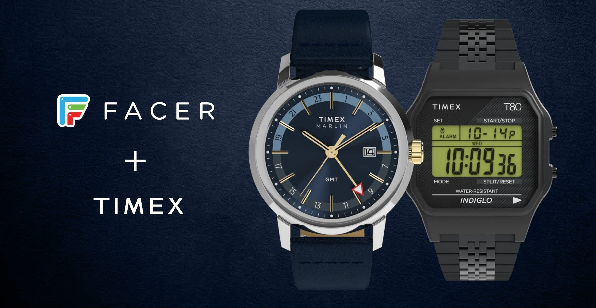

Facer, the watch face platform for smartwatches, has announced a partnership with Timex to bring the American brand's most recognisable designs to smartwatches. The official collection, which will include faces inspired by models such as the Marlin, the Expedition and the T80, will arrive this fall on watches supported by the app, including those running Wear OS.

## What the Timex watch face collection includes

Facer is one of the largest platforms for downloading and installing watch faces on Wear OS and Apple Watch. With this deal, the company adds official Timex designs — from a brand with more than 170 years of history and known for models such as the Expedition and the Q Timex — instead of relying only on community-made recreations.

The initial catalogue will blend analog heritage with digital style. Facer cites the Marlin, Expedition and T80 models as references, adapted to preserve their original character while also integrating the complications and health metrics a connected watch user expects.

Ariel Vardi, Facer's chief executive, sums up the move:

> Timex has defined what a watch looks like for millions of people. Now it gets to help define what a smartwatch looks like too. We're excited to help bring one of the world's most iconic watch brands into a new medium, while staying true to the timeless designs that made Timex an icon.

## How to install them on Wear OS and which watches work

The faces are distributed through the Facer app, available for Android (including Wear OS watches) and for iPhone, where it also serves the Apple Watch. The announcement does not detail a list of compatible models: the collection will reach the smartwatches that already run Facer, the same platform that in 2025 added support for Google's Watch Face Format and Wear OS 6.

To keep track of the first drop, Facer recommends following the Timex profile inside the app itself. That is where the first batch of watch faces, expected this fall, will be announced.

## What changes for the reader

The appeal of the partnership lies in how authentic the result is: these are not fan-made imitations, but official licensed designs. That lets anyone wearing a Wear OS smartwatch sport the look of a classic analog watch without giving up the connected features of the device.

It is not an isolated case. Facer already works with other watch brands and has announced that it will add collections from properties such as Angry Birds and Sonic, all expected this fall. That kind of personalisation has become a competitive battleground within Wear OS, where manufacturers such as Motorola are betting on their own features on the same platform, as with its [Moto Watch Ultra](/noticias/moto-watch-ultra-lte/). Traditional watchmaking, rather than fighting consumer technology, is finding a way to be part of it.
