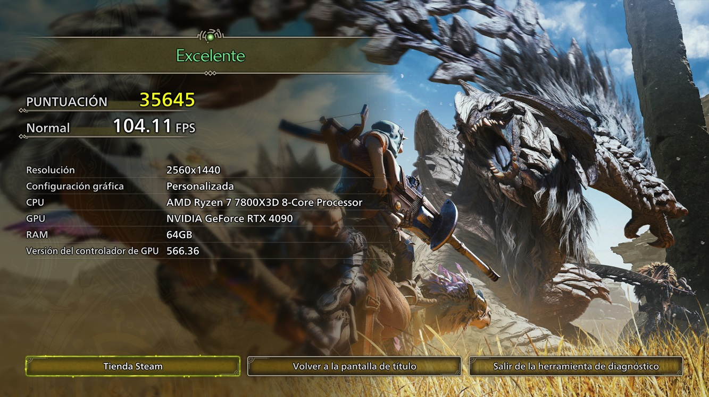
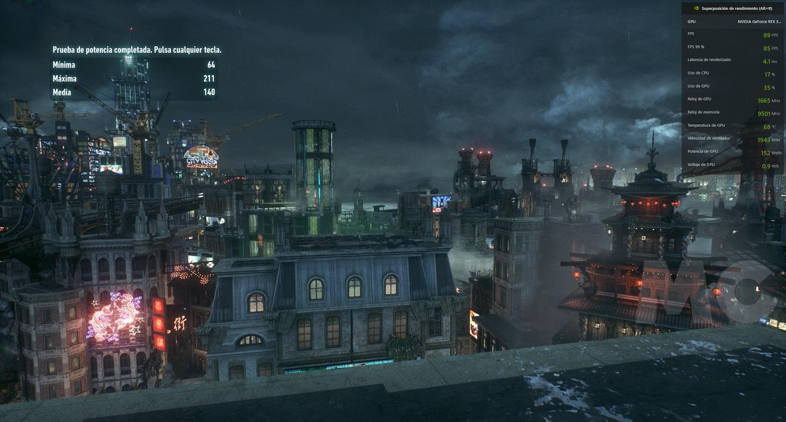
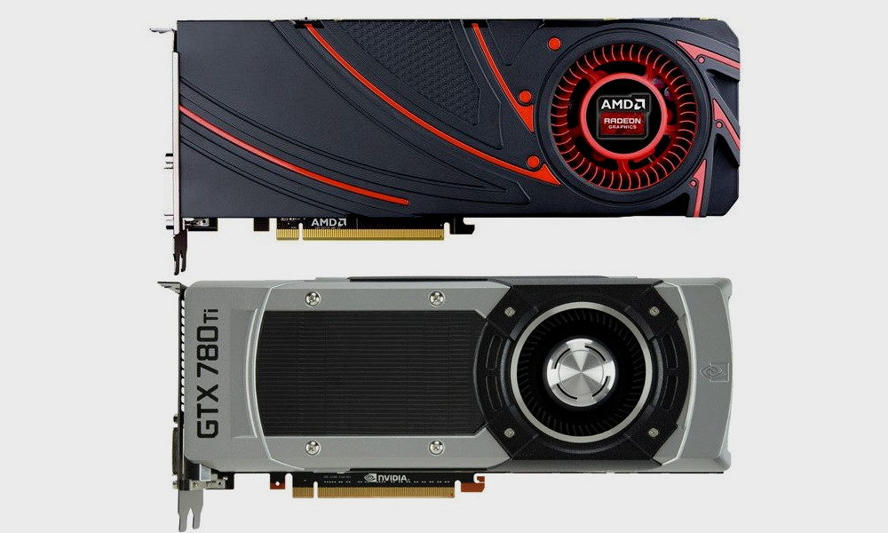
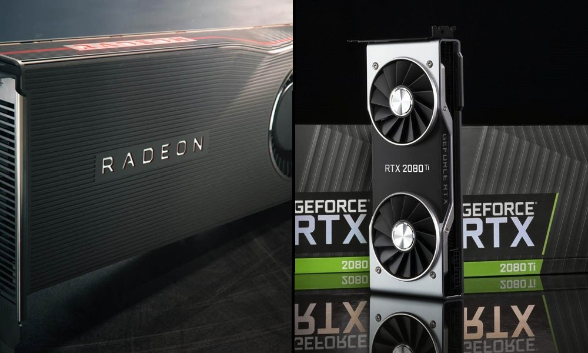
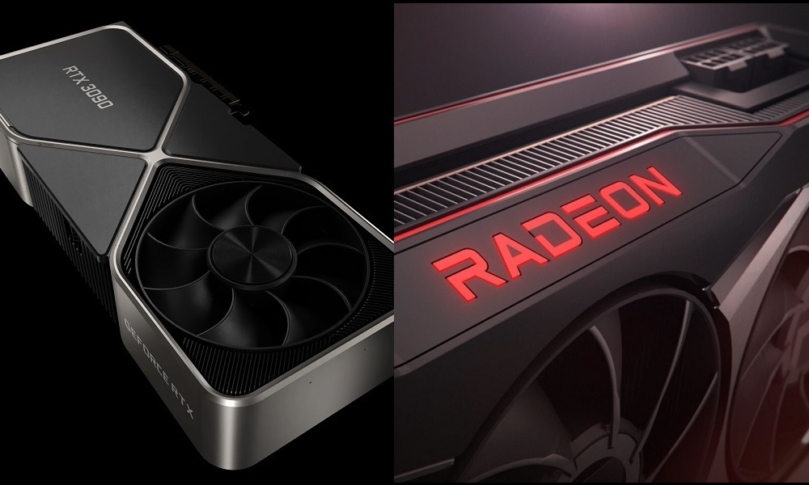

Building or upgrading a PC is not just about picking the most powerful graphics card
that fits the budget. The processor sets the ceiling of what that GPU can deliver, and a
CPU that cannot keep up leaves a significant part of the performance you paid for on the
table. This guide explains, step by step, how to detect a bottleneck and which processor
each graphics card needs today, with recommendations for the most recent NVIDIA and AMD
generations.

It is aimed at anyone building a new system or swapping their graphics card and wanting
to check that both components are balanced. If you are still deciding on the model, keep
in mind that the choice of card conditions everything else: in a new PC, [the RX 9070 XT
is the only GPU worth buying right now](/noticias/xda-one-gpu-worth-buying-right-now/).

## Prerequisites

- A PC with the graphics card installed, or the specific model you plan to buy.
- Knowing the **resolution** you usually play at.
- A way to **monitor CPU and GPU usage** while you play, so you can read the figures we
  discuss in the first step.

## Step 1. Check whether your processor is holding back the GPU

A bottleneck happens when one component ends up limiting another component's
performance. In this case it is the processor that drags down the graphics card because
it cannot work fast enough to supply all the data and instructions the GPU needs, so the
card sits through idle phases that are too long and never reaches its full potential.

To find out whether you have a serious bottleneck, look at the **usage rates**: it
happens when the CPU is very high and the GPU stays below **85%**. There are also two
less severe degrees:

- **Less serious bottleneck:** the CPU is maxed out, but the GPU stays around **90%**.
- **Mild bottleneck:** the GPU stays at **95%** or above.

In the Cyberpunk 2077 image with an RTX 3090 Ti and a Ryzen 7 5800X, at 1440p with ray
tracing and DLSS in quality mode, there is no bottleneck: the card runs at full tilt.

Keep in mind that bottlenecks **caused by low CPU usage** also exist. They are less
common but real, and are usually down to poor game optimisation that fails to make good
use of a processor with many cores and threads, ending up dependent on its single-thread
performance.

## Step 2. Take screen resolution into account

Resolution determines the graphics card's workload and, therefore, how much the CPU
weighs in the result. At a lower resolution, the GPU takes on less work and **the
processor's performance carries more weight**; conversely, the higher the resolution,
the less it depends on the processor.

These are the pixel counts handled at each level:

| Resolution | Pixels |
| --- | --- |
| 720p (HD) | 921,600 |
| 1080p (FHD) | 2,073,600 |
| 1440p (QHD) | 3,686,400 |
| 2160p (UHD) | 8,294,400 |

The effect is easy to see with a concrete case: a Core i5-10400F can create a huge
bottleneck for an RTX 4090 at 1080p, and with an RTX 5090 you will have one even at
1440p. However, that bottleneck **shrinks dramatically at 4K**, because the GPU has to
work with four times as many pixels and does not need the CPU to run as fast.

A good example of scaling is Alan Wake 2, a title so demanding that it has a huge
dependency on the GPU and can scale with an RTX 5090 even going from 720p to 1080p,
without a serious bottleneck even at 720p.

## Step 3. Weigh up graphics quality and ray tracing

Graphics settings directly affect the dependency between GPU and CPU. Lowering quality
makes the card take on less work and **increases the processor's weight**; raising it
does the opposite. Enabling **ray tracing** greatly increases the GPU's load and reduces
the CPU's weight, to the point of removing processor-level bottlenecks even at low
resolutions.

A clear example is Quake 2 RTX, capable of bringing any current GPU to its knees with a
minimal dependency on the CPU. This happens because ray tracing adds extreme load for the
card, which is further intensified as resolution rises.

Optimisation sits at the opposite end. In Batman Arkham Knight there is indeed a
significant bottleneck at 1440p with an RTX 3090 Ti and a Ryzen 7 5800X, but it is down
to how the game is optimised.

That is why processor reviews in games are often measured at **720p and low quality**:
the graphics load is reduced so much that the processor ends up making the difference.

## Step 4. Consider upscaling and frame generation

Enabling technologies such as **NVIDIA DLSS, Intel XeSS or AMD FSR** reduces the
resolution each frame is rendered at and, with it, the graphics load. The side effect is
that **it increases the processor's weight** and a bottleneck can appear. For example, a
game at 4K with DLSS in performance mode is rendered at 1080p and then upscaled, so it is
not working with the same number of pixels as native 4K.

The chart shows how performance improves when upscaling from a lower resolution: the
higher the base resolution, the bigger the gain. At 1440p, DLSS 2 in performance mode
gives 25 more FPS; at 2160p, 40 more FPS.

Two important warnings:

- **Do not drop below certain resolutions.** Although lowering resolution improves
  performance, the processor gains weight and at very low resolutions a huge bottleneck
  appears, so it is not worth it.
- That is why NVIDIA, AMD and Intel **do not go beyond ultra performance modes**, which
  are only recommended for upscaling to very high resolutions. That mode renders **33% of
  the pixels**; some games allow you to go lower, but it is not advisable at all because
  of the loss of sharpness and the bottleneck it causes.

To keep improving smoothness without that problem, **frame generation** has spread,
which does not depend on the processor: frames are generated on the GPU from information
in previous frames and slotted between those rendered the traditional way.

## Step 5. Check the recommended minimum for your graphics card

We now reach the core of the guide. The recommendations below are a general **minimum**
to avoid a serious bottleneck even at 1080p, assuming the goal is to play at maximum
quality. Bear in mind that some games can end up bottlenecking even a high-end build,
purely because of how they are optimised.

### GeForce GTX 10, Radeon RX Vega and older graphics cards

With these generations it is hard to run into a CPU-level bottleneck unless the
processor is very old:

- **GTX 970, GTX 1060, Radeon R9 390 and RX 580:** from a **Ryzen 5 1500X or a Core
  i7-4770** they run without issues and still deliver acceptable performance at 1080p.
- **GTX 1080, GTX 1080 Ti, Radeon RX Vega 56 and 64 and Radeon VII:** the recommended
  minimum rises to a **Ryzen 5 2500X or a Core i7-6700**.
- **GTX 600, GTX 700 and Radeon HD 7000:** a **Core i5-2500 or a Ryzen 3 1200** is enough,
  although they are obsolete and unsupported cards, with poor performance in today's
  games.

### GeForce RTX 20 and Radeon RX 5000

They still offer a good level of performance, especially in the higher tiers, and demand
a fairly powerful processor to reach their full potential:

- **RTX 2060, RTX 2060 Super and RTX 2070:** at least a **Ryzen 3 3100 or a Core i3-10100**.
- **Radeon RX 5600 XT, RX 5700 and RX 5700 XT:** as above, a **Ryzen 3 3100 or a Core
  i3-10100**.
- **RTX 2070 Super, RTX 2080, RTX 2080 Super and RTX 2080 Ti:** a **Ryzen 5 3600 or a Core
  i7-8700** avoids a serious bottleneck. For the RTX 2080 Ti, the ideal is a **Ryzen 5 5600
  or a Core i5-11600K**.

### GeForce RTX 30 and Radeon RX 6000

There is a major jump in raw power here, which means the processor bar has to rise too:

- **RTX 3050 6 GB and Radeon RX 6500 XT:** these are entry-level, so from a **Ryzen 5
  2500X or a Core i7-6700** there is more than enough.
- **RTX 3050 8 GB and Radeon RX 6600:** with a **Ryzen 3 3100 or a Core i3-10100** there
  will be no serious bottleneck; if you play at 1080p with DLSS or FSR enabled, a **Ryzen 5
  3600 or a Core i7-8700** is better.
- **RTX 3060, RTX 3060 Ti, RX 6600 XT, RX 6650 XT and RX 6700:** the power jump is
  significant, so at least a **Ryzen 5 3600 or a Core i7-8700** is advisable. At 1080p
  with DLSS or FSR, the ideal companions are a **Ryzen 5 5600 or a Core i5-11600K**.
- **RTX 3070, RTX 3070 Ti, RTX 3080, RX 6700 XT, RX 6800 and RX 6800 XT:** from a **Ryzen
  5 5600 or a Core i5-11600K** there will be no serious bottleneck, not even at 1080p.
- **RTX 3080 Ti, RTX 3090, RTX 3090 Ti and RX 6900 XT-6950 XT:** also a **Ryzen 5 5600 or a
  Core i5-11600K** to avoid bottlenecks, although the ideal is a **Ryzen 5 7600 or a Core
  i5-12600K**.

### GeForce RTX 40 and Radeon RX 7000

These generations set a new performance ceiling. The RTX 4090 is still so powerful that
even at 4K it can show some bottleneck with processors that used to cope fine in the
high-end tier:

- **RTX 4060 and Radeon RX 7600, RX 7600 XT:** from a **Ryzen 5 3600 or a Core i7-8700**
  there will be no serious bottleneck. With DLSS or FSR, a **Ryzen 5 5600 or a Core
  i5-11600K** is advisable.
- **RTX 4060 Ti and Radeon RX 7700 XT:** for the RTX 4060 Ti a **Ryzen 5 3600 or a Core
  i7-8700** is enough; for the RX 7700 XT a **Ryzen 5 5600 or a Core i5-11600K** is
  advisable.
- **RTX 4070 and Radeon RX 7800 XT:** they perform similarly to an RTX 3080, so a **Ryzen 5
  5600 or a Core i5-11600K** is enough.
- **RTX 4070 SUPER, RTX 4070 Ti, RX 7900 GRE and RX 7900 XT:** on par with an RTX 3090 or
  3090 Ti, they call for a **Ryzen 5 5600 or a Core i5-11600K**, although the ideal is a
  **Ryzen 5 7600 or a Core i5-12600K**, especially below 4K.
- **RTX 4070 Ti SUPER, RTX 4080, RTX 4080 SUPER and RX 7900 XTX:** at 4K a **Ryzen 5 5600X
  or a Core i5-12400F** is enough, but when enabling DLSS or FSR, or playing below 4K, a
  **Ryzen 7 7700X or a Core i5-13600K** is required.
- **RTX 4090:** from a **Ryzen 7 7700X or a Core i5-13600K** there are no serious
  bottlenecks at 4K. With DLSS or below 4K, a **Ryzen 7 7800X3D or an Intel Core Ultra 7
  270K Plus** is advisable.

### GeForce RTX 50 and Radeon RX 9000

These are NVIDIA's and AMD's most advanced and current generations. AMD covers the entry,
mid and high tiers with the RX 9070 XT, while NVIDIA has launched a new flagship, the
**RTX 5090**, the most powerful card on the consumer market ([the RTX 5070 is already the
most popular GPU on Steam](/noticias/tarjetas-graficas/rtx-5070-gpu-mas-popular-steam/)):

- **Radeon RX 9050:** available with 4 GB of VRAM and a 64-bit bus or with 8 GB and a
  128-bit bus; the second performs 20% to 30% better and is almost equivalent to an RX
  6600, so a **Ryzen 5 3600 or a Core i7-8700** is more than enough.
- **Radeon RX 9060:** performs like an RX 6700 XT when its 8 GB are not the limit. A
  **Ryzen 5 3600 or a Core i7-8700** already does well; with a **Ryzen 5 5600 or a Core
  i5-11600K** there will be no bottleneck.
- **Radeon RX 9060 XT:** the 8 GB and 16 GB versions perform the same and stand on par
  with an RX 7700 XT, so from a **Ryzen 5 5600 or a Core i5-11600K** there is no
  bottleneck.
- **Radeon RX 9070 GRE:** performs above an RTX 5060 Ti and below an RTX 5070. With a
  **Ryzen 5 5600 or a Core i5-11600K** there is no serious bottleneck; for the optimum,
  a **Ryzen 5 5600X or a Core i5-12400F**.
- **Radeon RX 9070:** slightly above an RTX 4070 Ti and an RTX 5070 in rasterisation. A
  minimum of a **Ryzen 5 5600 or a Core i5-11600K**, and ideally a **Ryzen 5 7600 or a
  Core i5-12600K** for below 4K or upscaling.
- **Radeon RX 9070 XT:** performs below an RTX 5070 Ti and slightly above an RTX 3090 Ti.
  At least a **Ryzen 5 5600X or a Core i5-12400F**, and ideally a **Ryzen 7 7700X or a Core
  i5-13600K**.
- **GeForce RTX 5050:** entry-level, performs a little below an RX 7600 and an RTX 4060.
  A **Ryzen 5 3600 or a Core i7-8700** is fine.
- **GeForce RTX 5060:** entry to the mid range with good performance at 1080p. A minimum
  of a **Ryzen 5 3600 or a Core i7-8700**, and ideally a **Ryzen 5 5600 or a Core
  i5-11600K**.
- **GeForce RTX 5060 Ti:** in 8 GB and 16 GB versions that perform the same when memory
  is not the limit. A **Ryzen 5 5600 or a Core i5-11600K** is recommended.
- **GeForce RTX 5070:** performs almost like an RTX 4070 Ti. At least a **Ryzen 5 5600 or
  a Core i5-11600K**; for below 4K or upscaling, a **Ryzen 5 7600X or a Core i5-12600K**.
- **GeForce RTX 5070 Ti:** performs practically like an RTX 4080. A minimum of a **Ryzen 5
  5600X or a Core i5-12400F**, and ideally a **Ryzen 5 7600X or a Core i5-12600K**.
- **GeForce RTX 5080:** the third most powerful, only behind the RTX 5090 and the RTX
  4090. It needs a **Ryzen 5 7600 or a Core i5-12600K**, and ideally a **Ryzen 7 7700X or a
  Core i5-13600K**.
- **GeForce RTX 5090:** the most powerful on the market. It calls for an **Intel Core
  Ultra 5 250K Plus or a Ryzen 7 9700X** to avoid serious bottlenecks, and ideally a
  **Ryzen 7 7800X3D**; Intel's closest option would be the **Core Ultra 7 270K Plus**.

## Step 6. Prioritise IPC, frequency and L3 cache over core count

Most current games only scale well on processors with **six cores and twelve threads**.
Some are starting to take advantage of eight cores, but that is not the norm. A processor
with more than eight cores and sixteen threads will not make a difference in games
because they are not optimised to take advantage of it. What does make a big difference
is the **IPC**, the **clock speeds** and the **L3 cache**.

One example makes it clear: between a Ryzen 7 2700X (8 cores and 16 threads with low
IPC) and a Ryzen 5 5600 (6 cores and 12 threads with higher IPC), the second is the
better option for gaming without a doubt. Because of the weight of the L3 cache, a Ryzen
7 7800X3D is also a better option than an Intel Core i9-13900K. That said, do not
underestimate core count: 4-core, 8-thread processors already cause problems in more and
more games, and the ideal is a minimum configuration of **6 cores and 12 threads**.
Those with 8 cores and 16 threads or more only make sense if you game and do other things
in the background, such as streaming.

The launch of the **Intel Core Ultra 200S Plus** has changed the landscape: the Core
Ultra 5 250K Plus is among the best in its price range, and the Core Ultra 7 270K Plus is
highly recommended if the PC is used for more than gaming.

## How to verify it worked

Launch a demanding game at the resolution and quality you usually use and watch the usage
rates while you play:

- If the **GPU stays at 95% or above** and the CPU is not maxed out, the pairing is
  balanced.
- If the **GPU stays below 85%** with the CPU very high, the processor is still limiting
  the card and it is time to step up to a CPU (or lower the resolution, settings or
  upscaling, with the caveats from steps 2, 3 and 4).

## Warnings and limitations

- These recommendations are a **general minimum for 1080p and maximum quality**. The
  lower the resolution or quality, or the more upscaling is used, the more weight the CPU
  carries and the more demanding the real minimum becomes.
- Bottlenecks from **low CPU usage** exist (games poorly optimised for multiple cores),
  but they are less common than those caused by a slow CPU.
- Some games bottleneck even high-end builds because of poor optimisation. In those cases
  there is nothing you can do on your end.
- Do not lower the resolution too far "to gain performance": at very low resolutions the
  bottleneck spikes and the result gets worse.
