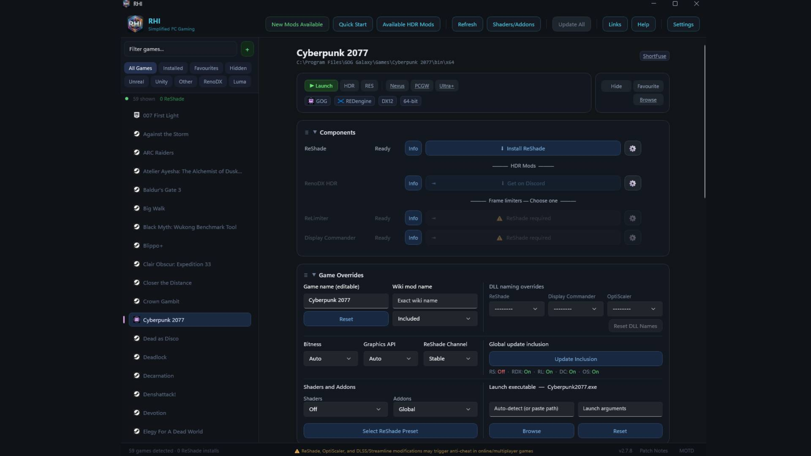
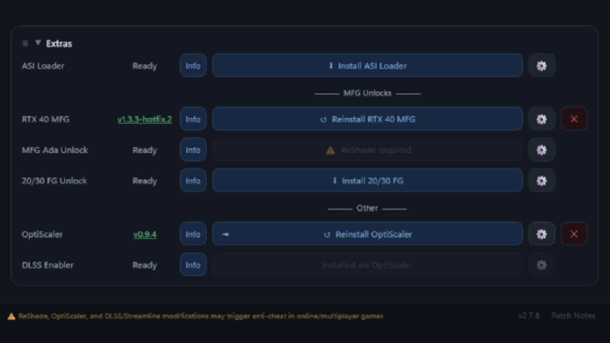
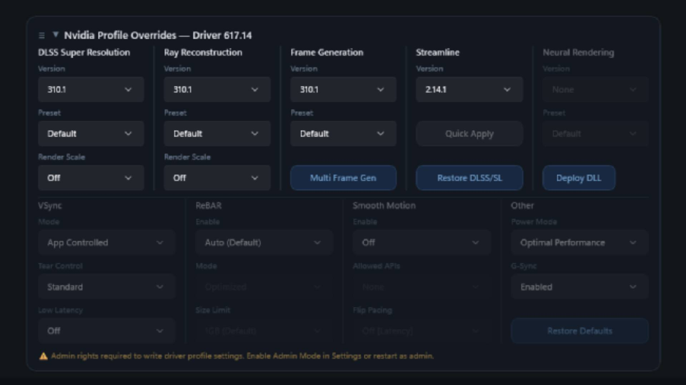
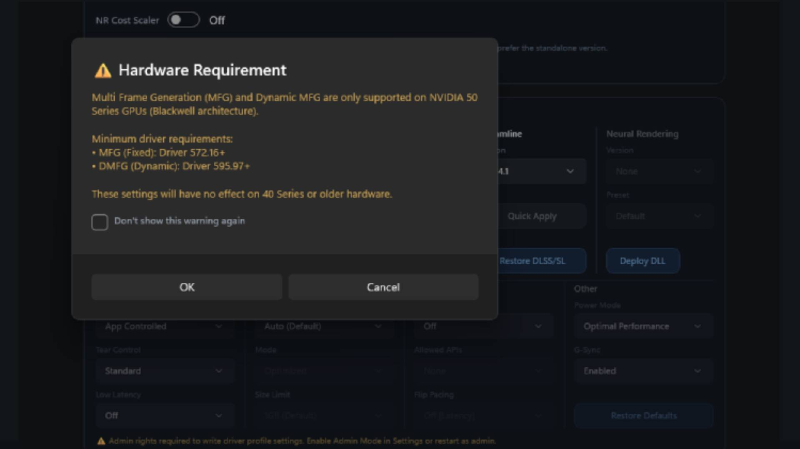
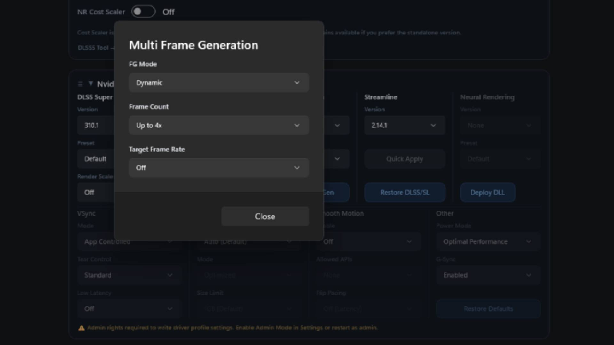

Multi Frame Generation (MFG) is Nvidia's AI-driven technique that interpolates frames to smooth the image out: it can generate as many as five frames for every frame that is actually rendered. The company introduced the original 2x Frame Generation with the RTX 40 cards in 2022, but it reserved the newer Multi Frame Generation version for the RTX 50 exclusively. This guide explains how to recover much of that smoothness on an RTX 40 card, as long as you do not mind a bit of software tinkering.

It is worth making clear from the start: the method is not officially supported. Nvidia limited the higher MFG rates to the RTX 50 for a hardware reason. That generation's silicon includes a dedicated AI Management Processor (AMP) that works alongside Flip Metering to deliver rendered and generated frames to the display as smoothly as possible, something the older architectures lack. CEO Jensen Huang himself has acknowledged that bringing "the latest generation AI technology to the previous generation GPUs" is a good idea but that it would "require a fair amount of engineering."

If you still want to give it a go, these are the steps.

## Prerequisites

- An Nvidia graphics card from the RTX 40 series.
- The [ReShade HDR Installer (RHI)](https://github.com/RankFTW/RHI), downloaded from GitHub: it is the tool that automates the installation of the unofficial mods.
- A game that already supports Multi Frame Generation out of the box, according to Nvidia's official list.
- Preferably a single-player title: the mods you have to install can trigger anti-cheat systems.

## Steps to enable 4x Multi Frame Gen on an RTX 40

### 1. Open RHI and check the detected games

When you run RHI for the first time, the tool imports every game you already have installed. Before touching anything, confirm in Nvidia's list that the title you want to use supports MFG.

### 2. Select the game

Click the game's name in the left panel of RHI. The central area will show every option and mod specific to that title.

### 3. Install the "RTX 40 MFG" and "OptiScaler" mods

Scroll to the bottom of the options list and tick the boxes to install **RTX 40 MFG** and **OptiScaler**. The installation takes only a few seconds.

### 4. Scroll back up to "Nvidia Profile Overrides"

Once both mods are installed, scroll back up to the **Nvidia Profile Overrides** section.

### 5. Click the "Multi Frame Generation" button

Click the blue **Multi Frame Generation** button. A dialog box will warn that MFG and Dynamic MFG are only supported on Nvidia 50-series GPUs (Blackwell architecture). Accept with "OK" to continue.

### 6. Configure the MFG settings

A window titled **Multi Frame Generation** will open with three drop-down lists. Select:

- Under **FG**, the "Dynamic" value.
- Under **Frame Count**, the "Up to 4x" value.
- Under **Target Frame Rate**, the "Off" value.

Press "Close" to save.

### 7. Launch the game and adjust the in-game option

Launch the game and enable the corresponding frame generation option in its own graphics settings. If everything went well, you will now be running MFG 4x on an RTX 40.

## How to verify it worked

Not every game offers a specific 4x MFG option, so the most reliable way to check that it is active is the overlay of Nvidia's **FrameView app**, which shows performance and frames in real time. In the original test it was confirmed this way on an RTX 4070 Super.

If you do not see the expected effect after launching the game, you may need to switch between different driver versions from inside RHI until you find one that works.

## Warnings and limitations

- **It is not an official method.** Nvidia does not support it, and RTX 40 architectures do not include the AMP or Flip Metering that the RTX 50 cards use to manage the extra frames.
- **Image quality is not perfect.** Enabling high levels of frame generation can introduce smeary frames and latency issues. Latency has been documented even with a frame rate limiter in place, so a high FPS figure does not guarantee a smoother experience in every game.
- **Anti-cheat risk.** The mods can trigger cheat-detection systems: it is better to test on single-player titles, as recommended in the original guide. If you are interested in the approach for another generation, there is an equivalent trick that [unlocked Multi Frame Generation on the RTX 30](/noticias/dlss-multi-frame-gen-rtx-30/).
