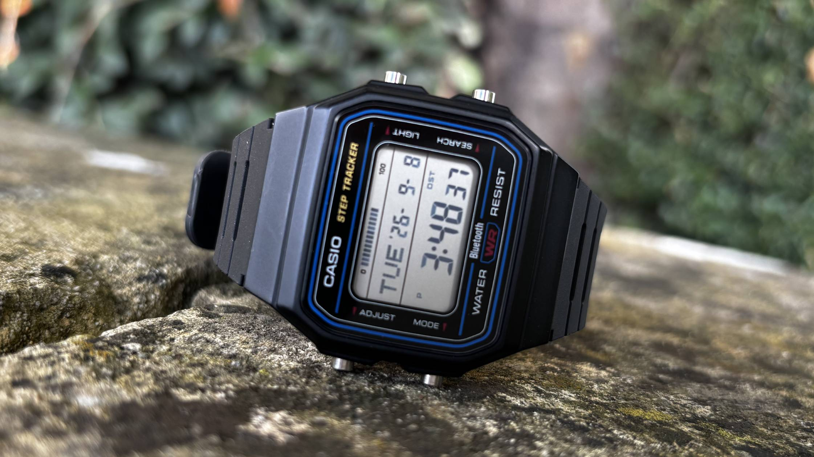

Some watches try to do everything and end up making you forget to check the time. The Casio F-B100W goes the other way. Casio has put this retro-styled digital watch on sale in the US for $64.95, with a list of features you can understand without opening the manual.

## What the F-B100W brings to the wrist

It is worth being clear about what it is and what it is not. The F-B100W does not compete with watches that track sleep, map routes with GPS or record an electrocardiogram. What it offers is a pedometer for step counting, Bluetooth to pair it with your phone and functions such as finding your phone from your wrist, plus a timer, a stopwatch and an alarm. Casio rates the battery life at two years, and that is probably the detail you will notice most day to day: there is no need to remember to charge it every night.

## Why it matters after selling out in Japan

The US launch does not come out of nowhere. The F-B100W went on sale in Japan in August and sold out within hours, and it has also been available in the UK: TechRadar's wearables writer, Matt Evans, described it as the watch that had given him "the most fun this year" and admitted he had fallen in love with it. There, too, it has become hard to find. None of that turns the F-B100W into an advanced watch; it makes it a product that has connected with people who just want the essentials done well. We had already seen similar bets in the budget segment, such as the [Celly TrainerWatch](/noticias/celly-trainerwatch-deportivo-barato/), but this Casio takes the rejection of the superfluous further than any of them.

## How much it costs and who it is for

The price on Casio's US website is $64.95, in three finishes: black with blue accents (F-B100W-1A), all-black (F-B100W-1B) and green (F-B100W-3A). In Japan it sold for ¥8,800 including 10% tax — ¥8,000 before tax — which is roughly $50.95 at the current exchange rate: the US version costs about $14 more.

If you are looking for a watch to count steps and tell the time without giving up battery life, the F-B100W is a sensible candidate. If you expect notifications, GPS or health metrics, this is not your watch, and no retro look is going to change that.
