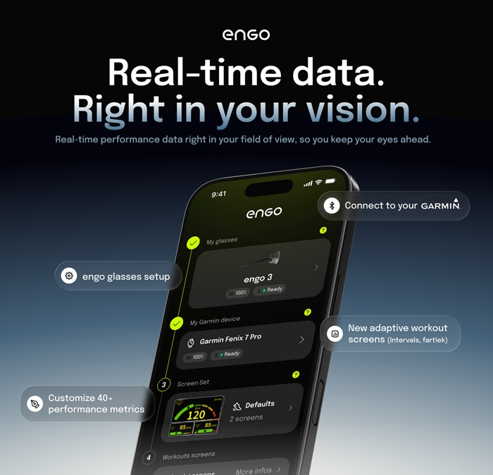

ENGO has unveiled the engo Titanium, 28.9-gram augmented reality (AR) glasses aimed at road runners and cyclists. The change the wearer will notice is not in the frame but in no longer looking at their wrist or bike computer: the data is overlaid in front of their eyes, in real time, while they keep watching the road. They are made and assembled in France.

The company describes them as "the lightest augmented reality running glasses ever made with 24+ hours autonomy." That is a company claim, not an independently verified figure, but it sets the direction: weight and battery ahead of adding features.

## engo Titanium: the data, in front of your eyes

The engo Titanium project information such as heart rate, pace and cadence onto a high-brightness color OLED HUD (heads-up display), which ENGO says can be read even in direct sunlight. The basis is ActiveLook Light AR technology, the same used by its current engo3, and the interface is customized from a companion app with 40+ metrics.

Beyond live data, the glasses include widgets to follow structured workouts — for example, interval sessions — and adjust pace on the move without taking your eyes off the road. Control is through a double-tap sensor and the connection uses Bluetooth Smart (BLE), with compatibility for Garmin and other devices via the ActiveLook ecosystem. Lenses are available in a standard or an adaptive photochromic version.

Much of the usefulness of glasses like these depends on the display being readable in broad daylight, and [the comparison of displays across smart glasses](/noticias/smart-glasses-display-comparison/) is the reference for understanding brightness, field of view and pixel density.

## Lighter than regular sports glasses

The figure that gives the design its meaning is the scale: 28.9 grams. ENGO recalls that traditional sports glasses weigh between 25 and 40 grams on average with no smart features at all, so the Titanium sits in the low band even competing against models that do nothing. To get there, the company says it ruled out features such as a camera, audio and AI during the design process, and focused the effort on battery life and comfort.

The temples are 3D-printed titanium and adjust both horizontally and vertically, and the nosebridge is also adjustable. The stated minimum battery life is 24 hours or more per charge. These are manufacturer figures and, as always with advertised batteries, it is worth seeing how they behave with the HUD always on rather than in the best-case scenario.

ENGO co-founder Éric Marcellin-Dibon said at the launch: "With engo Titanium we redefine what it means to wear performance glasses. Our design is so light and seamless that athletes forget they're even there while still delivering the most relevant data, anticipating their needs, and keeping them fully focused." For an endurance athlete or road cyclist, he added, that means "the right information in your field of view, exceptional comfort and enough battery life to forget about the technology altogether."

## Price and availability

The engo Titanium are sold as a limited edition and exclusively from `engoeyewear.com`. The classic version costs EUR 599 (USD 689.95 or GBP 489.95) and the photochromic one EUR 649 (USD 759.95 or GBP 549.95). They come in three finishes: Azure, Silver and Shift.

## What changes for the user

If you head out running or cycling and want to see pace, heart rate and cadence without letting go of the handlebars or looking down, the Titanium target exactly that problem and arrive at a weight you should not feel on your face. If what you are after is a fully featured "smart" pair of glasses — with a camera, audio or an AI assistant — they are not here: ENGO deliberately left them out and that gap is not going to be covered. And if price is the deciding factor, EUR 599 is a high-end figure for a device that, above all, displays numbers: if your bike computer or watch already works for you, waiting will cost you nothing.
