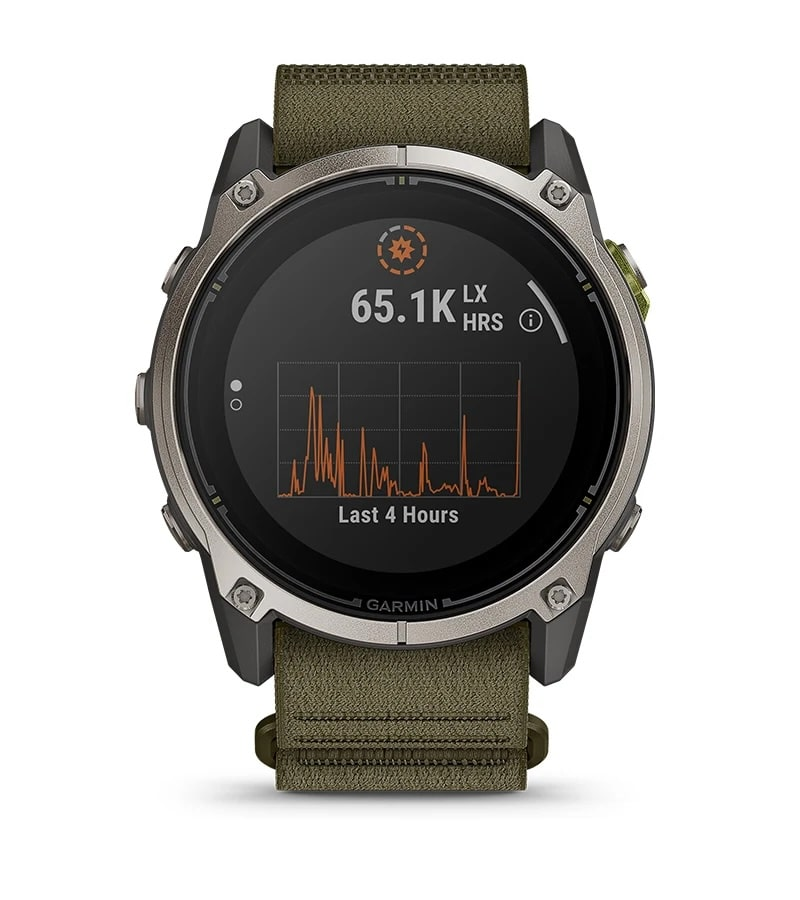

Garmin has announced the Enduro 4, a solar-charging GPS watch that keeps the Enduro 3 recipe and moves most of its update into software. The company positions it as its longest-lasting GPS smartwatch —up to 90 days in smartwatch mode and up to 320 hours in activity mode with enough solar exposure— and it is already on sale for $899.99.

## The Enduro 4 keeps the battery life and doubles the storage

On the wrist, the battery figures barely move. Garmin repeats the Enduro 3 numbers: up to 36 days in smartwatch mode (90 days with solar charging), up to 120 hours of continuous GPS (320 hours with solar) and up to 60 hours at maximum accuracy (90 hours with solar). Battery saver reaches 92 days and, with enough light, Garmin sets no cap at all.

That is not a problem: the Enduro 3 was already built around battery life that is hard to argue with, and chasing a bigger headline number would not have changed much in daily use. The two physical changes are the memory, which goes from 32 GB to 64 GB —more room for maps and music on long outings—, and the ComfortFit band, which replaces the previous model's ultra-light elastic nylon loop and raises the total weight from 63 to 66 grams (the case alone stays at 57 grams).

The rest is familiar: a 51 mm fiber-reinforced polymer case, titanium bezel, Power Sapphire lens, a 1.4-inch MIP display (280 × 280) with solar charging, an integrated LED flashlight with white and red light, and 10 ATM water resistance.

## New metrics and a race planner

Most of the update lives in the software. The Enduro 4 introduces grade-adjusted pace-based workout targets, meant to keep effort steady on climbs and descents, plus a grade-adjusted rolling pace in real time. Stamina zones show how available energy affects each activity, and the stamina curve estimates how endurance changes over time based on fitness and training history.

Garmin also adds a race planner for long events, with aid stations, cut-off checkpoints, notes and planned rest periods, and an automatic rest timer that avoids having to press buttons mid-race. Navigation becomes smoother thanks to 50% more RAM than the Enduro 3 and a refreshed map engine: the company promises 30% faster panning and a more detailed perspective view.

## Garmin Epic groups multi-day adventures together

The new feature with a name of its own is Garmin Epic, designed for activities that stretch over several days. Instead of treating each day as an isolated chunk, it gathers activities into a single story inside Garmin Connect —over days, weeks or months— and lets users add photos, share it and review the health and performance data collected during that period.

Added to that are indoor rowing tools, with VO2 max and a power curve, expanded rucking features —adjustable pack weight during an activity and targets such as calories burned—, and more than 100 activity profiles. The sensor setup is Garmin's usual one: wrist-based heart rate, Pulse Ox, skin temperature, GPS and multi-band GNSS with SatIQ, altimeter, barometer and compass. The health and rest side inherits the evening report, smart alarm and health status.

## What changes for existing Enduro 3 owners

It is worth being blunt: anyone coming from an Enduro 3 will not find a watch that makes theirs obsolete. The case, the display, the solar charging and almost every battery figure are identical, and the case weighs exactly the same. Doubling the storage is useful and the software is more complete, but the hardware alone gives few reasons to rush to the store.

If you want a watch for ultras and multi-day trips and you are after the latest grade-adjusted metrics, the race planner or Garmin Epic, then yes: the Enduro 4 is the current model and the reference for the line. If what you mainly want is lots of battery, your Enduro 3 still holds up, and Garmin already put battery life ahead of display technology when it decided to [return to AMOLED on the Fenix 9 Pro](/noticias/garmin-fenix-9-pro-microled-skip/). Waiting to see how the Enduro 4's real-world battery performs with the always-on display is, today, the most sensible call.
