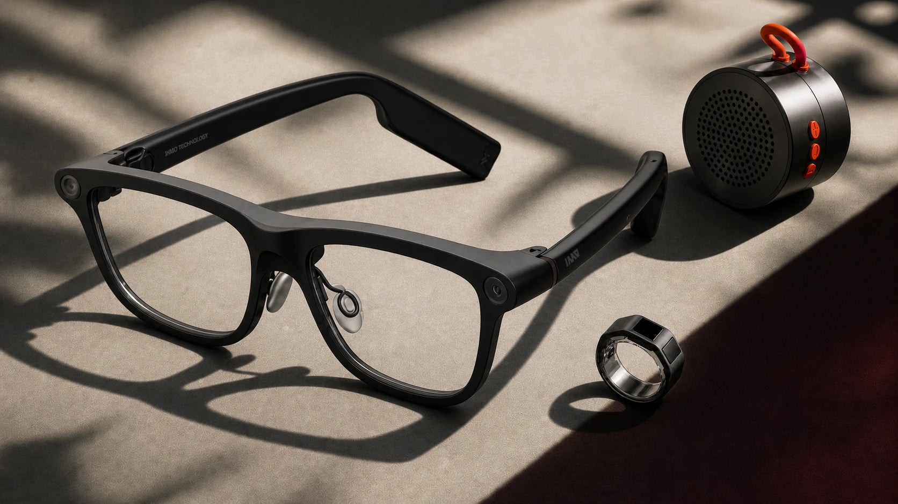

# INMO GO3 and Magic AI Glasses J: two opposite paths for smart glasses

The question that separates INMO's two smart glasses is not how many languages they translate or how many megapixels they capture, but where you want the information to end up: in front of your eye or inside a pocket. The company has published a comparison between its INMO GO3 and Magic AI Glasses J to make it clear that they do not compete with each other, but rather respond to two opposite ways of wearing technology. One prioritizes showing data while you continue doing what you were doing; the other, going unnoticed and recording what you see.

## INMO GO3 and Magic AI Glasses J: two proposals, two priorities

The INMO GO3 follows the screen line of the GO series. Its binocular display projects content into your field of view — translation, instructions, and alerts — so you don't have to look down at your phone. The company claims it covers real-time translation in more than 98 destination languages, plus live subtitles, photo translation, and offline translation in selected languages. To that, it adds an AI assistant, augmented reality navigation, a teleprompter, and meeting tools. For autonomy, it bets on two interchangeable batteries and a portable charging case; as optional accessories, it offers the Ring4 ring for discreet gestures and a GO3 speaker that plays out translated speech aloud during a conversation.

The Magic AI Glasses J starts from another point: design. Signed by Jackson Wang alongside INMO X WHL, it is a lightweight frame designed to match your everyday clothing. The company puts its weight at 40.1 grams. Instead of a screen, it prioritizes hands-free interaction: an 8 MP front-facing camera for first-person photos and videos, an AI assistant accessed with the phrase "Hey Magic," voice navigation, real-time translation, open-ear speakers, and calls.

## Why it matters: looking is not the same as recording

The underlying difference is not in the list of features, but what each frame does when your phone stays put. The GO3 tries to get information across without interruption: useful for moving through an unfamiliar city, talking with someone in another language, or presenting without looking at a secondary screen. The Magic AI Glasses J, by contrast, bets on capturing and sounding: it records from your own point of view and handles music and calls via open audio, with the idea that technology should not be the center of attention.

These figures are worth reading in context: the comparison is signed by the manufacturer itself, not an independent test. INMO does not publish real usage hours or measurement conditions in this text, so the weight and language data are brand promises rather than third-party verified results. As a framing reference, the firm recently pulled back [its Air 3 glasses due to burn risk](/noticias/wearables/inmo-air-3-gafas-recall/), a reminder that in this segment, product history matters as much as the spec sheet.

## What changes for you

If your priority is understanding and being understood without pulling out your phone — travel, multilingual conversations, presentations — the GO3 goes more in that direction: the binocular screen and communication tools are its argument. If what you're looking for is a discreet frame for everyday life, with a first-person camera and audio for music and calls, the Magic AI Glasses J fits better.

The decision depends on something as little technical as the clothes you wear and where you're going. If you want visible information constantly, yes: look at the GO3. If you want to record, listen, and go unnoticed, wait to try the Magic AI Glasses J before deciding. What is not advisable is buying based on the number of languages: without a demo in your everyday life, no frame replaces your phone.
