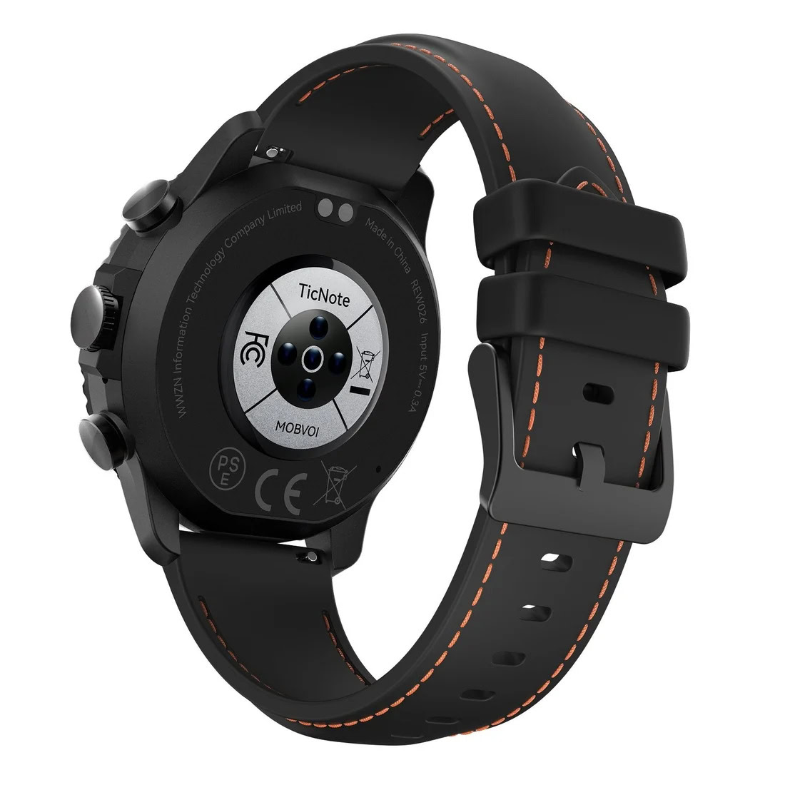

Mobvoi, the house behind the TicWatch line, has announced the TicNote Watch, a watch that flips the usual focus of the category: instead of competing to measure sleep better or add more sports modes, it is built for one very specific job. Its goal is to record, transcribe and summarize conversations straight from the wrist, without relying on a phone, as Android Authority reports.

The audience it targets is not the usual one. Mobvoi aims it at professionals whose work revolves around what is said in meetings — sales reps, consultants, journalists, lawyers or healthcare staff — not at someone mainly looking for a wrist coach.

## The TicNote Watch records without taking out your phone

The differentiating element is physical: a dedicated recording button. Holding it starts audio capture in about two seconds, it works offline and it serves both face-to-face conversations and two-way calls. A double press starts a recording of up to 60 seconds, meant to capture a fleeting idea before it slips away.

For capture, the watch relies on two omnidirectional microphones that pick up voices from 3 to 5 metres away, with noise reduction to clean up the signal.

On paper, the endurance is headline-worthy: the brand talks about more than 24 hours of continuous recording, up to 200 hours of recordings stored on the watch itself and up to 14 days on standby. Mobvoi's small print notes that these are lab figures and that real battery life varies with use and environment. Caution is warranted here: recording continuously is not the same as wearing the watch all day with notifications and the always-on display.

## Live transcription and AI summaries

The other pillar is software. Live transcription appears on the watch display — a 1.43-inch AMOLED — in up to 17 languages, with a claimed accuracy of at least 98% and latency under 1.5 seconds. These are the company's own figures, so they will need to be checked in noisy environments, with strong accents and several voices at once.

During transcription, key sentences can be marked with a single tap; those highlights are grouped automatically for review once the talk is over. When the recording ends, the watch shows an AI-generated summary and mind map, ready to search, review or share.

## Sports, health and an ecosystem for your notes

The TicNote Watch does not give up what is expected of a watch today. It adds more than 100 sports modes, built-in GPS, dual-band Wi-Fi and tracking of heart rate, sleep, blood oxygen and stress. That data, together with meetings and workouts, is woven into an "AI Journal" that reconstructs the day on a single timeline; in the evening, an "AI Recap" sums up the key moments. These are wellness metrics, not medical diagnoses.

The notes side rests on the TicNote app, the TicNote Cloud web studio and features such as Shadow AI 2.0 or a knowledge base. The brand also lets you connect assistants and your own models — Anthropic, DeepSeek and Qwen, with OpenAI "coming soon" — and export transcripts and summaries to Notion and Obsidian. It is the least glamorous part and, very likely, the one that decides whether the watch stays on your wrist or ends up in a drawer.

## Price and availability

The TicNote Watch costs $249, though the company is running a limited-time launch offer that brings it down to $199. It is sold on TicNote.ai and Amazon. Every unit includes the Plus plan, with 600 transcription minutes per month; Pro and Business plans are optional for anyone who needs more transcription time and more AI requests.

Is it worth it? If your job is not to miss what is said in meetings — visits, interviews, trade shows, consultations — and you want to do it without taking out your phone, the proposition is coherent and the included Plus plan helps the price make sense. If you are after a watch to train with every day, like the simple and cheap [Casio F-B100W](/en/news/wearables/casio-f-b100w-retro-smartwatch-us/), or a wearable focused on sports, this is not your product: here notes come first and everything else follows.
