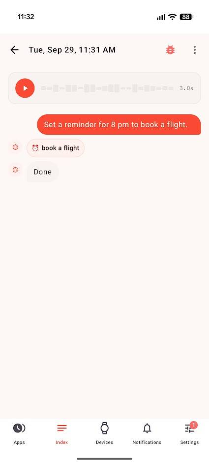
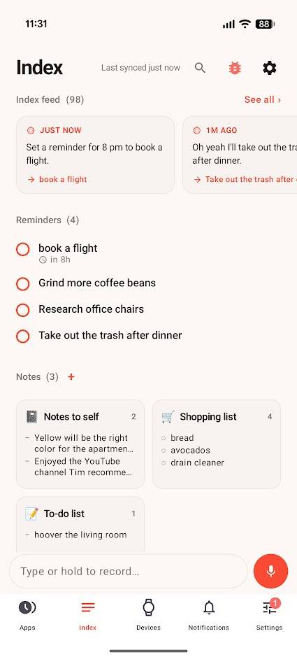
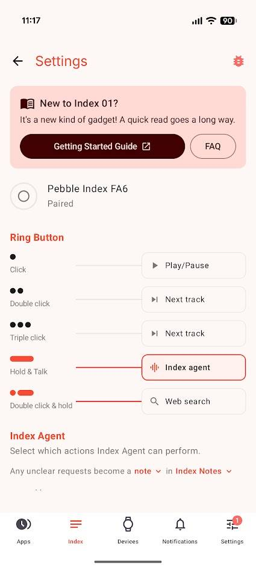

The **Pebble Index 01** is not a health ring or a smartwatch. It is a ring with a button that records your voice and turns it into tasks. Android Police writer Jon Gilbert tried it and says he has replaced both his Pixel Watch and much of his productivity stack with it. It is worth separating two layers from the start: what the product does and what its author thinks about it.

## A button on your finger that turns speech into tasks

The way it works is as simple as it sounds: press the button with your thumb, speak and release. The recording travels to the phone, where the Pebble app and its built-in large language model (LLM) decide what to do with it. According to the author, that model can create a note, add a reminder, create a calendar event, set an alarm or send a text message.

The button does more than dictate. Several presses control music playback —the factory setting assigns a single press to play or pause and two or three to skip tracks— and a double-press-and-hold launches a web search. The app also lets you choose which actions the assistant is allowed to perform.

The key, the author says, is where the button sits: next to your thumb when the hand is relaxed, not underneath it. That makes it reachable with a tiny movement, even with your hands full. He gives an everyday example: while packing his bag, he asked a friend about the office chair he had just bought and used the ring to note that he should look into it later.

## Its author finds it faster and more discreet than a voice assistant

This section is explicitly the writer's personal experience, not an independent measurement. His conclusion is that the Index 01 feels faster than summoning the phone's assistant: he says it takes about three seconds to act, compared with the wait that, he argues, has become normal since Gemini replaced Google Assistant. He also finds it more discreet, because he can press the button mid-conversation instead of talking to a speaker.

On recognition, the author notes that the model strips out the unnecessary language and that it works best when the instruction starts with the action ("set a reminder…", "add to my list…"), though it generally copes with vague commands. As for the design, he admits it is thicker than most rings and that he worried it would be uncomfortable, but he says that after a week of use he forgets he is wearing it.

## The Index 01 never needs charging: the promise and the fine print

This is where the product facts arrive, which the author mixes with his own assessment. The Index 01's battery cannot be replaced or recharged. Pebble claims it can last up to two years with normal use —between 10 and 20 voice notes a day— which removes the charging routine entirely, but also ties the ring's lifespan to its battery. It is the same awkward question as always: if the cell dies sooner than promised, there is no replacement.

The ring is water-resistant to one metre, and the author has worn it while washing his hands and showering with no drop in performance. On privacy, the link between the ring and the phone is encrypted and recordings can be processed on the device itself: both the ring and the app work offline and do not depend on a cloud service. On integrations, it saves notes in the Pebble app and can link to Google Tasks, Notion, Tasker or Obsidian.

The app makes clear that the on-device model is an experimental option, less accurate than the cloud model, and that some actions depend on the latter. That is an important nuance for anyone wanting to understand how far the local processing the product promises actually goes.

## What changes for anyone already wearing a watch on their wrist

The Index 01 measures nothing. It has no health tracking, and its author admits it is not proactive enough to be called a smart ring in the usual sense. It has no screen and shows no notifications. Its value is not in the spec sheet but in replacing a gesture we make dozens of times a day: pulling out the phone to jot something down. The author says he still uses Google Keep for collaboration and Bundled Notes for recipes, but that the ring has replaced his to-do lists and note-taking apps.

For anyone after health metrics or notifications, there are alternatives built for that, such as [Qalo's health-tracking ring](/noticias/wearables/qalo-pulsera-anillo/). If what you want is to stop interrupting what you are doing so you do not forget an idea, this kind of ring makes sense; if you expect health data, a screen or a replaceable battery, it is still not your product.
