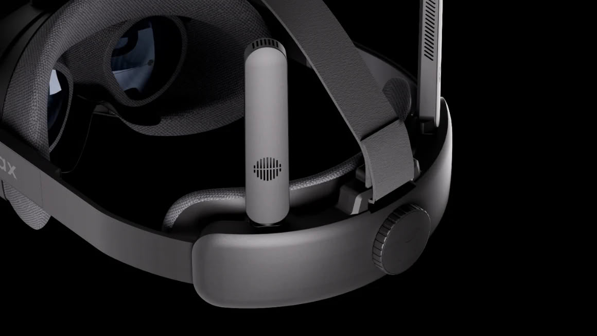
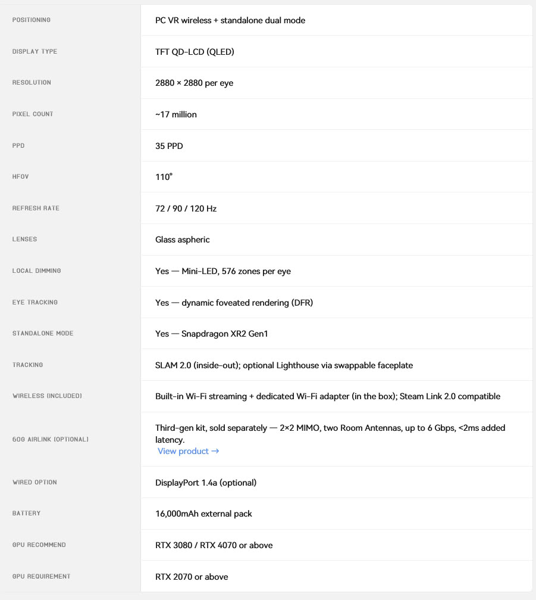

Pimax has unveiled the Crystal Pro, a PC virtual reality headset that runs without cables and revolves around a streaming technique the company calls native foveated streaming. The announcement came during its "Frontier: Change To Stay The Same" event, where it also showed off Ringless VR controllers, a mini-PC called Spation and a refreshed brand identity with a new signature colour, Stratosphere Blue.

On paper, the goal is the one that matters to whoever puts the headset on: cutting the cable without ruining the image. To pull it off, the Crystal Pro combines built-in Wi-Fi streaming — with a dedicated Wi-Fi 6E adapter included in the box — with an optional 60 GHz kit, the 60G AirLink, sold separately or in a bundle.

## What native foveated streaming changes

The key is where the user is looking. Thanks to eye tracking, the 60 GHz connection sends the GPU's native image straight to the panels in the area the user is focused on, without the encoding Wi-Fi streaming requires. In other words, the centre of the gaze does not go through the video compressor, which is exactly where artefacts tend to show up.

The kit carries two Room Antennas running in a 2x2 MIMO configuration, something Pimax presents as a first in a VR headset, with up to 6 Gbps of combined throughput and under 2 ms of added latency. The catch, and it is not a small one, is that this compression-free path depends on an accessory that costs $599 on its own: without it, the headset still relies on Wi-Fi, the route that involves encoding.

Pimax is also launching Ringless VR controllers, which replace the tracking ring of its earlier controllers with camera-based hand tracking alongside infrared and motion sensors. The company claims under 15 ms of latency and the ability to clip them into a gamepad for Windows and Steam. Their price and release date have not been set yet.

## QLED displays, tracking and standalone mode

The spec sheet accompanying the announcement places the headset in a dual position: wireless PC VR and standalone mode. The displays are TFT QD-LCD (QLED) at 2,880 × 2,880 pixels per eye — around 17 million pixels in total and 35 PPD — with aspheric glass lenses, a 110-degree horizontal field of view, and 72, 90 or 120 Hz refresh rates. Local dimming is handled by mini-LED, with 576 zones per eye.

For tracking, the Crystal Pro combines eye tracking with SLAM 2.0 inside-out tracking and a swappable faceplate for optional Lighthouse support or for mixed-reality passthrough with LiDAR depth. In standalone mode it relies on a Snapdragon XR2 Gen1, though it has no built-in battery: power comes from an included 16,000 mAh external pack.

To drive it, Pimax's recommendation starts at an RTX 3080 or an RTX 4070, with an RTX 2070 as the minimum. Those are figures worth keeping in mind: a headset with this pixel density is unforgiving of a weak GPU, and foveated streaming eases the transmission, not the render load.

## Pimax Crystal Pro pricing and availability

The Crystal Pro is priced at $1,399, or $1,899 in the bundle that includes the AirLink kit; the kit alone costs $599. Pimax is already taking reservations for $1 on its website, but it has not given shipping dates for the headset or pricing for the Ringless VR controllers and the Spation mini-PC.

That Spation, as a bonus, is a mini-PC with desktop-class components in a chassis smaller than a typical tower: it pairs an AMD Ryzen 7 9800X3D with an AMD RX 9070 XT or an NVIDIA RTX 5070 Ti, supports Windows and SteamOS, and will also have a DIY configuration.

It is worth looking at this announcement with the caution Pimax calls for. If you want a maximum-resolution wireless headset and do not mind paying for the AirLink separately, the Crystal Pro competes in that league; if you want a wireless headset without first-generation surprises, it is better to wait for the reviews and for the company to confirm dates, because native foveated streaming sounds great in the presentation and it remains to be seen how it behaves on your face, with the game already running. Anyone coming from [Meta's VR Glasses](/noticias/meta-vr-glasses-anuncio/) will notice the bet here goes the opposite way: more resolution and more hardware, in exchange for a considerably bigger outlay.
