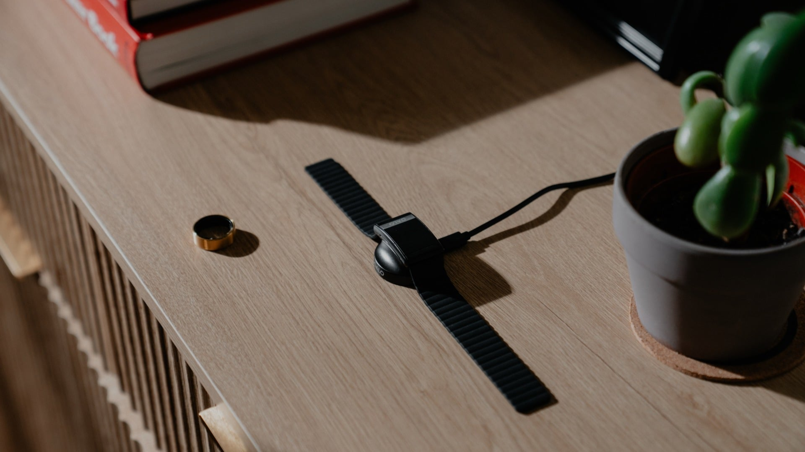

Qalo, the company competing with Oura in the subscription-free smart ring space, has announced the SL-1 Smart Band, a screenless wristband that tracks the same health data as its SR-2 ring. The pitch is practical: wear one or the other depending on the moment of the day without losing the thread of your metrics.

## A band you put on and forget

The SL-1 is a small rectangular puck of sensors, in the vein of the Whoop 5.0 or the [Garmin Cirqa](/noticias/garmin-cirqa-screenless-band/), that clips onto different silicone and fabric straps. Qalo says it is water-resistant to around 9 meters and lasts over 12 days on a single charge, two figures that, as usual, will have to be tested in a review. What it does promise is that no subscription is required: it tracks sleep, movement, blood-oxygen levels, heart rate, heart rate variability, stress, skin temperature and menstrual cycles with no monthly fee.

## Two devices, one profile

The real draw is how it works alongside the SR-2 ring. Both devices feed the same health profile, so you can switch between them without the data breaking off. Qalo imagines the ring for everyday wear and for sleeping, since it is more comfortable, and the band for intense workouts or activities where you need your fingers free. All of that information is summed up in a daily "Q Score", with menstrual prediction and automatic workout detection.

## Price and competition

The logic is not new: Samsung pitches combining the Galaxy Ring with the Galaxy Watch, and Google offers something similar with the Fitbit Air for anyone who already owns a Pixel Watch. Qalo does not promise the hardware and software level of those brands, but it does offer a more restrained price: the SL-1 band and the SR-2 ring retail for $200 each, so buying both costs around what an Apple Watch Series 12 goes for.

If you want a discreet tracker with no fees, and the option to alternate between ring and band depending on the scenario, the proposal fits. If you expect sensors or software at the level of Samsung or Google, it is worth waiting for the first reviews before deciding.
