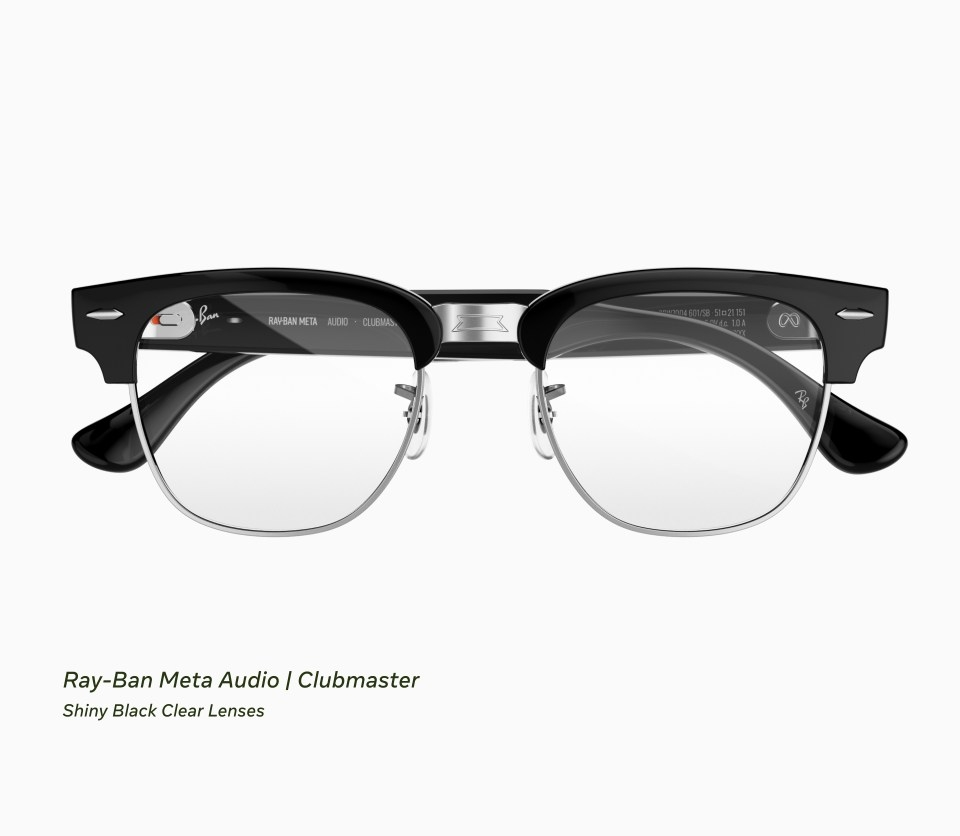

Samsung has a date for its first pair of glasses. The company plans to launch its Intelligent Eyewear in **November**, according to a report by South Korean outlet The Korea Herald that GSMArena relays, and which attributes the confirmation to a Samsung executive. Neither the price nor the exact day has been announced: those are the two gaps still open a month before the supposed arrival.

The glasses were first shown with Google at Google I/O in May on the Android XR platform, and the Galaxy Unpacked event in London in July revealed a bit more of their design. So far, the report is the only thing putting a date on the table.

## Intelligent Eyewear: display-less glasses with the camera front and center

Unlike augmented reality glasses, the Intelligent Eyewear carry no display. What they do include is a camera and microphones that capture what the wearer sees and hears, plus speakers to hear the response.

The processing does not happen on the glasses: Gemini, Google's AI, works with that information through a connected Galaxy phone and answers through the frame's speakers. In other words, without a phone nearby the device loses much of its usefulness. That is worth keeping in mind before getting excited about the concept.

Samsung has put weight at the center of its pitch: it claims they are "lighter than most AI glasses," and local media point to a target of up to 5 grams below Meta's 51-gram Ray-Ban Meta. The company **has not confirmed the final weight**, so for now it is a promise and not a figure. Development was done with Google and with frame makers Gentle Monster and Warby Parker.

## Meta's shadow: a market that already has an owner

Samsung's move comes into a market Meta occupied earlier and with a wide lead. According to Counterpoint Research, global AI-glasses shipments grew 263% year on year in the first half of 2026, and display-less models accounted for 96% of the total. Within that segment, Meta controlled 94%.

Meta has not stood still. On September 23 it unveiled the [camera-free Ray-Ban Meta Audio](/noticias/ray-ban-meta-audio-sin-camara/), 43-gram glasses focused on audio and AI that give up recording for those who do not want a camera in front of their face. That is exactly the flank Samsung wants to enter with a product that is also display-less.

## Privacy: alerting the person next to you

The other front for camera glasses is privacy, and in South Korea it has already arrived before launch. The Personal Information Protection Commission met with Samsung in late July to discuss how nearby people should be alerted when a camera or microphone is active, and the Ministry of Science and ICT began drafting safe-use guidelines in September.

Samsung maintains that its glasses will use LEDs inside and outside the frame to signal recording, and that if the outer indicator is covered the recording is disabled. It is the same approach as Meta, but the underlying doubt does not change: [the camera that sold these glasses is also their biggest problem](/noticias/smart-glasses-camera-privacy-opinion/).

## What changes for the user

If you are after discreet glasses to listen to music, look things up by voice and get notifications without checking your phone, Samsung's proposal is in the same league as the Ray-Ban Meta and deserves close attention. If what you expect is information overlaid in front of your eyes, this is not it: the Intelligent Eyewear have no display, like almost everything selling in that market today. And until there is an official price and date, the recommendation is the usual one: wait for Samsung to confirm.
