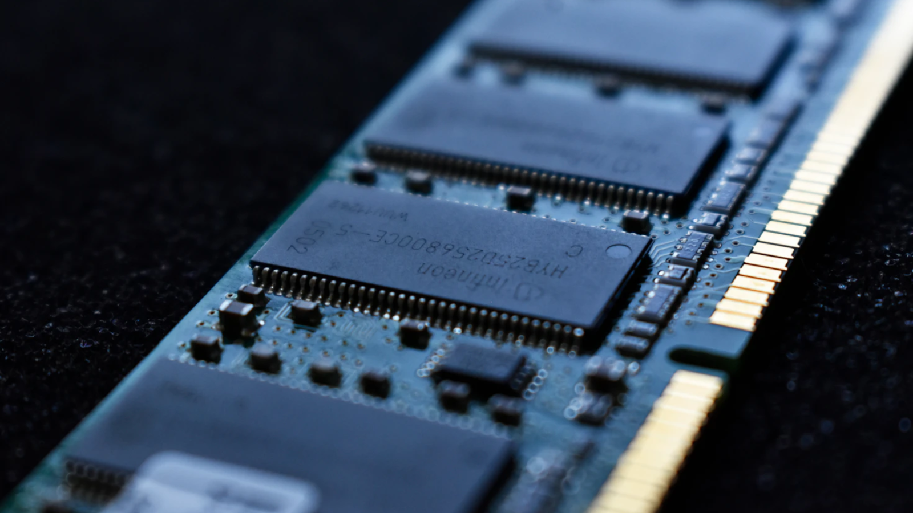

El consejero delegado de Acer, Jason Chen, ha puesto en duda que la escasez de memoria sea tan grave como la pinta buena parte del sector. En unas declaraciones recogidas por el medio taiwanés Economic Daily News y difundidas después por VideoCardz, Chen asegura que la oferta de DDR4 y DDR5 «sigue siendo bastante amplia» y que tampoco hay un problema serio de suministro de procesadores. Su conclusión es tajante: «Es imposible que la escasez dure hasta 2030».

## La escasez de memoria, según Acer

Chen reconoce, eso sí, que los precios de los componentes están «fluctuando» en niveles altos y que los PC seguirán encareciéndose durante el cuarto trimestre de 2026, con subidas medias de entre el 5 % y el 20 %. La diferencia está en el horizonte temporal: frente a los análisis que sitúan el problema más allá de esta década, el directivo cree que los precios empezarán a bajar a partir de mediados de 2027, cuando entre en juego la capacidad de producción adicional, en especial la procedente de China.

## Por qué importa: el resto de la industria no lo ve igual

La lectura optimista de Chen contrasta con la de otros actores del sector. El presidente de SK Group advirtió hace unas semanas de que la escasez actual podría prolongarse hasta 2030, y el consejero delegado de Nvidia, Jensen Huang, ha señalado que la crisis de la memoria durará «unos cuantos años». Ante ese coro, las palabras de Acer suenan a contrapunto, y conviene tomarlas con la cautela que impone su origen: llegan a través de una traducción y, según apunta el propio medio, podrían referirse sobre todo al mercado chino y no a la foto global.

## Qué cambia para el comprador

Para quien tenga previsto montar o renovar un equipo, el mensaje práctico no se mueve demasiado a corto plazo: los precios seguirán subiendo durante lo que queda de 2026 y buena parte de 2027. La mejora que anticipa Acer habla de tendencia, no de una bajada inmediata, y el propio Chen no espera que llegue antes de mediados del año próximo.

El alivio, si finalmente llega, dependerá de cuánta capacidad nueva entre en producción. En ese frente ya hay movimientos: CXMT ha empezado a [fabricar en masa su DRAM de quinta generación](/noticias/cxmt-5th-gen-dram-mass-production/), mientras la demanda de la inteligencia artificial sigue tensando el mercado hasta el punto de que la memoria absorbería el [64 % del gasto mundial en IA en 2027](/noticias/ai-cost-memory-2027/), según las estimaciones que maneja UBS. Hasta que esa oferta se traduzca en precios más bajos en las tiendas, la recomendación para el comprador hispanohablante es la misma de siempre: si el equipo es urgente, comparar y no dar por hecho que esperar saldrá más barato.
