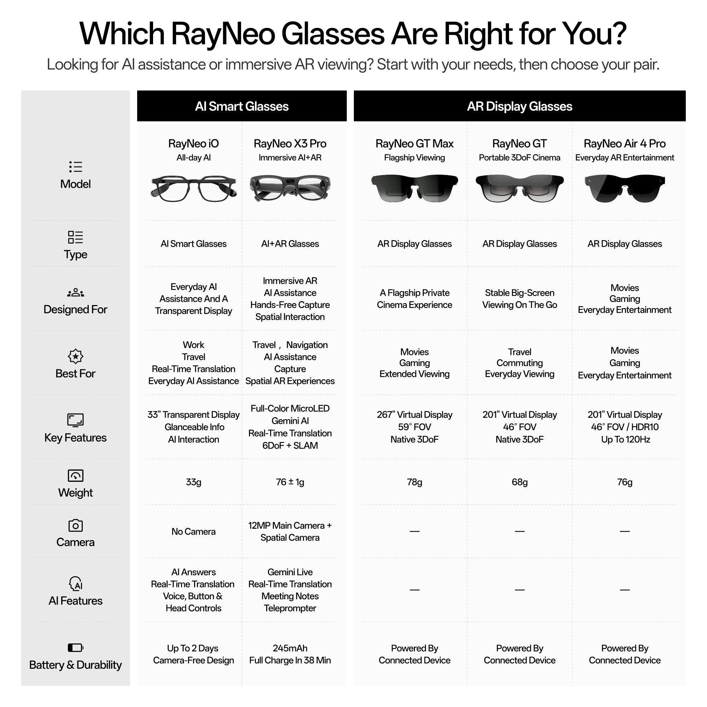
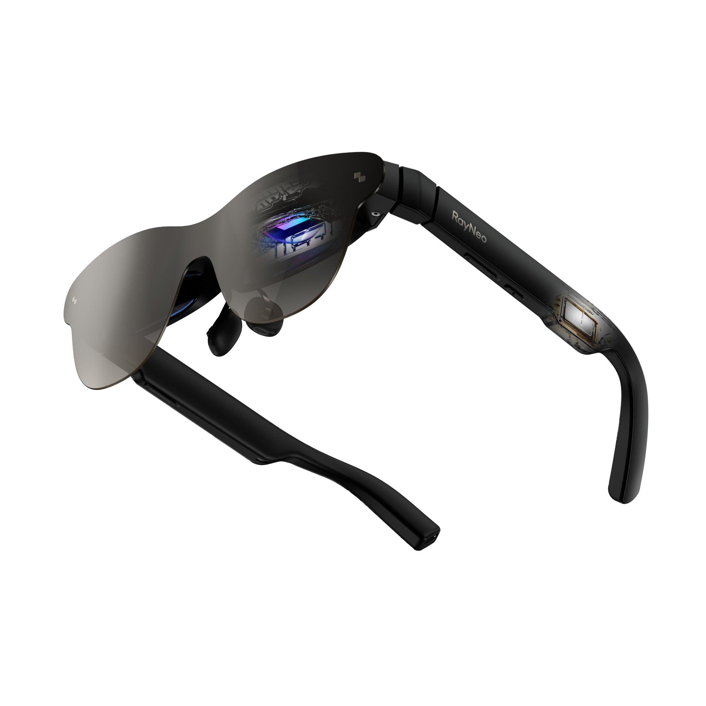

Bajo la etiqueta «gafas con IA» se esconden tres trabajos distintos, y acertar con la compra empieza por nombrar cuál de ellos quieres. Algunas gafas ponen información delante del ojo: subtítulos, agendas, traducciones, indicaciones. Otras se convierten en una gran pantalla privada para lo que les conectes. Y otras llevan una cámara que captura lo que estás mirando. Unos pocos modelos intentan cubrir los tres frentes, a un precio y un coste de batería acordes con esa ambición.

Esta guía no parte de una ficha técnica, sino de cómo es tu semana. Cada paso te ayuda a descartar modelos hasta quedarte con el tipo correcto. Al final tienes una forma de comprobar si la elección encaja y un repaso de lo que esta categoría todavía no resuelve.

## Antes de empezar

- Define el uso principal. Si quieres tu propio contenido más grande, es un producto de pantalla; si quieres información nueva superpuesta a tu día, es un producto de IA.
- Decide si necesitas grabar. Si la respuesta es sí, compras un modelo con cámara y arrastras las normas locales sobre grabación. Si es no, las monturas sin cámara son más ligeras, baratas y fáciles de llevar a una reunión.
- Ten presente la sesión más larga. Dos horas de película exigen una batería distinta que ocho horas de subtítulos.

## Paso 1: identifica qué deben hacer tus gafas

Antes de comparar precios, aclara cuál de las tres funciones resuelve tu problema:

1. **Poner información en tu línea de visión.** Subtítulos en vivo de la conversación que tienes delante, traducción de un idioma que no hablas, tu próxima reunión, un guion de teleprompter o un aviso al que echar un vistazo.
2. **Una gran pantalla privada.** No hace falta IA: solo una pantalla que llevas contigo, alimentada por un cable desde el teléfono, el portátil, la consola o una consola portátil.
3. **Capturar lo que ves.** Una cámara en tus gafas graba desde tu propio punto de vista y, además, es lo que permite al asistente responder sobre un menú, una señal o un objeto que tienes enfrente.

## Paso 2: empareja tu semana con un tipo

Cada escenario pide un trabajo concreto. Esta tabla es el atajo del paso anterior:

| Tu escenario | El trabajo que necesitas | Modelo que encaja |
| --- | --- | --- |
| Desplazarte con el teléfono en el bolsillo | Gran pantalla | GT Max o Air 3s Pro |
| Reuniones encadenadas | Información | iO |
| Viajar sin hablar el idioma | Información (y lectura de carteles con cámara) | iO, o X3 Pro si también necesitas leer señales y menús |
| Vuelos largos y tardes de hotel | Gran pantalla | GT Max con Pocket TV Pro |
| Jugar en PC o consola en un espacio compartido | Gran pantalla | GT Max o Air 3s Pro |
| Grabar lo que haces con las manos libres | Captura | X3 Pro |
| Presentar o hablar en público | Información | iO |
| Apoyo auditivo en conversaciones | Información | iO |

En el catálogo actual de RayNeo cada trabajo tiene un producto separado en lugar de un único dispositivo que lo mezcle todo, lo que lo convierte en un ejemplo útil para pensar la categoría: el iO para información, el GT y el GT Max para la gran pantalla, y el X3 Pro para todo, cámara incluida.

## Paso 3: elige el producto según el trabajo

**Información: RayNeo iO.** Muestra subtítulos en vivo, traduce, enseña tu próxima reunión y graba reuniones en transcripciones con etiquetas de hablante y resúmenes de IA. Lo hace en una montura de 33 gramos con pantalla MicroLED binocular que permanece invisible para los demás, cubre 55 idiomas y 109 acentos para subtítulos y traducción, y no lleva cámara alguna: renuncia a capturar y a cambio entra en salas donde una cámara no es bienvenida.

**Gran pantalla: GT Max y Air 3s Pro.** El GT Max proyecta una pantalla virtual de 267 pulgadas en un campo de visión de 59 grados a hasta 120 Hz, alimentada por USB-C desde un teléfono, portátil, consola o dispositivo portátil. El Air 3s Pro ofrece una pantalla de 201 pulgadas con 1.200 nits y es el punto de entrada de precio a este trabajo. El GT, por su parte, da 201 pulgadas con 49 PPD y una IPD fija de 64 mm.

**Captura: X3 Pro.** Su cámara de 12 MP graba hasta 4K desde tu propio punto de vista, y esa misma cámara es la que permite a su asistente responder sobre un menú, una señal o un objeto que tengas delante.

## Paso 4: comprueba con qué se conecta

Este es el requisito que más decepciones evita.

- **Gafas de información:** funcionan con su propia batería, así que la pregunta es cuánto dura la sesión, no qué cable necesitas.
- **Gafas de pantalla:** GT Max, GT y la serie Air son pantallas, no ordenadores. Muestran lo que les envía un dispositivo conectado, lo que exige un puerto USB-C con salida de vídeo, un adaptador HDMI o un reproductor aparte. Un cable y la pantalla es tuya.
- **Gafas de captura:** el X3 Pro tiene sus propias radios Wi-Fi 6 y Bluetooth 5.3 y un sistema basado en Android, así que funciona de forma independiente en una red conocida. El iO se empareja por Bluetooth 5.4 y depende de la conexión del teléfono para sus funciones en la nube.

## Paso 5: mide la autonomía real

La ambición cuesta energía, y las cifras lo dejan claro:

- **El iO** monta una batería de 240 mAh con hasta dos días de uso típico, 18 horas de grabación continua o 6,2 horas de traducción continua. Es la mejor historia de batería de la familia precisamente porque mueve una pantalla monocroma y ninguna cámara.
- **El X3 Pro**, en cambio, es de uso por ráfagas. TechRadar Pro midió entre una y dos horas de uso activo, a veces 45 minutos, frente a las cinco horas de uso ligero que declara RayNeo. Admite una carga completa en 38 minutos.

## Paso 6: resuelve la graduación

Las gafas con IA pueden llevarse con receta a través del socio óptico de RayNeo, Lensology. El Air 3s Pro admite prescripciones de miopía e hipermetropía, y la serie GT también. En los modelos de pantalla el cambio implica quitarse las gafas de diario para ponerse estas, como ocurre con las de sol. El iO va más allá: se vende con la opción «Buy with Prescription», de modo que llega listo para llevar todo el día.

## Cómo verificar que acertaste

Antes de comprar, escribe las tres cosas que esperas que hagan las gafas y comprueba cuántas dependen de un servicio en la nube o de una actualización futura. Si dos de las tres dependen de eso, estás comprando una promesa tanto como un producto.

La prueba definitiva es más simple: si el ritmo del dispositivo encaja con tu jornada, las seguirás llevando. Esa es la diferencia entre unas gafas que usas y unas gafas que compraste una vez.

## Advertencias y limitaciones

- **No sustituyen al teléfono.** Ninguna pieza de esta categoría navega por la web con comodidad, escribe un mensaje largo ni aguanta un día entero de uso intensivo sin cargarse.
- **El uso intensivo todo el día no está sobre la mesa.** Es la limitación que más condiciona la compra.
- **Las gafas de pantalla necesitan una fuente.** Sin un puerto con salida de vídeo, un adaptador o un reproductor, solo muestran lo que les llegue.
- **Los asistentes todavía tienen costuras.** Gizmodo, al probar el X3 Pro, comprobó que el asistente de voz no reconocía los recordatorios creados en la propia aplicación de tareas de las gafas. La integración entre el modelo de IA y las funciones del dispositivo es donde la categoría aún está madurando.
- **No son visores de realidad virtual.** Dejan intacta tu visión de la sala, ya sea superponiendo texto o flotando una pantalla virtual. Un visor reemplaza por completo tu vista, y por eso pesa entre 33 y 78 gramos frente a varios cientos.
- **Comparar precios entre tipos engaña.** El iO cuesta 150 dólares más que el GT y muestra una imagen mucho menor, porque no compite en tamaño: compra una montura de 33 gramos, sin cámara y que dura todo el día. El GT y el Air 3s Pro venden área de pantalla por dólar.

Para poner la categoría en contexto de mercado, puedes leer nuestro análisis sobre [el crecimiento de las gafas inteligentes y el dominio de Meta](/noticias/smart-glasses-market-doubles-meta/), así como el giro hacia [modelos sin cámara por el rechazo a la privacidad](/noticias/meta-smart-glasses-without-camera/).
