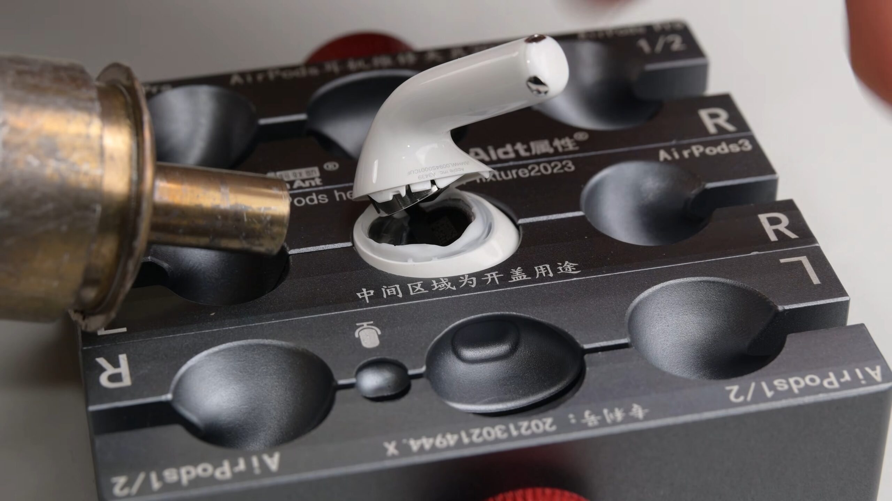

Durante diez años, los AirPods estándar de Apple encadenaron ceros en las pruebas de reparabilidad de iFixit, hasta ganarse la fama de producto prácticamente desechable en cuanto su diminuta batería de litio se degrada. La quinta generación rompe esa racha. El desmontaje que iFixit publicó el 29 de septiembre concede a los AirPods 5 una puntuación de **2 sobre 10**, la más alta que la firma especializada ha otorgado nunca a unos auriculares de Apple, aunque sigue muy lejos de lo que se considera un producto reparable de verdad.

## La batería de los AirPods 5, por fin extraíble

El cambio está en cómo se sella la carcasa del altavoz. En las generaciones anteriores había que cortar plástico o fundir el cableado interno para llegar a la celda, pero en los AirPods 5 basta con aplicar calor suave y controlado —incluso con un secador de pelo doméstico— sobre la junta del controlador para que la carcasa se separe limpiamente. Esa junta es una línea tan fina que pasa casi desapercibida, justo por encima del texto con el modelo grabado.

En el interior, la batería vuelve al diseño de pines de contacto que ya apareció en los AirPods 3: en lugar de cables soldados, incorpora un par de pines que se desconectan y reconectan como si fuera un enchufe. Para llegar hasta ellos sin instrumental de taller, iFixit usó un secador de pelo en su ajuste de calor bajo —mantenido a distancia y en movimiento para no fundir el plástico— y una pinza para sujetar el auricular. Funcionó, y repitieron la operación en el segundo auricular con el mismo resultado.

El resto del hardware también tiene miga. Dentro del vástago, iFixit encontró la capa táctil capacitiva que ya vieron en las dos últimas generaciones de AirPods Pro —presente solo en la versión con carga inalámbrica, según la propia corrección de la firma— y, por debajo, el sistema en paquete H2, el chip que gestiona la cancelación activa de ruido con los tres micrófonos MEMS repartidos entre la parte superior e inferior del vástago y la cabeza del altavoz.

## Las baterías izquierda y derecha no son intercambiables

La prueba de sustitución empezó con mal pie. Al colocar la batería del auricular izquierdo en el derecho, la aplicación mostraba que se estaba cargando, pero el auricular no acumulaba energía; al devolverla a su sitio, la carga volvía a ser parcial. No era un bloqueo por software ni un sistema de emparejamiento de piezas: al mirar de cerca, iFixit comprobó que la polaridad de las baterías estaba invertida y que los pines iban soldados ligeramente descentrados.

Son físicamente distintas de un lado al otro, así que una batería que sale con facilidad no sirve para el auricular contrario. Cuando empiecen a venderse recambios, habrá que asegurarse de comprar el modelo correcto para el auricular que se quiera reparar.

## La caja de carga sigue siendo un desastre

Si los auriculares son una buena noticia, la caja de carga cuenta la historia opuesta. Sus juntas están muy apretadas y, donde podrían haber ido tornillos, hay soldaduras de plástico. Ni siquiera con una estación de retrabajo iFixit logró retirar la capa interna sin dañar el plástico: para cuando llegó a la batería, la caja estaba destruida. Es un problema ya resuelto por otros fabricantes; los Fairbuds de Fairphone, por ejemplo, lograron el primer 10 sobre 10 en reparabilidad de unos auriculares inalámbricos precisamente por facilitar el acceso a la batería tanto en los auriculares como en su estuche.

A eso se suma que Apple no ofrece piezas de repuesto, manuales de reparación ni ninguna vía dentro de su programa de reparación de autoservicio para esta gama. El contraste con otros desmontajes recientes es notable: en el [desmontaje del iPhone 18 Pro](/noticias/iphone-18-pro-ifixit-teardown/), la marca sí había facilitado el cambio de batería, aunque la pantalla siguiera dando problemas.

## Qué cambia para el comprador

Un 2 sobre 10 sigue siendo una nota mala, pero rompe el patrón de ceros que convertía cada fallo de batería en basura electrónica. Por primera vez, los técnicos cualificados y los aficionados más atrevidos tienen una posibilidad realista de sustituir la batería de unos AirPods: el calor moderado y la paciencia al hacer palanca bastan para llegar a la celda, algo impensable hace una generación.

Ahora bien, conviene no vender la piel del oso antes de cazarlo. No es una reparación casera sencilla: el primer intento de abrir por el vástago ya derritió plástico, y el método que funciona exige controlar bien la temperatura. Y mientras Apple no ponga a la venta piezas y manuales, y siga sin poder abrirse la caja sin destrozarla, la puntuación difícilmente subirá. El 2 sobre 10 es un paso, pero deja claro cuánto camino queda por recorrer.
