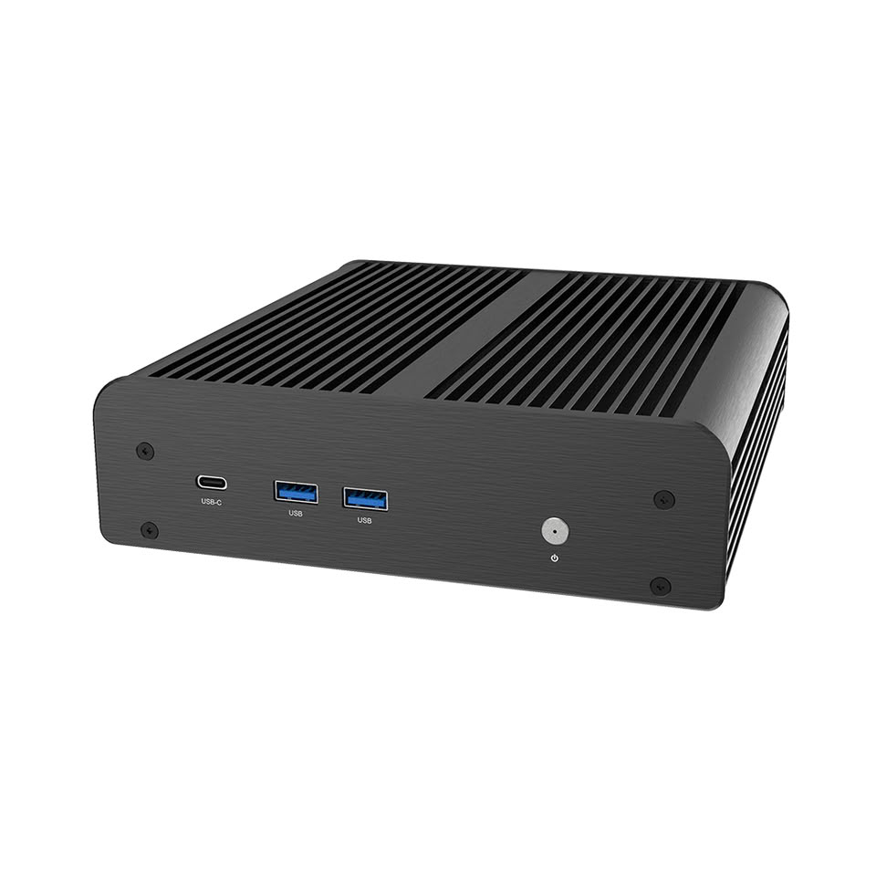
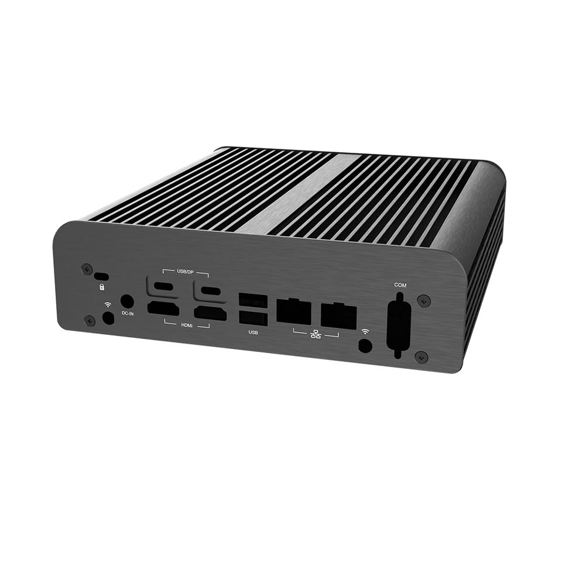
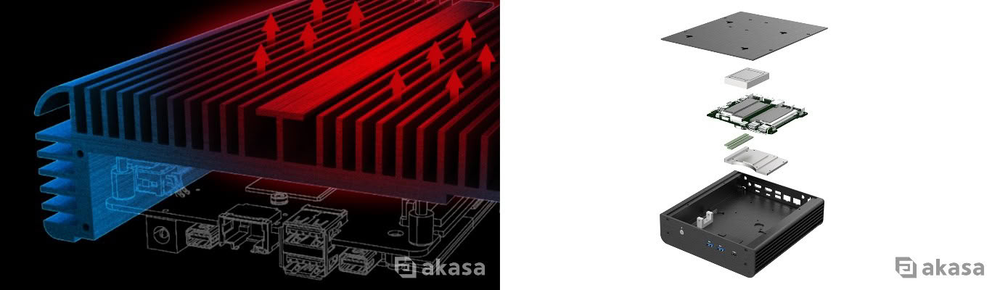
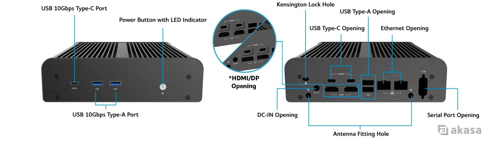
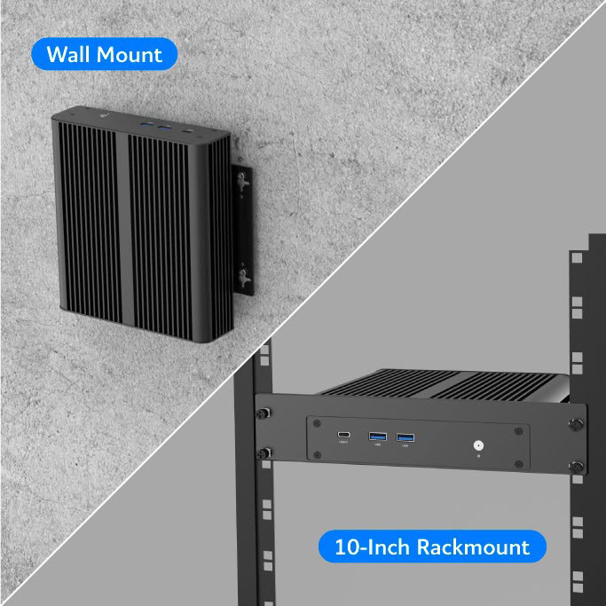
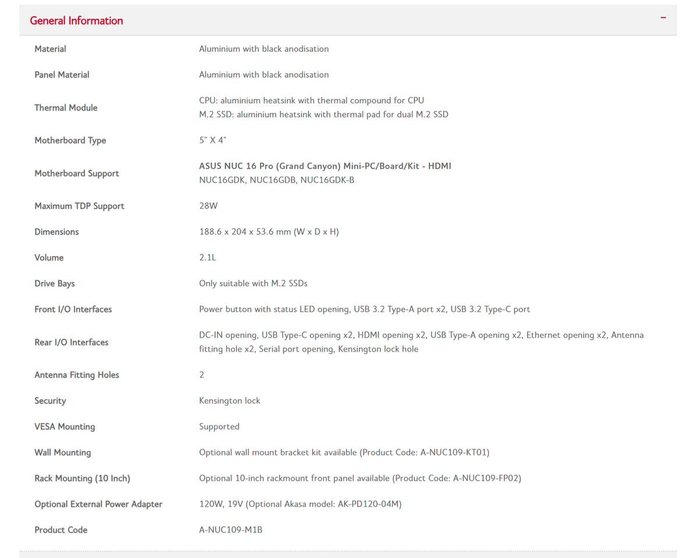

Akasa ha presentado la Newton N16, una caja de aluminio con refrigeración pasiva diseñada específicamente para el ASUS NUC 16 Pro. Se trata de un anuncio de producto: la compañía no ha detallado precio ni fecha de disponibilidad, y el foco está puesto en el formato y en la solución térmica.

## Una caja pasiva hecha a medida del NUC 16 Pro

La Newton N16 no es una carcasa genérica: está construida para alojar la placa del ASUS NUC 16 Pro con todos sus puertos nativos accesibles. El chasis mide 188,6 × 204 × 53,6 mm (ancho, fondo y alto) y ocupa un volumen de 2,1 litros, por lo que mantiene el perfil compacto típico de estos mini PC.

La plataforma que aloja combina procesadores Intel Core Ultra de la Serie 3 con gráficos Intel Arc integrados y una NPU dedicada. Akasa cifra en hasta 180 TOPS de rendimiento de IA a nivel de plataforma, una capacidad que sitúa al conjunto en el terreno de las cargas de inteligencia artificial locales y de borde.

## Refrigeración pasiva: silencio a cambio de límites térmicos

La propuesta de una caja fanless es sencilla de explicar: al no haber ventiladores, no hay ruido ni piezas móviles que se desgasten, pero la disipación depende por completo del chasis y eso impone un techo de consumo. En la Newton N16, módulos de aluminio dedicados trasladan el calor de la CPU y de dos SSD M.2 hacia las aletas exteriores, que lo evacúan por convección.

Ese diseño admite procesadores de hasta 28 W de TDP. Akasa advierte de un punto importante: los procesadores del NUC 16 Pro están calibrados por encima de ese límite, así que recomienda ajustar el límite de potencia a 28 W en la BIOS antes de usar la caja. Operarla por encima de ese valor sin el ajuste puede provocar limitación térmica o reducir la estabilidad del sistema. La compañía también precisa que la pasta térmica incluida (AK-TC5026) está cualificada para sus cajas pasivas y que conviene retirar los compuestos y almohadillas originales de la placa antes de aplicar la nueva.

## Conectividad y opciones de montaje

La caja se ofrece en dos versiones que se corresponden con las dos configuraciones traseras del NUC 16 Pro: la A-NUC109-M1B con dos aberturas HDMI y la A-NUC109-M2B con dos salidas DisplayPort. Ambas conservan la conectividad de doble LAN y el resto de la E/S nativa.

En el frontal hay un puerto USB 3.2 Gen 2 (10 Gbps) Type-C y dos USB 3.2 Gen 2 (10 Gbps) Type-A. En la parte trasera, además de la E/S de la placa, la Newton N16 incluye una abertura para puerto serie que se conecta al encabezado RS-232 interno mediante un cable incluido, un detalle pensado para equipos industriales, puntos de venta y kioscos que aún dependen de comunicaciones serie. También dispone de dos orificios para antenas externas de Wi-Fi y soporte para candado Kensington.

El montaje VESA viene soportado de serie. Como accesorios opcionales, Akasa ofrece el kit de montaje en pared (A-NUC109-KT01) y el panel frontal para rack de 10 pulgadas (A-NUC109-FP02), este último pensado para instalaciones de red o embebidas.

## Para qué tipo de usuario tiene sentido

Por su enfoque, la Newton N16 apunta a escenarios de funcionamiento continuo donde el ruido o el mantenimiento de los ventiladores son un problema: señalización digital, automatización industrial, terminales punto de venta, kioscos, vigilancia y computación embebida o de IA en el borde. No es una propuesta para quien busque rendimiento máximo sostenido, ya que el techo de 28 W acota las cargas de trabajo que puede mantener sin estrangular el procesador.

Para el lector que arma o despliega mini PC en España, la noticia es que el ecosistema de periféricos para las placas NUC que ASUS heredó de Intel sigue creciendo, y que una caja pasiva a medida es hoy una opción real para equipos que deben pasar meses encendidos. Queda pendiente, eso sí, el precio de cada versión y su disponibilidad, datos que Akasa todavía no ha comunicado.
