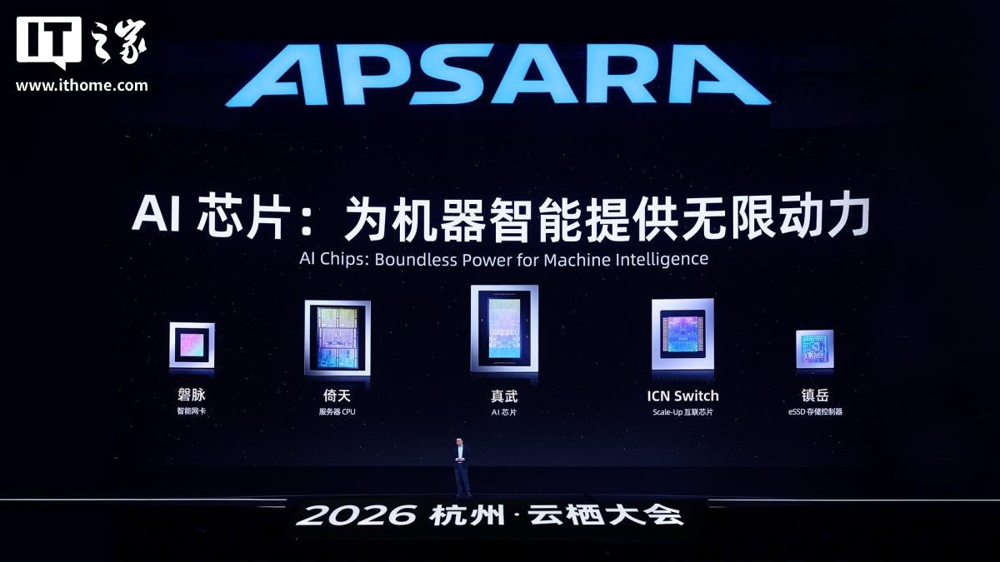
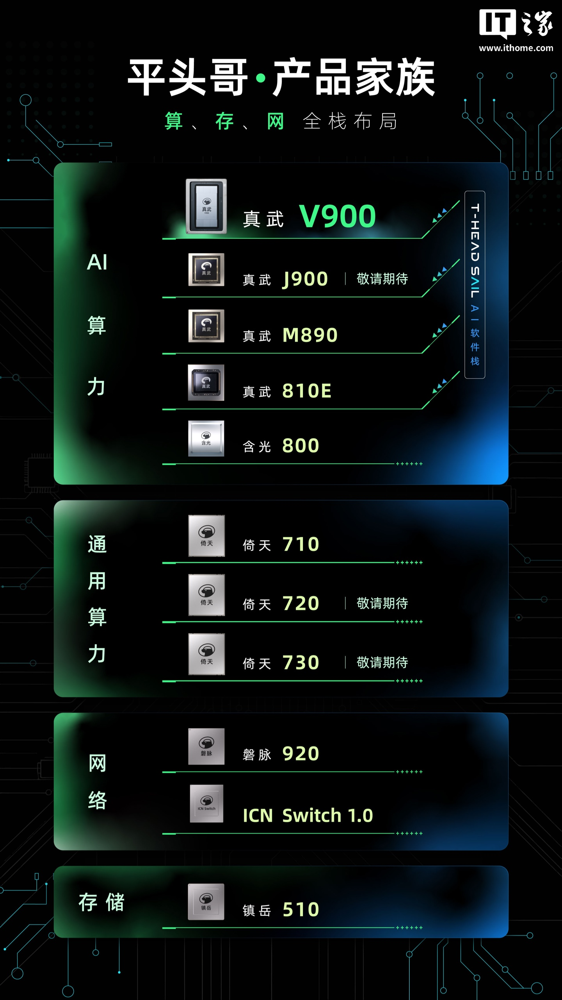

En el marco de la conferencia Yunqi 2026, celebrada en Hangzhou entre el 22 y el 24 de septiembre, Alibaba ha publicado por primera vez la hoja de ruta de su familia de procesadores para servidores Yitian (倚天). La filial de semiconductores del grupo, T-Head (平头哥), ha puesto fecha a tres generaciones —720, 730 y 750— y ha confirmado que la próxima etapa pasa por dejar atrás el diseño de terceros y firmar su propia microarquitectura.

El anuncio llegó junto a la presentación del chip de inteligencia artificial Zhenwu V900, la otra mitad de la apuesta de la compañía por controlar de principio a fin el hardware de sus centros de datos.

## Tres generaciones Yitian con el tercer trimestre de 2027 como meta

Lo más concreto del anuncio son las dos primeras paradas. Yitian 720 y Yitian 730 llegarán en el tercer trimestre de 2027. Según T-Head, el 720 mejorará a la vez el rendimiento por núcleo, la densidad de núcleos y la eficiencia energética. El 730 da un paso más: es el primer procesador de la casa construido sobre una microarquitectura diseñada íntegramente por T-Head, y su rendimiento de un solo núcleo medido en SPECint2017 por gigahercio alcanzará hasta 1,4 veces el del Yitian 710, el modelo que la compañía presentó en 2021.

La diapositiva de la hoja de ruta resume las especificaciones que maneja la compañía:

| Generación | Fecha prevista | Núcleos | Memoria | PCIe | Rendimiento de un núcleo por GHz |
| --- | --- | --- | --- | --- | --- |
| Yitian 710 | 2021 Q4 | 128 | 8 canales | 96 carriles | 1,0x |
| Yitian 720 | 2027 Q3 | 192 | 12 canales | 96 carriles | ~1,1x |
| Yitian 730 | 2027 Q3 | 32 (diseño propio) | 8 canales | 128 carriles | 1,25x–1,4x |
| Yitian 750 | sin fecha | n/d | n/d | n/d | n/d |

El medio chino MyDrivers, que siguió la misma presentación, añade que el 720 apunta a cargas de trabajo intensivas en concurrencia y a un coste por núcleo contenido, mientras que el 730 se orienta a escenarios sensibles a la latencia, como los nodos de cabecera de IA, y estrena multithreading simultáneo (SMT) de dos vías. Es decir, Alibaba no persigue un único tipo de carga, sino cubrir dos extremos del centro de datos con dos chips distintos.

## Del IP de Arm al núcleo propio

El dato con más recorrido es el cambio de estrategia que representa el Yitian 730. El Yitian 710 se apoyaba en los núcleos Neoverse de Arm, la vía habitual para quien quiere una CPU de servidor sin diseñar el corazón desde cero. Con el 730, T-Head pasa a usar su propio núcleo de alto rendimiento, un movimiento que solo tiene sentido si la compañía aspira a diferenciarse en eficiencia y no únicamente a ensamblar silicio ajeno. El salto recuerda al esfuerzo que otros fabricantes están haciendo en la misma dirección para los centros de datos, como el [laboratorio donde Arm desarrolla su CPU para cargas de IA](/noticias/arm-agi-cpu-lab/).

Para el Yitian 750, T-Head ya habla de una segunda generación de núcleo propio, sin fecha concreta. Lo relevante ahí no es el rendimiento bruto, sino la interconexión: el chip soportará el protocolo de bus ICN de la propia empresa —ICNLink en la diapositiva—, de modo que las CPU Yitian y los chips de IA Zhenwu podrán enlazarse directamente sin pasar por un intermediario. La idea es que el procesador y el acelerador de IA trabajen como un solo sistema y no como dos piezas comunicadas por un bus genérico.

## Zhenwu V900: el otro anuncio de la conferencia

El compañero de viaje del Yitian es el Zhenwu V900, el chip de IA que Alibaba presentó en el mismo evento. Según MyDrivers, sustituye al Zhenwu M890 con unas tres veces más de rendimiento, 216 GB de memoria y un ancho de banda de interconexión entre chips de 1.200 GB/s, y admite cálculo de baja precisión FP8 y FP4 de forma nativa. La compañía prevé producirlo en serie en el primer trimestre de 2027.

El objetivo declarado es conectar miles de estos chips para que operen como un único sistema capaz de entrenar y servir modelos de parámetros masivos. Es la razón por la que el anuncio de las CPU importa: sin procesadores propios que se comuniquen con los aceleradores a través de un bus también propio, la pila quedaría a medias.

## Qué cambia para el lector

Conviene ser claro con el alcance: son chips para centros de datos. No habrá un Yitian en un PC de escritorio ni en un portátil, y de momento no se han anunciado precios, clientes fuera de China ni disponibilidad internacional. Lo que cambia es el mapa de la computación en la nube china: Alibaba se coloca entre los pocos actores del mundo capaces de diseñar su propia CPU, su propio chip de IA, su propia red de interconexión y su propio controlador de almacenamiento.

Para el usuario hispanohablante el efecto es indirecto pero real. Cuanto más completa sea la pila propia de los grandes proveedores chinos, menos dependerán de Intel, AMD, Arm o Nvidia para escalar sus servicios, y más probable es que aparezcan alternativas de precio en la nube y en los servicios de IA que consume a diario. La pregunta abierta es la de siempre con este tipo de anuncios: qué rendimiento tendrán esos chips en cargas reales y cuánto tardarán en salir de los centros de datos de la propia Alibaba.
