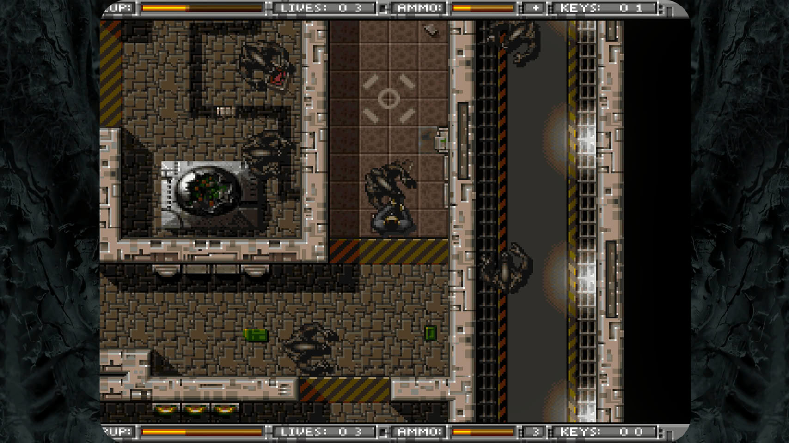
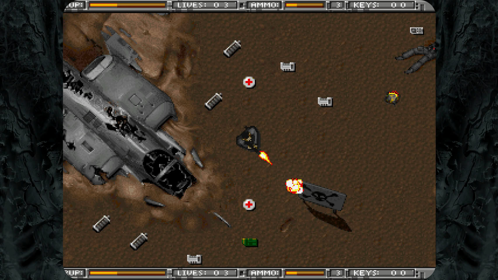
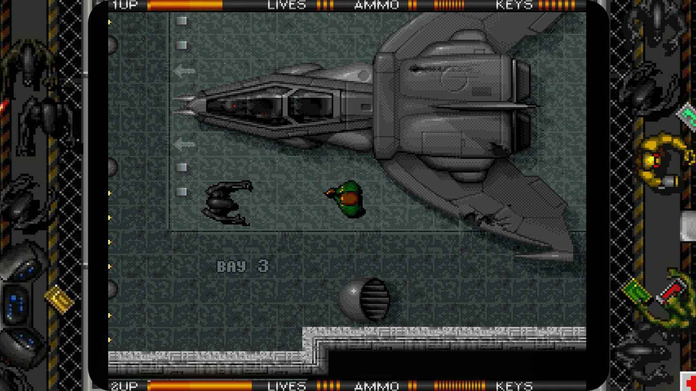
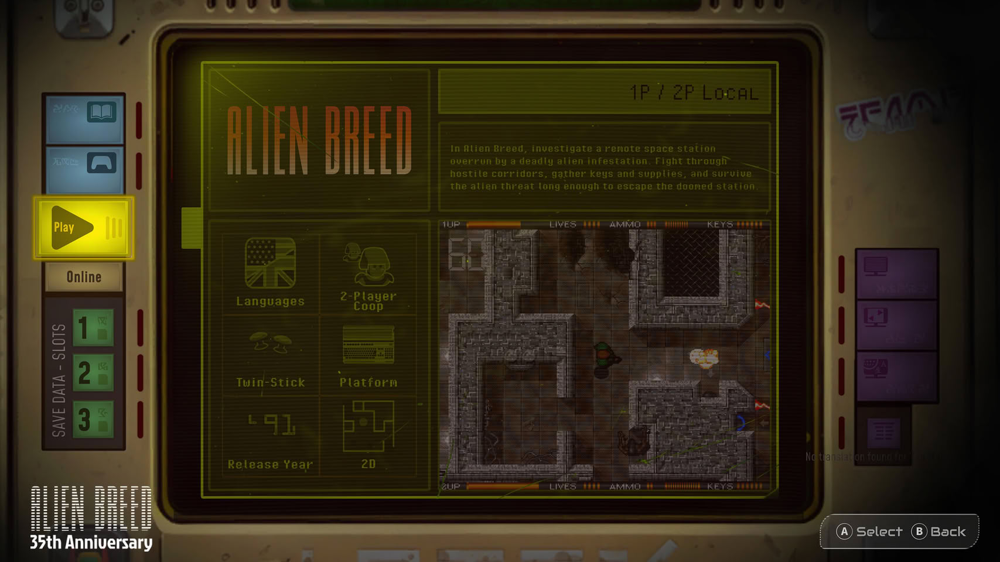
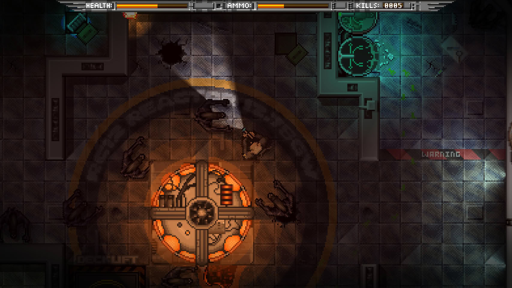
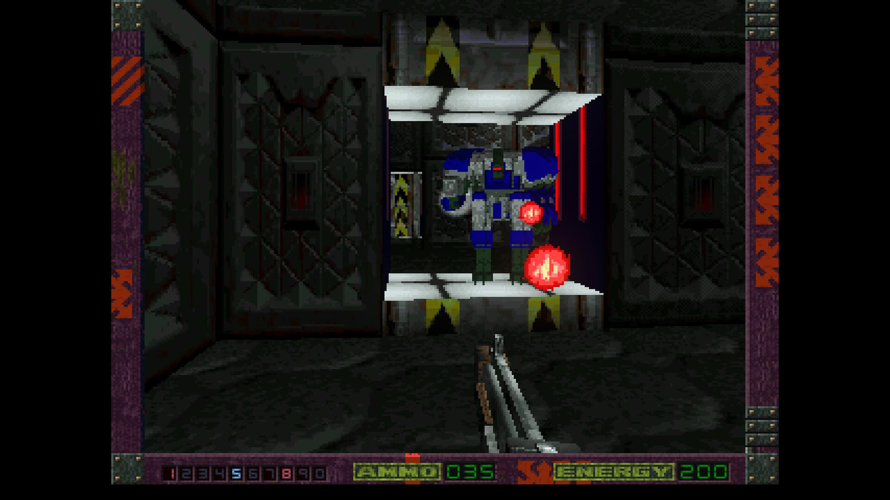
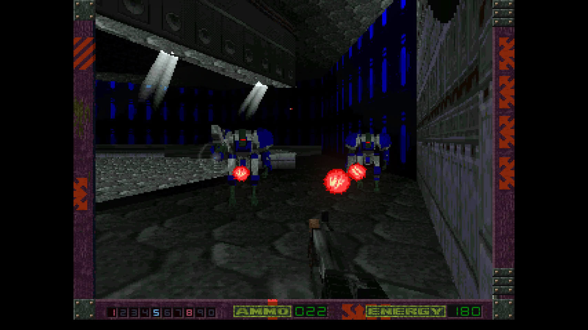

La colección Alien Breed 35th Anniversary Collection ya está a la venta en PC (Steam, GOG y Epic Games Store), PlayStation 5 y Xbox Series X|S. Commodore la publica en colaboración con Team17, el estudio original, y con la plataforma de preservación retro Antstream Arcade. La versión para Nintendo Switch llegará más adelante en 2026.

El lanzamiento recupera la primera era de la saga: los seis juegos publicados entre 1991 y 1996, con sus variantes de plataforma, demostraciones originales y material de archivo acumulado durante dos décadas.

## Qué incluye la colección Alien Breed 35th Anniversary

El recopilatorio reúne Alien Breed (1991), Alien Breed: Special Edition (1992), Alien Breed II: The Horror Continues (1993, en versiones ECS y AGA), Alien Breed: Tower Assault (1994, en versiones Amiga y Amiga CD32), Alien Breed 3D (1995, versión Amiga CD32) y Alien Breed 3D II: TKG (1996). También conserva las diferencias entre las máquinas OCS y AGA, es decir, entre los Amiga con el juego de chips original y los que montaban la arquitectura gráfica avanzada.

Para el lector que no vivió aquella época: el Alien Breed original de 1991 era un juego de disparos cenital donde la munición se agotaba, las puertas exigían tarjetas de acceso y una cuenta atrás de autodestrucción no esperaba a nadie. La saga cerró su etapa clásica con dos entregas en primera persona, Alien Breed 3D y su secuela, que exprimieron el hardware del Amiga más allá de lo que muchos creían posible.

## Controles modernos y modos nuevos sin desvirtuar los originales

La colección añade control con dos palancas para apuntar con independencia del desplazamiento, aunque el esquema clásico sigue disponible desde el menú para quien aprendió a jugar con un solo botón. Se suman estados de guardado instantáneo, filtros de pantalla retro y soporte de vibración.

Hay además dos alicientes para veteranos: el modo Horda, inédito en la saga, propone oleadas crecientes de enemigos con los recursos que el jugador consiga recoger; y el modo Rush incorpora cooperativo en línea, de modo que el segundo jugador ya no necesita estar en la misma habitación.

## Un museo virtual con material inédito y precio de lanzamiento

Junto a los juegos, el museo virtual reúne soportes físicos originales, arte de mercadotecnia, bandas sonoras, entrevistas con desarrolladores y material de proyectos que nunca se publicaron, entre ellos un Alien Breed cancelado para PSP y un juego de estrategia en tiempo real de la misma saga. Es una propuesta de preservación en la línea de otras iniciativas recientes, como [el museo de Game Boy distribuido en un cartucho jugable en hardware real](/noticias/game-boy-museum-cartridge-meta/).

La colección cuesta 24,99 euros y ya puede adquirirse en las tiendas digitales de PC, PlayStation 5 y Xbox Series X|S. La edición de Nintendo Switch se publicará antes de que termine 2026.
