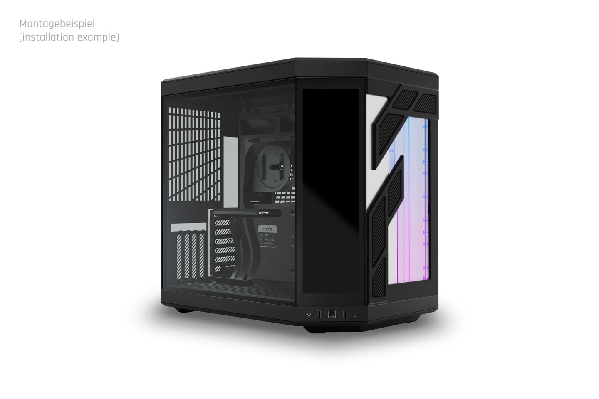
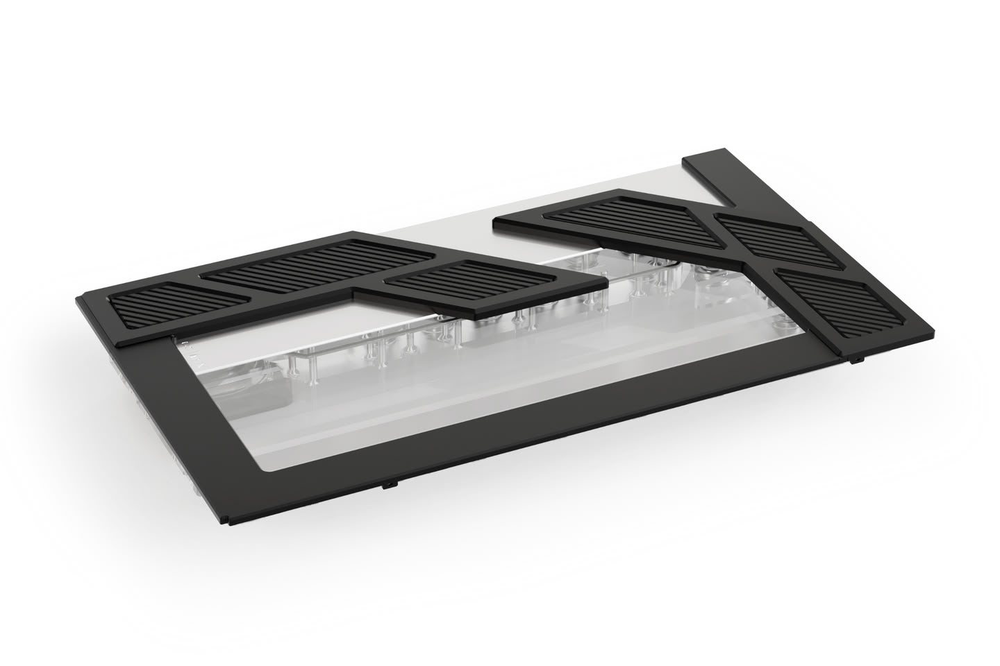

Alphacool amplía su gama Apex con dos nuevas placas de distribución (distro plates) diseñadas a medida para las cajas Hyte Y70 y Hyte Y70 Touch Infinite. Las placas sustituyen la cubierta frontal de la caja y convierten el circuito de refrigeración líquida en un elemento visible del montaje, además de funcional.

## Un frontal a medida para la Hyte Y70

Las distro plates se han desarrollado específicamente para la serie Y70, con un diseño ajustado a las formas de la caja. Se comercializan en negro y blanco, a juego con los acabados oficiales de la Hyte Y70, de modo que se integran en el conjunto sin romper su estética panorámica.

Como parte de la línea Apex, apuestan por materiales de gama alta: están fabricadas en vidrio acrílico de alta calidad que deja a la vista el circuito, con iluminación aRGB integrada que añade acentos de luz al equipo. La compañía alemana, con sede en Braunschweig y más de 20 años de experiencia en refrigeración líquida para PC, reserva esta denominación para sus productos de mayor acabado.

## Racores y soporte de bomba pensados para durar

Uno de los detalles más cuidados está en los racores. Los conectores de latón cromado con rosca G1/4" no se atornillan directamente sobre el acrílico: son piezas de dos elementos que se entrelazan durante la instalación con una junta tórica. Esta construcción reduce la tensión sobre el material y ayuda a prevenir fugas provocadas por grietas alrededor de los conectores, uno de los puntos débiles clásicos de este tipo de placas.

El soporte de bomba, de nuevo desarrollo, admite de forma nativa los formatos D5/VPP y DDC, lo que da más margen a la hora de planificar un circuito personalizado. Quien prefiera colocar la bomba en otro punto del loop dispone además de una tapa de sellado específica para los anclajes VPP/D5, que cierra de forma segura la posición de bomba sin usar.

## Precio y disponibilidad

Los dos modelos, Apex Distro Plate Y70 D5/DDC en negro y en blanco, tienen un precio recomendado de 319,98 euros. La tapa de sellado para el soporte de bomba VPP/D5 cuesta 12,98 euros.

Para el lector español que esté montando o ampliando un circuito personalizado en una Y70, la novedad simplifica sobre todo el tendido de tubos: la placa hace de colector central y evita recorridos largos entre componentes. Quienes amplíen su equipo por partes pueden combinarla con otros elementos del circuito, como los [bloques de CPU Mycro Pro de Thermal Grizzly](/noticias/thermal-grizzly-mycro-pro/), pensados para abaratar la entrada a la refrigeración líquida a medida en plataformas AMD e Intel.
