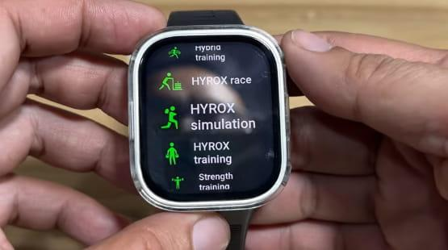

El **Amazfit BIP Max** es uno de los pocos relojes inteligentes de precio contenido que incluye un seguimiento específico para **HYROX**, el formato de carrera que combina resistencia cardiovascular y fuerza. Así lo plantea **Smartwatch Specifications**, que dice haber probado la función HYROX del reloj y describe las herramientas que Amazfit ha agrupado bajo ese nombre. La propuesta es interesante precisamente por dónde se sitúa: un reloj de gama económica que intenta cubrir un deporte que hasta ahora solía depender de relojes deportivos mucho más caros.

## Qué mide el modo HYROX del Amazfit BIP Max

La función **HYROX Race** está diseñada, según Amazfit, para registrar las **ocho estaciones de trabajo funcional** de la prueba y los **tramos de un kilómetro** que se intercalan entre ellas. Es decir, el reloj no se limita a cronometrar la sesión completa: intenta desglosarla estación por estación para que el atleta vea dónde gana y dónde pierde tiempo.

Ese desglose es justamente lo que separa un modo genérico de "entrenamiento por intervalos" de un modo realmente adaptado a HYROX. La estructura de la prueba —alternar fuerza y carrera durante toda la sesión— castiga a quien no controla el ritmo en cada bloque, y tener el detalle de cada estación ayuda a prepararla mejor.

## Simulacros con voz guía y entrenamiento

El reloj añade una función de **simulación de recorrido**, pensada para ensayar la prueba fuera de competición. Las opciones que recoge la fuente son el **recorrido completo**, el **medio recorrido**, la **primera mitad**, la **segunda mitad** y una **simulación personalizada**. Durante el ensayo, una **voz del entrenador** va narrando cada actividad, y el reloj muestra **frecuencia cardiaca, tiempo de actividad, calorías y duración total**. La actividad se puede saltar pulsando el **segundo botón inferior** del reloj.

En el apartado de preparación, **HYROX Training** incluye entrenamiento libre y la posibilidad de elegir el tipo de sesión, con acceso a los **planes de entrenamiento de Zepp**. La fuente menciona además un temporizador con tres formatos de trabajo muy usados en entrenamiento funcional:

- **TABATA** — alterna 20 segundos de ejercicio con 10 de descanso, habitualmente durante ocho ciclos.
- **AMRAP** — consiste en completar tantas rondas o repeticiones como sea posible dentro de un tiempo fijado.
- **EMOM** — cada minuto empieza una serie asignada, con el tiempo restante como descanso antes de la siguiente ronda.

## Qué no confirma la fuente (y qué cambia para ti)

Conviene ser claro con los límites de esta información. La pieza de **Smartwatch Specifications** describe las funciones, pero **no publica el precio, la autonomía, los sensores, el tamaño de pantalla ni la disponibilidad** del BIP Max, y tampoco ofrece cifras del supuesto test de la función HYROX. Son los datos que un comprador necesita antes de decidir, y aquí sencillamente no están.

Tampoco conviene presentar este reloj como un equivalente a un deportivo de gama alta. Lo que ofrece es un **modo HYROX dedicado** —desglose por estaciones, simulacros guiados por voz y temporizadores de entrenamiento funcional— dentro de un dispositivo de precio contenido; lo que no está sobre la mesa, al menos con esta fuente, es el ecosistema de métricas avanzadas, navegación o análisis de recuperación que sí caracterizan a los relojes deportivos premium. Para quien compite en HYROX y busca lo esencial, la propuesta puede encajar; para quien espera un sustituto completo de un reloj de triatlón o de montaña, las expectativas deben ser otras.

El contexto de la categoría ayuda a situarlo. Amazfit ya había apostado por acercar prestaciones de gama alta a precios ajustados con el [T-Rex 3 Pro frente a los Garmin Fénix](/noticias/amazfit-t-rex-3-pro-garmin-rival/), y el sector arrastra desde hace tiempo una distancia notable entre lo que un reloj **promete medir** y lo que realmente **aporta con evidencia**, un debate que ya hemos abordado al hablar de las [puntuaciones de preparación física sin respaldo suficiente](/noticias/wearable-readiness-scores-evidence-gap/).

Para el lector hispanohablante que entrena HYROX, la conclusión práctica es doble. Por un lado, que un reloj económico incorpore un modo específico para este deporte amplía las opciones de quienes no quieren gastar en gama alta para cronometrar sus series. Por otro, que todavía falten precio y autonomía significa que **no hay una recomendación de compra posible** con estos datos: toca esperar a la ficha completa o a un análisis con mediciones reales antes de decidir.
