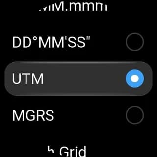
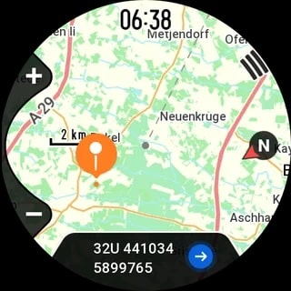

El Amazfit Cheetah 2 Ultra está recibiendo una mejora de navegación con el firmware 6.4.16: siete formatos de coordenadas, entre ellos UTM y MGRS, según los reportes de propietarios recogidos por la prensa especializada. La novedad acerca el reloj a la navegación de montaña seria, aunque llega con una ausencia notable.

## Qué trae la actualización del Cheetah 2 Ultra

El nuevo ajuste aparece en Ajustes > Preferencias > Coordenadas y ofrece siete opciones: grados decimales, grados con minutos decimales, grados con minutos y segundos, MGRS, UTM, cuadrícula británica y cuadrícula japonesa. Así lo describen los usuarios que ya tienen instalada la versión 6.4.16.

La clave está en los formatos de cuadrícula. UTM permite trabajar con referencias de cuadrícula en lugar de latitud y longitud, el sistema habitual de los mapas topográficos, mientras que MGRS ofrece otra opción reticular para quien ya la utiliza. La cuadrícula británica encaja con los mapas del Ordnance Survey en Gran Bretaña y la japonesa cumple la misma función con la cartografía compatible de Japón: Zepp Health no se limitó a añadir UTM y dar el tema por cerrado.

## Por qué importa para la navegación de montaña

No es la primera mejora de navegación que recibe el reloj desde su lanzamiento. Un firmware anterior sumó la distancia restante, el ascenso y el descenso hasta el siguiente punto de paso y el destino final, además de mejoras del GPS bajo arboleda. Después, Zepp OS 6 trajo la vista previa de rutas y más cambios en los mapas, con nuevas opciones de escala.

Los nuevos formatos de coordenadas encajan mejor con ese posicionamiento de reloj de trail que cualquier función generalista: la mayoría de los usuarios los ignorará, pero para senderistas, corredores de trail y cualquiera que combine el reloj con mapas en papel, cubren una carencia real.

## Qué cambia para el lector y qué falta todavía

Lo extraño es que las coordenadas aún no se pueden añadir como campo de datos de entrenamiento. Se consultan desde la pantalla del mapa, pero no es posible mantenerlas visibles junto al tiempo transcurrido, la distancia o el desnivel. Para navegar con mapa de papel, llevar la referencia UTM o MGRS fija en una pantalla de entrenamiento sería mucho más rápido que volver al mapa cada vez.

La gestión de puntos de paso también sigue siendo básica: el mismo firmware añade más iconos, pero los usuarios indican que los puntos guardados no se pueden renombrar y que ni las rutas ni los puntos se pueden ordenar por nombre o por distancia.

Con todo, el firmware 6.4.16 deja al Cheetah 2 Ultra con un sistema de coordenadas claramente mejor. Conviene recordar que se trata de un despliegue en curso del que informa la prensa especializada a partir de reportes de usuarios: la actualización puede tardar en llegar a cada región y conviene comprobar su disponibilidad en la aplicación Zepp. Para poner el movimiento en contexto, Amazfit también refuerza su gama outdoor por otros flancos, como muestra [el T-Rex 3 Pro que reta a los Garmin Fénix](/noticias/amazfit-t-rex-3-pro-garmin-rival/).
