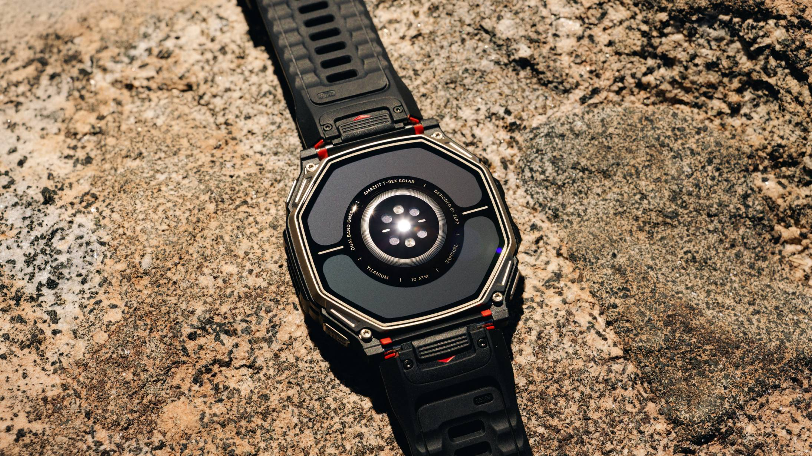

Amazfit ha presentado el **T-Rex Dual Solar**, un reloj de aventura que combina por primera vez en su catálogo una pantalla **AMOLED** con carga solar. El movimiento es llamativo porque la carga solar y los paneles AMOLED brillantes suelen considerarse incompatibles: los relojes solares de Garmin, hasta ahora la referencia del segmento, recurren a pantallas de bajo consumo tipo *memory-in-pixel* para no sacrificar autonomía. Amazfit asegura haber resuelto esa tensión y, además, ha añadido un detalle poco habitual: una segunda placa solar en la parte trasera que permite llevar el reloj del revés.

## Carga solar por las dos caras en el T-Rex Dual Solar

La novedad central del T-Rex Dual Solar no está en la esfera, sino en cómo aprovecha la luz. El reloj carga desde la parte frontal, como cualquier modelo con panel solar, pero incorpora una **segunda placa solar más eficiente en la tapa trasera**. Según Amazfit, esa placa puede **revivir una batería completamente agotada** si recibe suficiente luz solar. En la práctica, eso abre dos gestos insólitos: girar el reloj y llevarlo *inside-out* en la muñeca, o dejarlo apoyado en una roca con la tapa trasera mirando al sol.

La compañía enmarca la función en un uso de emergencia. "Para quienes se aventuran en el límite del mapa, lo solar ofrece algo más: una forma de devolver la vida a un reloj completamente descargado usando la luz del sol cuando no hay energía tradicional disponible, y así recuperar funciones esenciales como los mapas y la información de ruta", señala Amazfit en el comunicado recogido por TechRadar. La carga desde ambas caras se produce, según la marca, en condiciones de **50.000 lux o más durante tres horas o más**.

## Autonomía, pantalla y navegación

El T-Rex Dual Solar se apoya en cifras de autonomía propias de la gama de aventura. Amazfit declara hasta **25 días de uso normal**, ampliables a **35 días en condiciones solares óptimas**, y **41 horas en modo GPS preciso**. La caja de **titanio** integra una **linterna con modos de luz roja y blanca**, mientras que el cristal de **zafiro** cubre una pantalla capaz de alcanzar **3.000 nits de brillo**.

En navegación incluye mapas en color precargados, incluso mapas de esquí, planificación inteligente de rutas con indicaciones giro a giro, puntos de ruta al estilo del Apple Watch Ultra y **LiveShare**, la función de Amazfit equivalente al LiveTrack de Garmin para compartir la ubicación en tiempo real.

## Por qué importa: AMOLED con solar y un precio de gama alta

Que un AMOLED pueda cargarse con luz solar es una barrera técnica que Garmin no ha cruzado todavía. Sus relojes solares combinan pantallas de bajo consumo con su tecnología Power Glass, de modo que renuncian al brillo y al color de un panel AMOLED. Amazfit sostiene que ahora ofrece las dos cosas a la vez. "Con el T-Rex Dual Solar no queríamos que los usuarios tuvieran que elegir entre la pantalla brillante y premium que quieren a diario y la resistencia de batería que necesitan al aire libre. Unir AMOLED y solar por primera vez nos permite ofrecer ambas", afirma **Sara Webster Wylie**, vicepresidenta de marketing global de Amazfit.

Para la gama T-Rex, orientada al trail y la aventura, el salto tiene un coste. El T-Rex Dual Solar se vende en Estados Unidos por **649,99 dólares**, un precio inusualmente alto para Amazfit, que suele competir por debajo de sus rivales. El fabricante no ha detallado todavía las tarifas para otras regiones; TechRadar apunta a unos 500 libras o 900 dólares australianos como referencia aproximada.

## Qué cambia para el lector

El dato a retener es que la promesa de autonomía ya no obliga a renunciar a una pantalla AMOLED, al menos sobre el papel y según la propia compañía: la capacidad de resucitar una batería vacía con luz solar es una afirmación de Amazfit que aún no ha pasado por una prueba independiente. Para quien compara relojes de aventura, el T-Rex Dual Solar entra en una categoría de precio nueva para la marca, justo donde compiten los Garmin Fénix. Conviene, por tanto, esperar precios y disponibilidad oficiales para España antes de valorar si el salto de gama se traduce en una ventaja real frente a los rivales establecidos, como ya ocurre con propuestas más económicas de la misma familia, caso del [Amazfit T-Rex 3 Pro](/noticias/amazfit-t-rex-3-pro-garmin-rival/).
