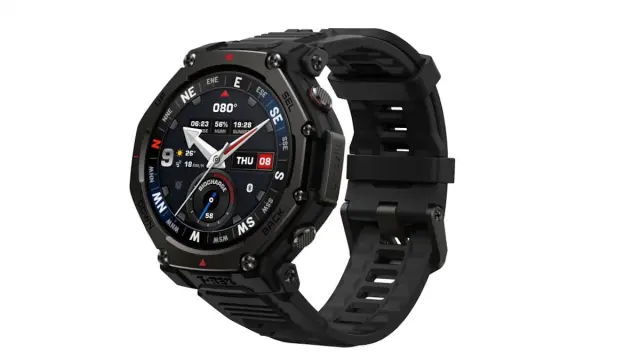

El **Amazfit T-Rex 3 Pro** es un reloj deportivo pensado para trail y aventura que, por prestaciones, materiales y autonomía, aspira a instalarse en el terreno de los relojes premium. Su versión de 44 mm aparece en Amazon por **304 €**, con un descuento del **24 %** sobre el precio recomendado mostrado. ComputerHoy presenta el modelo como una alternativa a considerar frente a la familia Garmin Fénix, y ese es el marco de esta pieza: qué aporta el reloj y hasta dónde llega de verdad la comparación.

## Qué ofrece el Amazfit T-Rex 3 Pro

La construcción apunta directamente a un uso exigente: cristal de **zafiro**, y bisel y botones de **titanio de grado 5**. La resistencia al agua llega a **10 ATM**, con actividades de buceo de hasta **45 metros**. Está disponible en cajas de **44 y 48 mm** para ajustarse a distintos tamaños de muñeca.

La pantalla es uno de sus argumentos principales. La versión de 44 mm monta un panel **AMOLED de 1,32 pulgadas** con resolución de **466 x 466 píxeles** y un brillo máximo de **3.000 nits**; la de 48 mm sube a **1,5 pulgadas y 480 x 480 píxeles**. El zafiro añade una protección relevante para quien usa el reloj en montaña o al aire libre.

En navegación incorpora posicionamiento mediante **seis sistemas de satélites**, **GPS de doble banda** y **mapas sin conexión**, además de planificación de rutas, búsqueda de puntos de interés, creación de recorridos circulares y recálculo automático. Son funciones pensadas para zonas con cobertura móvil poco fiable. En el apartado deportivo suma **más de 180 modos**, métricas como VO₂ Max, carga de entrenamiento y efecto del entrenamiento, y **Zepp Coach** para generar planes de running a distintas distancias.

La autonomía marca diferencias frente a muchos relojes inteligentes convencionales: hasta **17 días de uso típico** en el modelo de 44 mm y hasta **25 días** en el de 48 mm. Con GPS preciso, las cifras oficiales alcanzan **26 horas** en el pequeño y **38 horas** en el grande. A ello se suman una **linterna LED bicolor** con luz blanca, roja y modo Boost, señal SOS, micrófono y altavoz para llamadas Bluetooth y el asistente Zepp Flow. En salud, el sensor **BioTracker 6.0 PPG** registra la frecuencia cardiaca y se acompaña de sensores de movimiento, altímetro barométrico, temperatura y luz ambiental.

## El pulso con los Garmin Fénix

ComputerHoy enmarca el T-Rex 3 Pro como un rival duro frente a los Garmin Fénix: un reloj que, según su análisis, es **equivalente** a la familia de gama alta **por la mitad de precio**. Conviene leer esa afirmación con precisión. Se trata de una pieza de recomendación de compra con enlaces de afiliación, y la equivalencia se apoya en las especificaciones que el propio medio enumera —materiales, pantalla, navegación y autonomía—, no en una medición independiente ni en una prueba comparativa cara a cara entre ambos modelos.

Eso no resta valor a lo que sí está sobre la mesa. El T-Rex 3 Pro reúne en su ficha elementos que suelen asociarse a relojes deportivos caros: zafiro, titanio de grado 5, GPS de doble banda, mapas sin conexión, 3.000 nits de brillo y varias semanas de batería. La comparación con los Fénix tiene sentido como referencia de categoría, pero el veredicto sobre cuál es mejor para cada deportista exige contrastar uso real, ecosistema y soporte, algo que la fuente no desarrolla.

## Qué cambia para el comprador

El dato central es el precio: **304 €** en la versión de 44 mm, un **24 % por debajo** del precio recomendado mostrado. ComputerHoy advierte de que la oferta puede cambiar, por lo que conviene **comprobar el importe antes de comprar**. Es la misma precaución razonable en cualquier rebaja de Amazon: el descuento es válido en el momento de consultarlo, no una garantía permanente.

Para quien venía siguiendo la gama alta, el contexto de precios en 2026 es relevante. El [Garmin Fénix 8 bajó a 698 €](/noticias/garmin-fenix-8-price-drop/) tras el anuncio del Fénix 9, de modo que la distancia entre un deportivo premium rebajado y el T-Rex 3 Pro se ha estrechado. En paralelo, Garmin sigue ampliando su catálogo con propuestas de otro perfil, como su [pulsera sin pantalla Cirqa](/noticias/garmin-cirqa-screenless-band/), señal de que el segmento se está diversificando.

La decisión pasa, por tanto, por separar lo que es una ficha técnica solvente de lo que es una promesa de equivalencia. El T-Rex 3 Pro ofrece argumentos de gama alta a un precio contenido; cuánto de esos argumentos se traduce en una experiencia equiparable a la de un Fénix es algo que la propia comparación en la que se basa la oferta no llega a demostrar.
