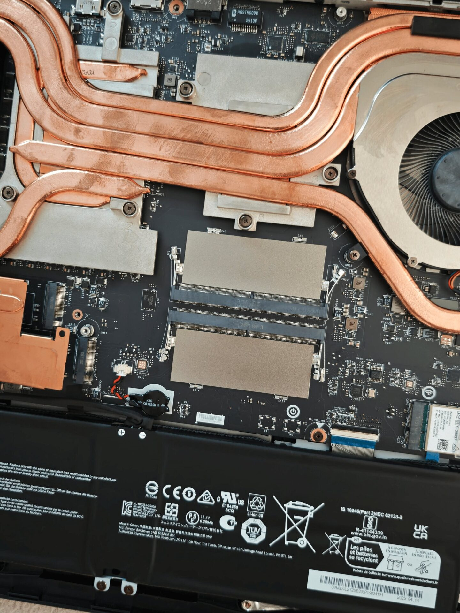
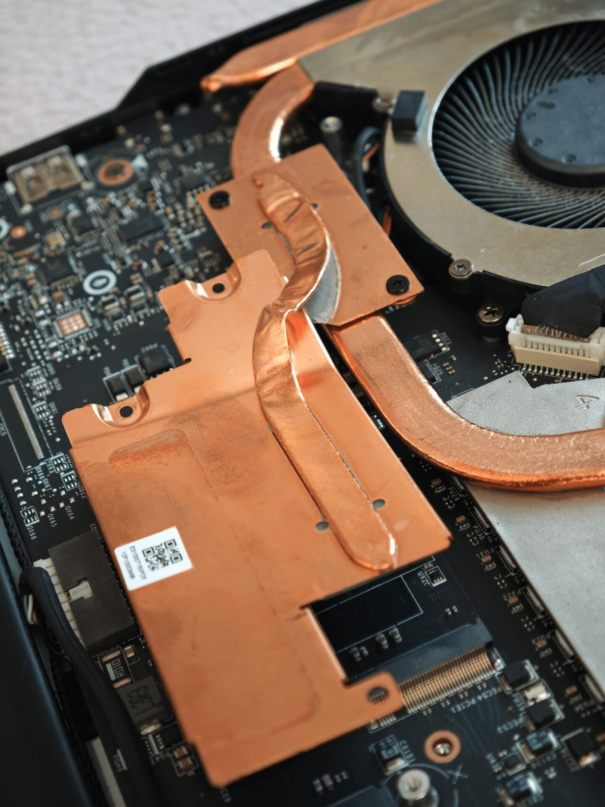

Un comprador ha denunciado en el subforo r/GamingLaptops que el portátil gaming MSI Vector A18 HX de segunda mano que adquirió en Amazon llegó sin la memoria RAM y sin el SSD que anunciaba la ficha del producto. El equipo, descrito como «en muy buen estado», no llegó a arrancar. Al abrirlo, comprobó que alguien había retirado antes del envío los dos componentes más valiosos de la configuración. El caso, compartido por el usuario JustMe2679 y recogido por Wccftech, engrosa la lista de incidentes con hardware de segunda mano.

## Un MSI Vector A18 HX «en muy buen estado» que llegó vacío

La ficha del MSI Vector A18 HX prometía un procesador AMD Ryzen 9 9950HX, una tarjeta gráfica dedicada GeForce RTX 5070 Ti y 32 GB de memoria RAM. El comprador no desveló el precio que pagó, pero el estado «muy bueno» del anuncio y el encarecimiento general de la memoria y el almacenamiento lo llevaron a dar el paso. Cuando abrió la caja, faltaban justo la RAM y el SSD: los dos elementos que explican buena parte del valor del equipo.

## Una extracción con daños

El robo no fue limpio. Una de las láminas de cobre —el tubo de calor que cubre los disipadores de la zona del SSD— aparecía forzada y rota, según se ve en las imágenes que acompañan al testimonio. El disipador principal, el que refrigera la CPU y la GPU, en cambio, no mostraba daños visibles, lo que apunta a que la manipulación se concentró en los módulos de memoria y almacenamiento. Un detalle relevante es que el portátil lo vendía directamente el propio minorista y no un vendedor ajeno del marketplace.

## Por qué importa

Con los precios de la memoria RAM y los SSD al alza, el mercado de segunda mano se ha vuelto más atractivo para quien busca hardware gaming sin pagar la prima de una unidad nueva. El problema es que, en ese segmento, la verificación es casi un acto de fe: ni siquiera un vídeo de funcionamiento enviado por el vendedor garantiza que el producto no se manipule después, justo antes de meterlo en la caja. Lo que sí aporta cierta red de seguridad es comprar a través de una plataforma con protección al comprador, como la propia Amazon, capaz de responder ante una anomalía de este tipo.

## Qué cambia para el lector

Si se compra hardware de segunda mano, conviene grabar el unboxing, revisar la configuración nada más recibirla y reclamar de inmediato por los canales de la plataforma, sin esperar a montarlo todo. La RAM y el SSD son, precisamente, los componentes más fáciles de extraer y revender, de modo que son los primeros que hay que comprobar. No es un caso aislado: hace apenas unos días, otro usuario denunció haber recibido [un Ryzen 7 9800X3D falsificado comprado en una tienda física](/noticias/fake-9800x3d-official-store/), con el precinto intacto y sin derecho a devolución. En ambos casos se repite el mismo patrón: la confianza en el vendedor no sustituye a la comprobación.
