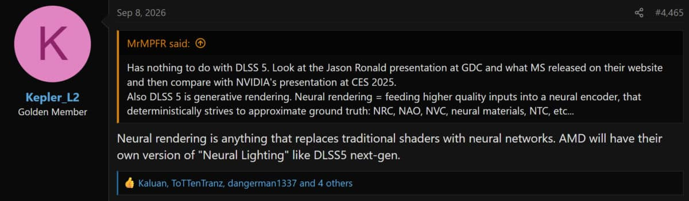
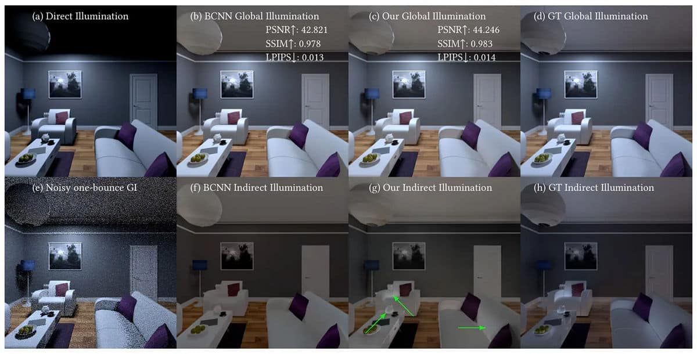
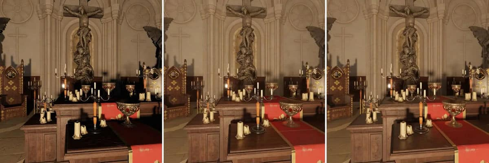

AMD **no** ha confirmado la existencia de una tecnología llamada «Neural Lighting». La información procede de una filtración del usuario **Kepler_L2**, recogida por el medio especializado **VideoCardz**, que etiqueta su propia publicación como *rumor*. Según esa filtración, la compañía estaría desarrollando una técnica de renderizado neuronal equivalente a **DLSS 5** de NVIDIA, destinada a sus futuras tarjetas gráficas.

Conviene separar dos planos. Por un lado, lo que afirma un filtrador y que nadie ha verificado. Por otro, lo que AMD ha hecho público: dos proyectos de investigación sobre iluminación generativa en su plataforma **GPUOpen**. La filtración interpreta ese material como la base de una futura función comercial, pero el salto del laboratorio al producto no está anunciado.

## Qué dice la filtración

Kepler_L2 sostiene que el renderizado neuronal consiste en sustituir los shaders tradicionales por redes neuronales, y afirma que AMD tendrá «su propia versión de *Neural Lighting*, como DLSS 5, en la próxima generación». Preguntado por si quedará limitada a **RDNA 5**, el filtrador responde que «probablemente», porque este tipo de técnicas «pesa bastante». También aclara que no debe confundirse con **Ray Regeneration**, que describe como un proceso de *denoising*.

VideoCardz puntualiza algo importante: la propuesta concreta de implementación que plantea Kepler_L2 —dar al modelo acceso directo a datos 3D del juego, como geometría o BVH, datos de rayos, *buffers* de profundidad y materiales— es una **opinión personal** del filtrador, no el diseño confirmado de AMD. El medio insiste en que se trata de un rumor sin validación de la compañía.

## Lo que AMD sí ha publicado

Al margen del rumor, AMD ha publicado en GPUOpen, su portal para desarrolladores, dos investigaciones sobre iluminación global (GI) con redes neuronales. Son documentos públicos, con autoría y fecha:

- ***Lightweight attention-based indirect illumination*** (20 de agosto de 2026, presentado en SIGGRAPH 2026): un modelo ligero basado en atención que combina la información del G-buffer en espacio de pantalla con *reflective shadow maps* para reconstruir iluminación indirecta, incluida la que llega desde fuera del campo de visión. Según AMD, el modelo tiene 2,19 millones de parámetros, 432 GFLOPs y tarda 45,56 ms a 512×512 en un acelerador Instinct MI250, sin optimizaciones de inferencia.
- ***Temporally stable generative illumination with a one-step diffusion model*** (9 de septiembre de 2026, presentado en ECCV 2026): un modelo de difusión latente de un solo paso que genera iluminación global estable a partir de luz directa, geometría, materiales y vectores de movimiento. Un decodificador VAE temporal reutiliza el fotograma anterior para evitar el parpadeo, un requisito para cualquier uso en tiempo real.

En paralelo, AMD ya anunció en marzo su tecnología **FSR Diamond**, pensada para la próxima generación de consolas y PC, con reescalado por aprendizaje automático, generación múltiple de fotogramas y reconstrucción de rayos. Eso sí: son funciones presentadas de cara al futuro, no una función llamada «Neural Lighting» que esté en el mercado.

## Qué cambia para el lector

Para quien esté pensando en comprar una tarjeta gráfica, esta filtración no cambia nada a corto plazo. Si el rumor es cierto, la función requeriría hardware de nueva generación y, por tanto, no llegaría a las GPU Radeon que se venden hoy. Y si es falso o se queda en investigación, tampoco habrá consecuencias para el comprador actual.

El desafío real de AMD no es anunciar la tecnología, sino conseguir que los desarrolladores la adopten. VideoCardz recuerda que, en generaciones anteriores, varias funciones de FSR llegaron más tarde de lo previsto o con soporte limitado a ciertos modelos, dejando al resto de arquitecturas para después. NVIDIA tampoco lo ha tenido fácil: según el mismo medio, DLSS 5 se ha añadido de forma oficial a un solo juego y ha llegado a muchos otros gracias a mods.

Por ahora, lo prudente es tratar «Neural Lighting» como lo que es: una filtración sin confirmar. AMD no ha emitido ningún comunicado y no hay fecha, especificaciones ni lista de juegos compatibles.
