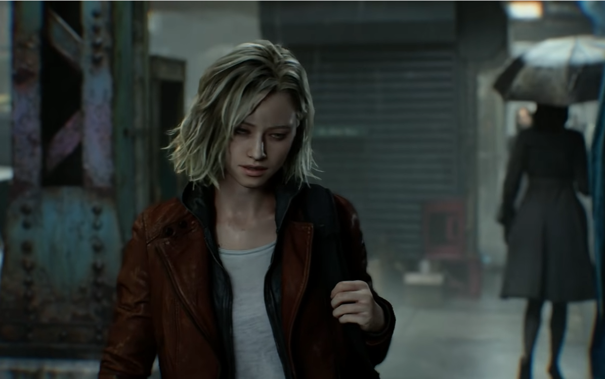
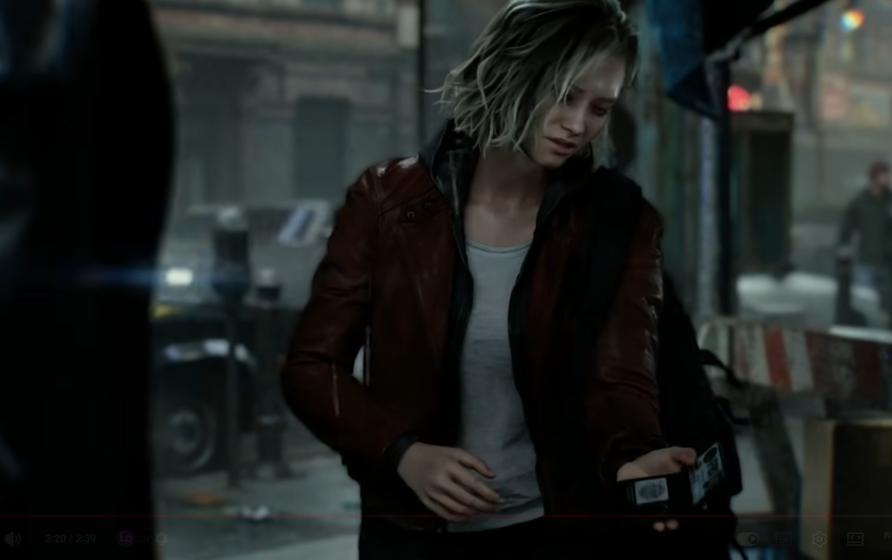

La serie Radeon RX 9000 acaba de recibir un impulso importante por la vía del software. La herramienta de optimización de terceros OptiScaler ha publicado su parche de corrección 0.3.4.1, que introduce renderizado neuronal y reconstrucción de rayos por FSR en las tarjetas gráficas de AMD. Según las pruebas recogidas por MyDrivers, una Radeon RX 9070 XT con trazado de rayos completo en *Resident Evil Requiem* alcanza una media de 130 fotogramas por segundo.

## Qué trae el renderizado neuronal del parche 0.3.4.1 de OptiScaler

El núcleo de la actualización es la reconstrucción de rayos: una técnica que emplea una red neuronal de inteligencia artificial para reducir el ruido propio del trazado de rayos. El objetivo es doble, mejorar el realismo de la imagen y aligerar al mismo tiempo la carga sobre la GPU.

El equipo de desarrollo ejecuta esa carga neuronal sobre un entorno de bajo nivel basado en AMD HIP y la reparte entre distintos fotogramas. De este modo, la mejora de imagen y de rendimiento llega, según los datos publicados, sin aumentar la latencia de entrada.

En el caso concreto medido, la RX 9070 XT trabaja a resolución 1440p con el modo equilibrado de FSR y la generación de fotogramas activada, y se mantiene estable entre los 110 y los 130 FPS. Hay un requisito adicional para este juego: al correr sobre el motor RE Engine de Capcom, es necesario acompañar la herramienta con el complemento REFramework para canalizar las nuevas funciones a bajo nivel.

## Nitidez, lanzador y nuevas funciones

Además del rendimiento, la nueva versión corrige uno de los efectos secundarios de parches anteriores: la imagen borrosa. OptiScaler 0.3.4.1 aplica por defecto un valor base de nitidez de 0,25, de forma que los juegos sin opción nativa de enfoque conservan unos bordes nítidos.

La herramienta incluye además un lanzador con nueve idiomas, buscador de juegos instalados, verificación de la integridad de los archivos y mecanismo de desinstalación completa. En el apartado de funciones suma la generación de fotogramas avanzada de XeSS, con un multiplicador de hasta 10 veces, y una opción experimental de iluminación global Screen GI.

## Qué tarjetas son compatibles y qué cambia para el lector

La compatibilidad anunciada abarca las GPU Radeon RX 7000 y RX 9000, los procesadores híbridos Strix Halo y los dispositivos portátiles con Ryzen Z1 Extreme, Radeon 780M y Radeon 890M.

Para quien ya tenga una de estas tarjetas, el mensaje es práctico: el trazado de rayos completo deja de ser un modo casi testimonial y pasa a ser jugable a 1440p con alta fluidez, algo coherente con [el nivel que ya mostró la RX 9070 XT frente a la RTX 5060 Ti](/noticias/rx-9070-xt-vs-rtx-5060-ti-52-games/), siempre que se acepte la letra pequeña de usar una herramienta de terceros y un complemento adicional en el caso del motor de Capcom. Como ocurre con cualquier modificación de este tipo, conviene aplicarla sobre una instalación con los archivos verificados y conservar la opción de desinstalación completa que el propio lanzador ofrece.
