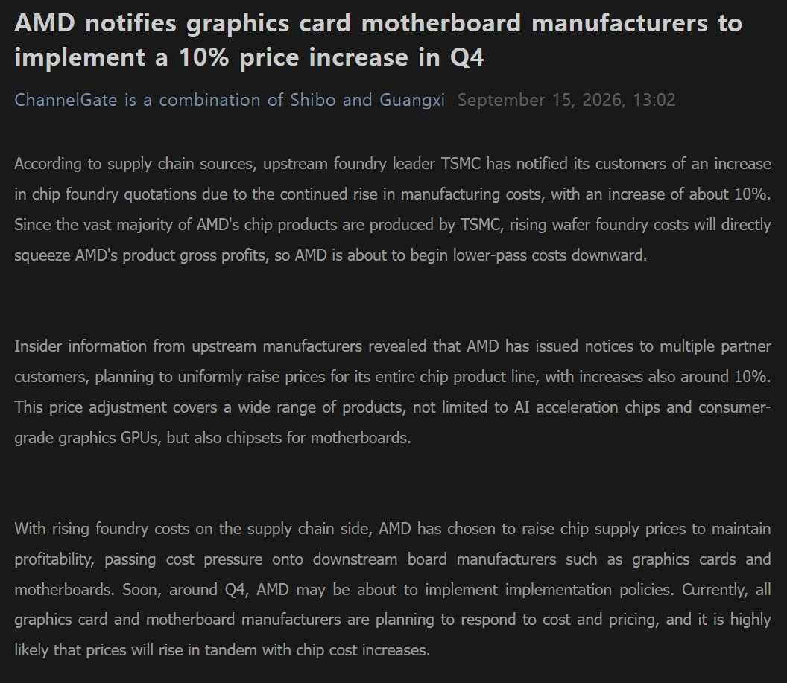
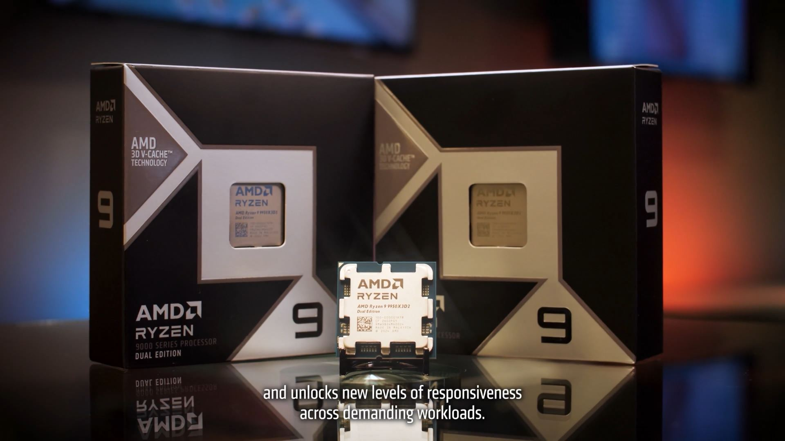

AMD **no ha anunciado ninguna subida de precios**. La información que circula estos días parte de una filtración: un informe del medio ChannelGate, difundido por el filtrador **@harukaze5719** en X el 17 de septiembre, sostiene que la compañía ha avisado a sus socios de un encarecimiento de sus chips de alrededor del **10 %** a partir del **cuarto trimestre de 2026**. Medios especializados como Wccftech y MuyComputer se han hecho eco del dato, pero lo tratan como un rumor y no como un movimiento confirmado.

Conviene separar lo que dice la filtración de lo que la empresa ha hecho público. AMD no ha emitido ningún comunicado, no ha fijado una fecha concreta ni ha detallado qué productos subirían de precio. Todo lo que sigue, por tanto, debe leerse con esa cautela.

## Qué dice la filtración

Según el informe recogido por el filtrador, TSMC habría comunicado a sus clientes un aumento en el coste de las obleas y AMD habría trasladado ese aviso a sus socios. El incremento ronda el **10 %** y se aplicaría en el cuarto trimestre del año.

El detalle importante es qué productos menciona el aviso. La filtración habla de **aceleradores de IA, tarjetas gráficas de consumo y chipsets para placas base**. No cita de forma explícita a los procesadores. Es decir, la subida de los Ryzen no aparece recogida en el documento filtrado, aunque tampoco se descarta.

## Por qué los Ryzen podrían acabar entrando

El motivo por el que la prensa especializada incluye a los procesadores en la ecuación es la dependencia de AMD de TSMC. El encarecimiento de las obleas no se limita a los nodos más avanzados: según la información recogida, **afecta a buena parte del catálogo de fabricación**, desde los 2 y 3 nanómetros hasta nodos más veteranos de 4 a 22 nanómetros.

Los Ryzen actuales se fabrican precisamente dentro de esos rangos:

| Familia | Chiplet de CPU | Chiplet de E/S |
| --- | --- | --- |
| Ryzen 5000 | 7 nm | 12 nm |
| Ryzen 7000 | 5 nm | 6 nm |
| Ryzen 9000 | 4 nm | 6 nm |

Con ese panorama, es razonable pensar que un aumento del coste de las obleas termine repercutiendo en el precio final de los procesadores. Pero eso es una deducción, no un dato confirmado por AMD.

## Qué cambia para quien va a comprar

Si la subida se confirma, el efecto es sencillo de calcular porque se trata de un porcentaje: cuanto más caro es el producto, mayor es el incremento. Tomando como referencia ese 10 %, los cálculos que manejan los medios consultados sitúan un procesador de 300 euros en unos 330 euros, y una tarjeta gráfica de 800 euros en unos 880 euros.

El contexto tampoco invita a pensar que la situación se desinfle. Wccftech recuerda que **Intel anunció hace poco una subida similar para sus procesadores de consumo**, de modo que el encarecimiento no sería exclusivo de AMD. La recomendación habitual ante este escenario es no esperar si ya se tiene decidida una compra y aprovechar ofertas puntuales, o bien aguardar a periodos de descuentos como el Black Friday. Aun así, conviene repetirlo: **AMD no ha confirmado nada** y una subida del 10 % en los Ryzen debe tratarse, por ahora, como una posibilidad y no como un hecho.
