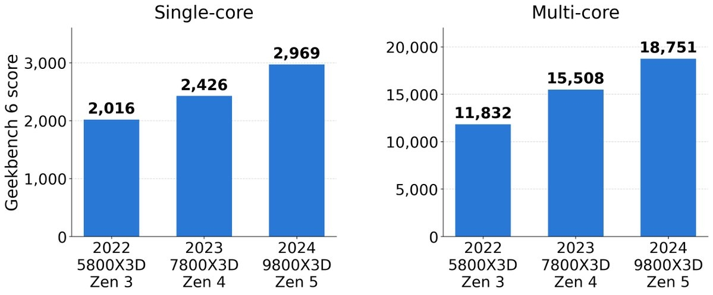
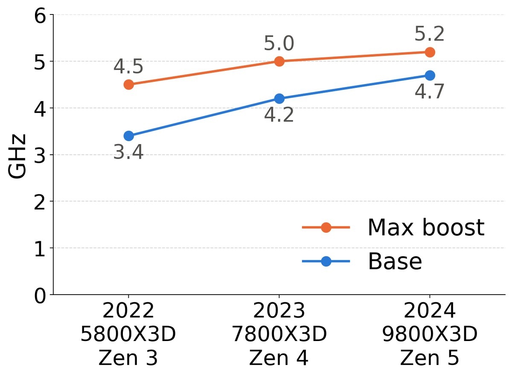
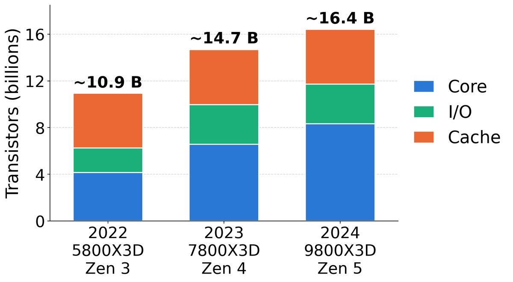
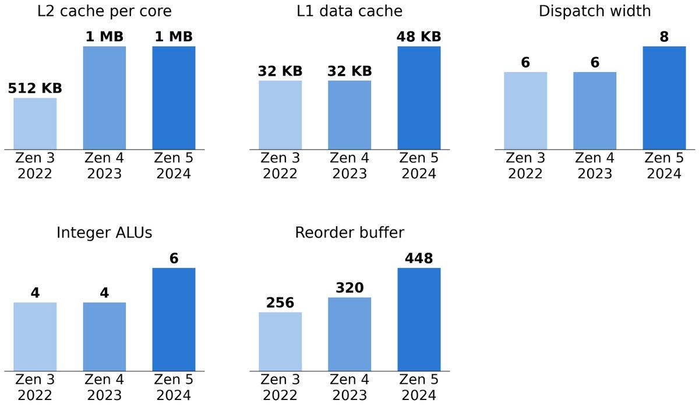
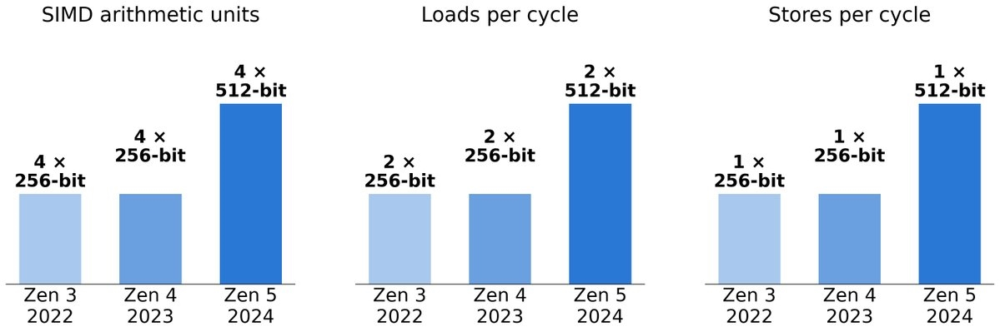

Durante años se ha repetido que los procesadores de escritorio avanzan a paso lento, con mejoras anuales que apenas se notan. Un análisis publicado el 18 de septiembre de 2026 por **Daniel Lemire**, profesor de informática de la Universidad de Quebec (TÉLUQ), pone esa idea en duda al medir lo que ocurrió en apenas dos años dentro de la misma familia de chips. La conclusión que resume el propio autor es que el rendimiento creció alrededor de un **50 % en dos años**.

Para llegar a esa cifra, Lemire comparó tres procesadores de **8 núcleos con caché 3D V-Cache**: el Ryzen 7 5800X3D (arquitectura Zen 3, 2022), el Ryzen 7 7800X3D (Zen 4, 2023) y el Ryzen 7 9800X3D (Zen 5, 2024). La base de la comparación es sintética y acotada: los resultados de **Geekbench 6**, la misma prueba para los tres modelos.

## Qué dicen los números de Geekbench 6

El punto de partida es 2022 y el de llegada, 2024, es decir, dos años. Medido así, el 9800X3D es más rápido que el 5800X3D:

| Prueba (Geekbench 6) | 5800X3D (Zen 3, 2022) | 7800X3D (Zen 4, 2023) | 9800X3D (Zen 5, 2024) |
| --- | --- | --- | --- |
| Mononúcleo | 2.016 | 2.426 | 2.969 |
| Multinúcleo | 11.832 | 15.508 | 18.751 |

Conviene precisar qué mide ese "50 %" del que habla el análisis, porque en el desglose no es un único dato redondo. La comparación entre el chip de 2022 y el de 2024 deja un **47 % más de rendimiento mononúcleo** y un **58 % más de rendimiento multinúcleo**. El titular del trabajo redondea ambos extremos como un aumento cercano al 50 % en dos años.

## La frecuencia no explica el salto

El dato que descarta la explicación fácil es el reloj. La frecuencia máxima de impulso pasó de **4,5 GHz a 5,2 GHz**, un incremento del **15 %**, y la frecuencia base subió de 3,4 GHz a 4,7 GHz. Ninguno de esos porcentajes se acerca al 47 % mononúcleo: si el rendimiento dependiera solo de la velocidad de reloj, la mejora habría sido mucho menor.

Es decir, la mayor parte del salto proviene de ejecutar **más trabajo en cada ciclo** (mejor IPC), no de subir el reloj. Ese matiz es el que convierte el caso de los X3D en un ejemplo útil de lo que significa un rediseño de núcleo y no solo un ajuste de fábrica.

## Más transistores y núcleos más anchos

El análisis también desglosa a dónde fue el presupuesto de transistores. El recuento total creció alrededor de un **50 %**, desde unos **11.000 millones hasta unos 16.000 millones**, y la mayor parte de ese aumento recayó en el núcleo, no en la caché.

Con ese espacio extra, AMD ensanchó el núcleo y le dio más recursos internos. El ancho de despacho pasó de un máximo de **6 a 8 instrucciones por ciclo**; la caché L2 por núcleo se duplicó, de **512 KB a 1 MB**; la caché L1 de datos subió de **32 KB a 48 KB**; las ALU de enteros pasaron de **4 a 6**, y el búfer de reordenación creció de **256 a 448 entradas**, lo que permite mantener más instrucciones en vuelo y ordenarlas mejor.

En el apartado de paralelismo de datos, el cambio es más drástico. Zen 3 y Zen 4 disponían de cuatro unidades SIMD de 256 bits; Zen 5 usa cuatro unidades de **512 bits**, y las cargas y los almacenamientos se ensancharon igual: dos cargas de 512 bits por ciclo y un almacenamiento de 512 bits.

## Qué significa para quien compra

Este análisis mira hacia atrás y mide generaciones ya disponibles en el mercado, no anuncia producto nuevo. Su utilidad para el lector está en dos ideas. La primera es que el dato de contexto —los procesadores "van lentos"— depende del periodo y del segmento que se mire: entre el 5800X3D y el 9800X3D hubo dos años y un salto del 47 % mononúcleo.

La segunda es que ese salto no se apoya en la frecuencia, sino en el rediseño del núcleo. Para la familia X3D, además, la comparación deja fuera su terreno más conocido: la caché 3D V-Cache está pensada sobre todo para juegos, y es ahí donde estas tres generaciones se han consolidado como referencia en la prensa especializada, con una ventaja que va más allá de la puntuación sintética.

Lemire cierra su texto mirando a lo que viene. La próxima arquitectura de escritorio, **Zen 6**, aún no tiene núcleos confirmados en detalle; el propio autor apunta, como referencia de magnitud, que AMD ya habla de una pieza EPYC de 256 núcleos con un gigabyte de caché L3. La pregunta que deja abierta es si la siguiente generación repetirá un salto de este calibre.
