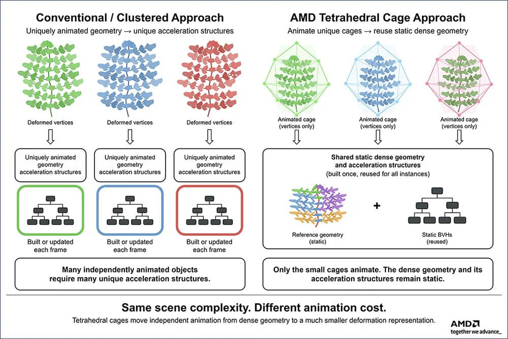

AMD ha publicado en su plataforma para desarrolladores GPUOpen una técnica de investigación bautizada como «Tetrahedral Cages» (jaulas tetraédricas) que ataca un cuello de botella poco visible del ray tracing: el coste en VRAM y en tiempo de actualización de las estructuras de aceleración cuando una escena está llena de objetos que se deforman de forma independiente.

Según las cifras que la compañía ha hecho públicas, el método reduce ese gasto desde los 80 GB de memoria que puede exigir el enfoque convencional hasta unos 1,7 GB, y rebaja el tiempo de actualización por fotograma de más de 300 ms a unos 3,3 ms. De momento es una demostración de investigación: AMD no ha anunciado su integración en ningún juego comercial.

## Qué es una jaula tetraédrica y por qué ahorra memoria

Para trazar rayos en tiempo real, el motor necesita una estructura de aceleración —la llamada BVH, *Bounding Volume Hierarchy*— que le permita saber con rapidez qué triángulos puede golpear cada rayo. El problema aparece cuando la geometría se anima: cada objeto que se deforma de manera única genera posiciones de vértices distintas y, con el enfoque tradicional, obliga a mantener y actualizar su propia estructura de aceleración. Repetido en miles de plantas, matas de hierba o personajes de fondo, ese coste se dispara.

La propuesta de AMD invierte el reparto. En lugar de animar cada vértice, encierra la malla densa dentro de una jaula tetraédrica mucho más simple y deformable. Durante el preprocesado, la malla se divide en piezas pequeñas asociadas a los tetraedros y se construyen unas mini-BLAS estáticas que se reutilizan. En tiempo de ejecución solo se deforma la jaula; los rayos que entran en un tetraedro animado se transforman al espacio de reposo y allí intersectan la geometría estática. Cada deformación distinta necesita su propia jaula, pero puede compartir las mismas mini-mallas y mini-BLAS de reposo.

El trabajo lo firma Holger Gruen, *fellow* de AMD, y se apoya en el artículo científico *Ray Tracing Massive Amounts of Animated Geometry*, distinguido con el tercer premio Wolfgang Straßer al mejor artículo en High-Performance Graphics 2026.

## Los números: de 80 GB a 1,7 GB y de más de 300 ms a 3,3 ms

La demostración que acompaña a la investigación es una escena de terreno con unas 25.000 plantas animadas de forma independiente, cada una respondiendo a una simulación de viento con direcciones variables. En su nivel máximo de detalle, esas plantas suman unos 2.800 millones de triángulos; tras la selección de nivel de detalle, la escena traza en torno a 500 millones de triángulos animados por fotograma con rayos primarios y de sombra, a más de 60 FPS en 1080p sobre una Radeon RX 9070 XT.

Las cifras que resumen el avance son las de las estructuras de aceleración. Actualizar las BLAS de triángulos densos para esa misma escena independiente consumiría hasta 80 GB de memoria de GPU y más de 300 ms por fotograma en la misma tarjeta; con las jaulas tetraédricas, el uso baja a unos 1,7 GB y el tiempo de actualización a unos 3,3 ms. En términos relativos, eso equivale a unas 47 veces menos memoria y a más de 90 veces menos tiempo de actualización.

Conviene señalar una diferencia entre los propios documentos de AMD: su entrada más reciente en GPUOpen cifra la escena en unos 500 millones de triángulos animados por fotograma, mientras que la figura del artículo científico describe esa misma demostración con unos 585 millones. La cifra que circula en buena parte de la prensa —y que también recogen los medios que se han hecho eco de la noticia— es la segunda; dado que AMD no explica el desajuste, lo prudente es tomarlas como aproximaciones de una misma prueba.

## El precio: menos control sobre cada vértice

El ahorro no sale gratis. Como la animación se traslada a la jaula, el movimiento resultante es una deformación lineal a trozos inducida por ella, no una animación por vértice. Cuanto más gruesa es la jaula, más barata y pequeña resulta, pero menos fiel al movimiento original; cuanto más fina, más se acerca a la animación de partida. AMD sitúa el método en animaciones que conservan la conectividad: vegetación que se mece, hierba, multitudes, personajes lejanos o niveles de detalle de animación. En cambio, encaja mal cuando cambia la topología, cuando el movimiento es de escala muy pequeña o cuando lo importante son deformaciones marcadas de personaje.

La técnica es compatible con Microsoft DirectX Raytracing —por ejemplo, con estructuras de nivel superior particionadas— y puede convivir con las estructuras de aceleración por clústeres, que ahorran memoria aún más agresivamente pero siguen obligando a animar y almacenar cada vértice que se deforma.

## Una investigación abierta, no una función que ya esté en los juegos

AMD presenta las jaulas tetraédricas como un puente entre contenido animado abundante y el ray tracing acelerado por hardware, no como un reemplazo de las técnicas actuales. La compañía trabaja en muestras de DXR y en una biblioteca C++ de cabecera única para construir jaulas de alta calidad en objetos con *skinning*, animados por fotogramas clave y estáticos, y apunta como siguientes pasos a mejorar la generación de jaulas y la calidad de la animación.

Para el jugador, la lectura es de medio plazo. Nada de esto se traduce hoy en más FPS ni en un parche que llegue a las tarjetas ya vendidas: es una técnica del lado del desarrollo, y su adopción depende de que los motores la integren. Aun así, el contexto la hace interesante, porque la VRAM se ha convertido en un recurso escaso y caro, y esa presión ya se nota en el mercado, como muestra la brecha entre las [Radeon RX 9050 de 4 y 8 GB](/noticias/radeon-rx-9050-4gb-vs-8gb/). Toda técnica que recorte el consumo de memoria sin exigir más hardware tiene, por eso, un atractivo evidente. AMD ya ha explorado otras vías de investigación en GPUOpen, como el [renderizado neuronal con iluminación generativa](/noticias/amd-neural-lighting-dlss-5/) que podría llegar a su próxima generación.
