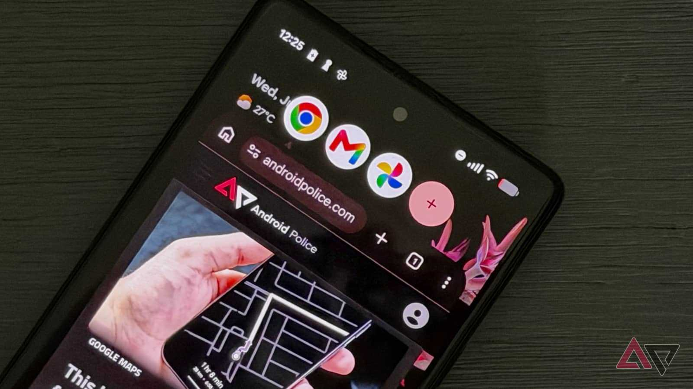
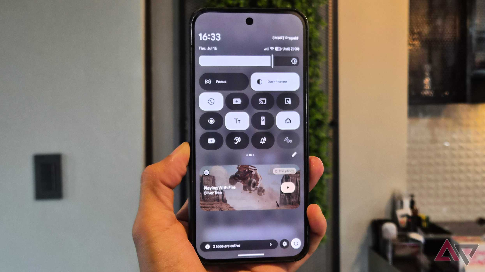
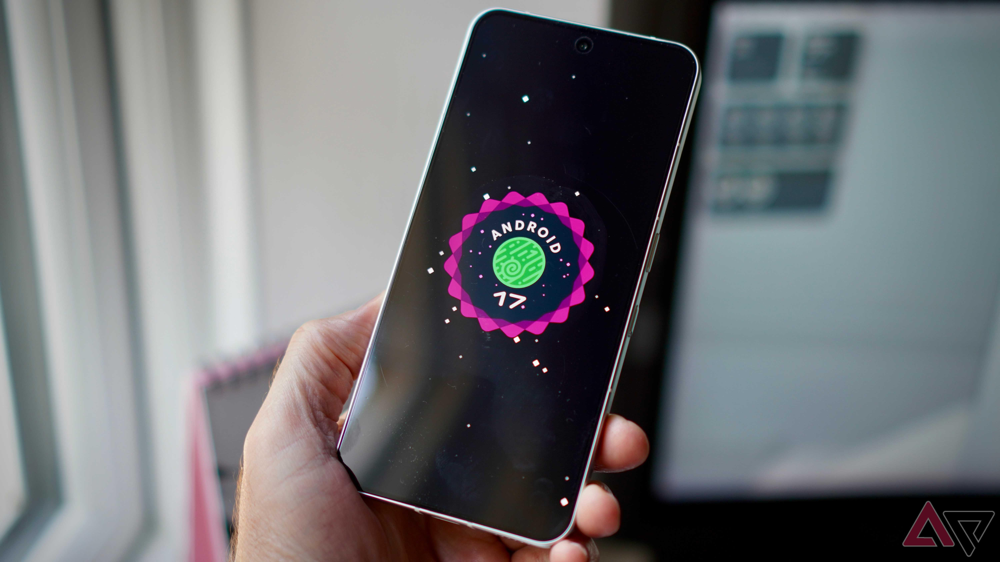

Google ha comenzado a distribuir la Beta 6 de Android 17 QPR2, apenas dos semanas después de lanzar la Beta 5. Se trata de una actualización de mantenimiento centrada en corregir fallos que afectaban al uso diario, aunque llega acompañada de una contrapartida: varias funciones que ya habían aparecido en versiones anteriores del programa de pruebas desaparecen de momento.

Conviene recordar que QPR son las siglas de *Quarterly Platform Release*, es decir, la actualización trimestral de plataforma que Google publica entre las versiones principales de Android. La QPR2 de Android 17 llegará de forma estable a los Pixel previsiblemente a comienzos de diciembre, por lo que el programa de betas todavía tiene margen para cambiar.

## Qué errores corrige Android 17 QPR2 Beta 6

Las notas de la versión publicadas por Google detallan una lista de correcciones que toca tanto la interfaz como el propio sistema:

- Una regresión visual que dejaba ver contenido con barras negras (*letterbox*) a través de la barra de estado durante las transiciones entre aplicaciones.
- El protector de pantalla mostraba una imagen en blanco mientras el dispositivo se cargaba.
- Reinicios inesperados en el Pixel 9 Pro Fold al iniciar el visor de la cámara desde aplicaciones de terceros.
- Las aplicaciones bloqueadas no se podían cerrar con gestos de deslizamiento en la pantalla de recientes.
- Un fallo del kernel del sistema que provocaba reinicios cuando una aplicación de terceros solicitaba acceso simultáneo a la cámara y al micrófono durante una verificación de identidad biométrica.
- Un problema que causaba cierres, reinicios o bloqueos del dispositivo al hacer scroll.

De todos ellos, el más delicado es el del kernel, porque no se limita a una app concreta: cualquier aplicación que pidiera cámara y micrófono a la vez para autenticar al usuario podía tumbar el teléfono. La corrección de los reinicios en el Pixel 9 Pro Fold también resulta relevante, ya que afectaba a un dispositivo plegable de gama alta en una tarea tan común como abrir la cámara desde otra aplicación.

## Funciones que se retiran de forma temporal

El precio de esta beta es la desaparición momentánea de tres novedades que ya se habían visto en compilaciones previas:

- Los avisos difuminados en la pantalla de bloqueo.
- Parte de las opciones de personalización de los ajustes rápidos.
- La funcionalidad App Lock, que permite proteger aplicaciones concretas con un bloqueo adicional.

Según recoge Android Police a partir de los comentarios de Mishaal Rahman en el hilo de la comunidad de betas, se trata de retiradas temporales y no de cancelaciones definitivas. En el caso de App Lock, el equipo habría decidido apartar la función "para permitir un pulido adicional, pruebas exhaustivas e integración en todas las superficies del sistema", lo que sugiere que podría tardar algo más en volver. En los ajustes rápidos, el motivo sería seguir afinando el comportamiento a partir de los comentarios recibidos durante las primeras pruebas.

Para el lector que participa en el programa beta, la lectura práctica es sencilla: si usabas App Lock o los avisos difuminados, esta compilación los elimina del dispositivo hasta nuevo aviso. Es el comportamiento habitual de un programa de pruebas, donde las funciones pueden entrar y salir entre versiones antes de consolidarse.

## Pixel 11, Pixel 7 y los plazos de la versión final

No todos los Pixel reciben esta beta. Las compilaciones para la familia Pixel 11 siguen sin estar disponibles y Google asegura que llegarán pronto. Hasta entonces, esos terminales —presentados hace unas semanas, como recoge nuestro [análisis del Pixel 11 Pro XL](/noticias/google-pixel-11-pro-xl-review/)— permanecen anclados en Android 16 QPR2 Beta 5.

En el otro extremo, el Pixel 7 recupera en esta versión el kernel 6.12, que se había quedado fuera en la beta anterior. Si el dispositivo ya estaba en Android 17 QPR2 Beta 5, la actualización OTA a la Beta 6 debería aparecer disponible para su descarga.

Con la versión estable todavía a más de dos meses vista, es probable que veamos un par de betas adicionales antes del lanzamiento definitivo. Eso significa que el equilibrio actual —errores corregidos a cambio de funciones aplazadas— aún puede moverse en las próximas entregas, así que conviene no dar por cerrado el diseño de la QPR2 hasta que Google publique la versión final.
