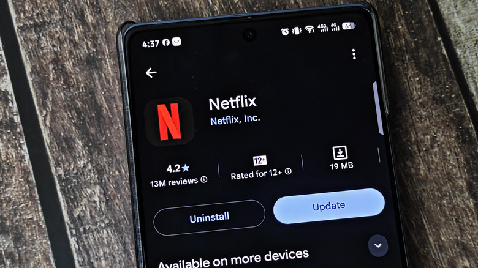

Aunque Android Auto se muestra en la pantalla del coche, todo su funcionamiento depende del teléfono. La aplicación se distribuye como una app normal de Google Play, no como un componente del sistema, así que se actualiza por internet igual que cualquier otra aplicación para corregir errores y añadir funciones nuevas.

Esta guía sirve para quien tiene un fallo concreto en la pantalla del coche, espera una función que todavía no le ha llegado o simplemente quiere confirmar que su teléfono está en la última versión disponible. Los pasos son los mismos que describe el fabricante y no requieren herramientas externas.

## Antes de empezar

- Un teléfono con **Android 9.0 o superior**. Es el requisito para recibir las últimas actualizaciones; versiones anteriores se quedan sin ellas. Como Android 9.0 se publicó en 2018, la mayoría de los dispositivos actuales cumplen este punto.
- La aplicación **Android Auto** instalada. Si no aparece en el teléfono, es posible que el sistema la integre de otra forma o que no esté disponible para ese modelo.
- Una conexión a internet. Conviene tener **Wi-Fi**, porque Google Play no usa datos móviles para actualizar en segundo plano de forma predeterminada.

## Paso 1: comprobar si hay una actualización en Google Play

Android Auto se actualiza automáticamente en segundo plano, pero esos procesos pueden fallar o retrasarse indefinidamente si el teléfono no detecta una red Wi-Fi. La forma de comprobar el estado es manual:

1. Abre **Google Play Store** en el teléfono.
2. Busca **Android Auto**.
3. Si aparece la opción de actualizar, púlsala para instalar la versión más reciente.
4. Si solo ves el botón **Desinstalar**, significa que ya tienes la última versión disponible para tu dispositivo.

## Paso 2: confirmar que la actualización automática está activada

Si en el paso anterior solo aparecía el botón de desinstalar, conviene asegurarse de que la app seguirá actualizándose sola en el futuro:

1. En la ficha de Android Auto dentro de Google Play, toca el **menú de tres puntos** de la esquina superior derecha.
2. Comprueba que la opción **Activar actualización automática** esté marcada.

## Paso 3: restablecer Android Auto si la actualización no resuelve el problema

Puede ocurrir que Google Play no ofrezca ninguna actualización, porque ya tienes la última versión, y que aun así sigas viendo fallos o comportamientos extraños. En ese caso, el siguiente recurso es restablecer la aplicación:

1. Abre la aplicación **Ajustes** del teléfono.
2. Entra en **Aplicaciones** y después en **Ver todas las aplicaciones**.
3. Selecciona **Android Auto**.
4. Toca **Almacenamiento y caché**.
5. Pulsa **Borrar almacenamiento**.

Este restablecimiento borra las preferencias guardadas dentro de la interfaz de Android Auto, pero no elimina los datos que otras aplicaciones guardan por su cuenta, como Google Maps o Spotify. Después, vuelve a conectar el teléfono al coche y comprueba si el problema ha desaparecido.

## Paso 4: volver a la versión anterior de Android Auto

Si los fallos continúan, queda una vía más: retroceder a la versión más antigua que el teléfono traía de fábrica. Para ello:

1. Vuelve a **Ajustes > Aplicaciones > Ver todas las aplicaciones > Android Auto**.
2. Toca el **menú de tres puntos** de la esquina superior derecha.
3. Selecciona **Desinstalar actualizaciones**.

El teléfono volverá a la versión original de Android Auto incluida con el sistema. Si esa versión funciona de forma más estable, se puede desactivar temporalmente la actualización automática en Google Play y esperar a que una futura actualización corrija el problema. La alternativa es volver a instalar la última versión y comprobar si la instalación limpia mejora la experiencia.

## Cómo verificar que funcionó

- Vuelve a **Google Play** y busca Android Auto: si solo aparece el botón **Desinstalar**, estás en la última versión disponible.
- Conecta el teléfono al coche y comprueba si el fallo concreto que motivó el cambio ha desaparecido.
- Si acabas de usar **Desinstalar actualizaciones**, la versión que verás será la más antigua incluida en el teléfono, no la más reciente.

## Advertencias y limitaciones

- **Las actualizaciones pueden retrasarse sin Wi-Fi.** De forma predeterminada, Google Play no descarga actualizaciones en segundo plano con datos móviles, por lo que la falta de una red inalámbrica puede dejar la app desactualizada durante tiempo.
- **Borrar almacenamiento elimina preferencias de Android Auto**, no los datos de otras aplicaciones. Aun así, conviene revisar los ajustes de la interfaz tras el restablecimiento.
- **Volver a la versión anterior no es una solución permanente** si se mantiene la actualización automática: la app volverá a actualizarse y el problema podría reaparecer. La reversión sirve para diagnosticar y, en el mejor de los casos, para ganar estabilidad temporal.
- **El requisito de Android 9.0 o superior** deja fuera a los teléfonos más antiguos, que no recibirán las últimas versiones de la aplicación.
