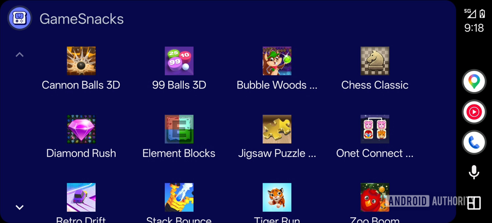
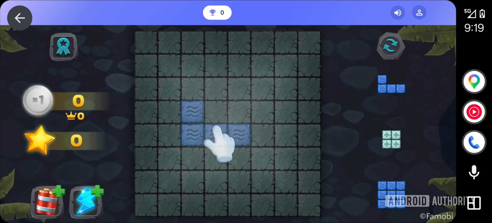
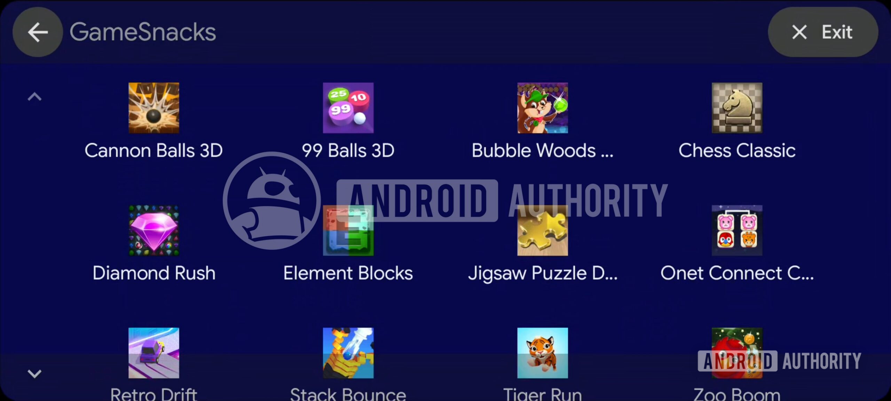
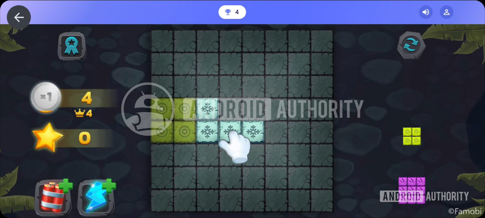

Android Auto estaría preparando una experiencia a pantalla completa para GameSnacks, la plataforma de juegos ligeros de Google que se ejecuta en el sistema de infoentretenimiento del coche. Un análisis del APK de la versión beta del servicio ha permitido activar una interfaz en la que desaparece la barra de navegación lateral que hoy acompaña tanto al menú de GameSnacks como a las partidas. Conviene tomarlo como un indicio del rumbo del desarrollo y no como una función confirmada: al tratarse de una revisión de código en curso, el cambio podría no llegar nunca a una versión estable.

## Una barra lateral que desaparece

En la versión actual de Android Auto, GameSnacks no aprovecha todo el panel del vehículo. La barra de navegación permanece visible al abrir la aplicación y sigue en su sitio una vez que el usuario empieza a jugar. Otros juegos del sistema, como Beach Buggy Racing, ya ocupan la pantalla completa y ofrecen sus controles al deslizar el dedo hacia abajo, gesto que revela los botones de volver y de salir; este último devuelve al listado de aplicaciones de Android Auto.

## Cómo cambia GameSnacks en la beta

En la beta más reciente, el equipo que firma el análisis consiguió habilitar una versión en la que la barra de navegación se retira tanto del menú principal de GameSnacks como de los propios juegos, liberando toda la superficie de la pantalla. En las capturas de esa variante también aparece un botón de volver fijo que, de momento, no responde. Dado que los controles habituales siguen disponibles con el gesto de deslizar hacia abajo, todo apunta a un fallo de la versión en pruebas más que a una decisión de diseño, por lo que podría corregirse antes de un lanzamiento público.

## Por qué importa ahora

El movimiento encaja con el impulso que Google está dando a los juegos en el coche. La compañía acaba de sacar los juegos de Android Auto de la fase beta y los ha puesto a disposición general, un paso que amplía el catálogo disponible para los conductores mientras el vehículo está aparcado. En ese contexto, que GameSnacks deje de arrastrar la barra de navegación la pondría al mismo nivel que el resto de títulos y evitaría que la aplicación parezca una excepción dentro de la propia plataforma.

Para el usuario español, la lectura práctica es sencilla: si el cambio llega a producción, GameSnacks aprovechará mejor las pantallas de los receptores compatibles, que en muchos coches son de formato panorámico. Es un ajuste de interfaz, no una revolución, pero afecta directamente a cuánto espacio útil se gana en la pantalla.

## Un cambio por confirmar

La información procede de un análisis del APK, una técnica que anticipa funciones a partir de código en desarrollo y que, por definición, no garantiza su llegada al público. Google no ha anunciado esta variante de GameSnacks, así que cualquier novedad dependerá de lo que finalmente decida incluir en una actualización estable. Como referencia del ecosistema, la plataforma ya ha recibido otras mejoras recientes de la mano de Android Auto, como [las advertencias de Google Maps sobre semáforos y señales de stop al aproximarse a un giro](/noticias/google-maps-android-auto-mejoras/).
