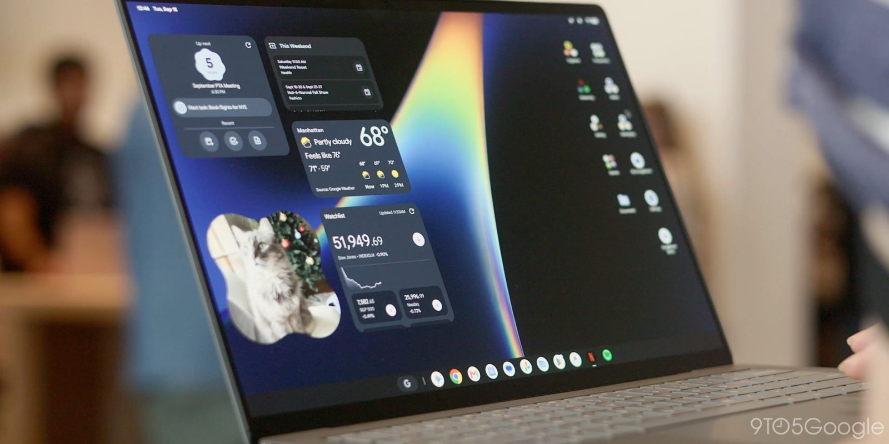
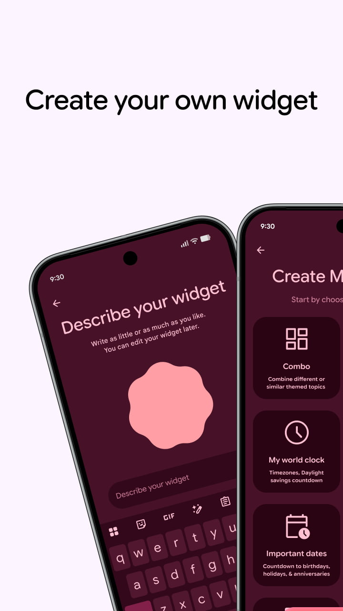
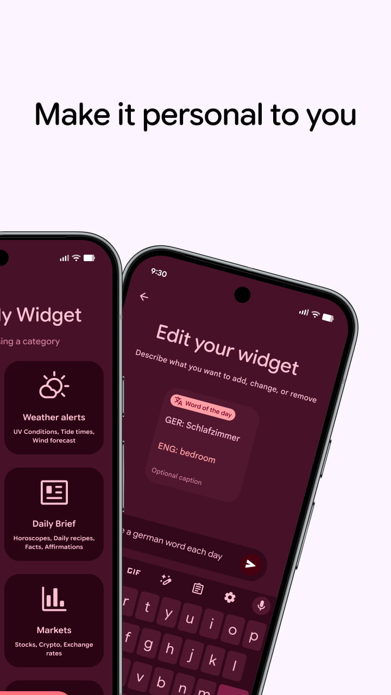
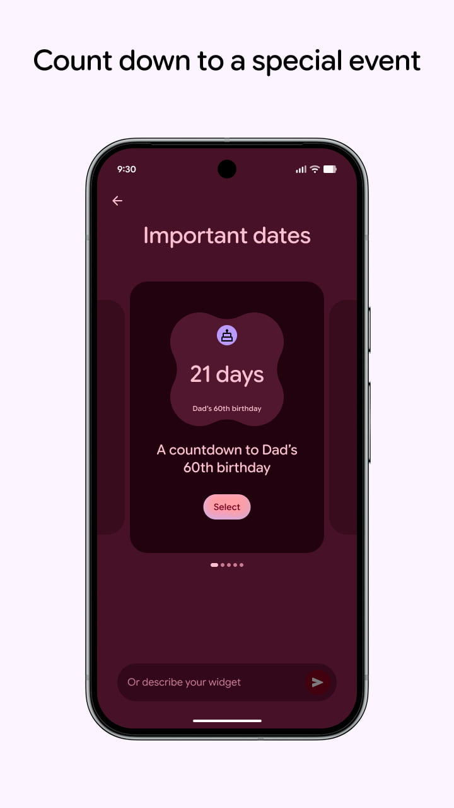
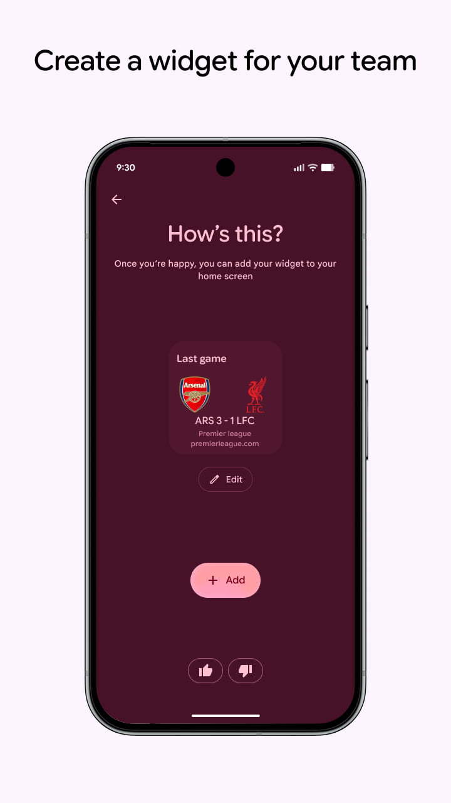
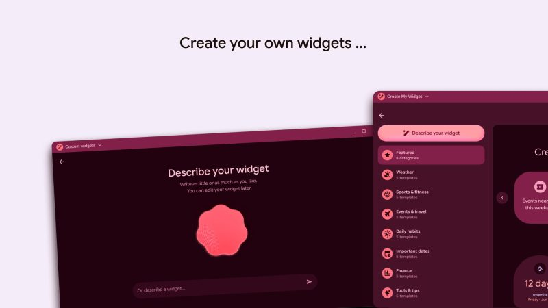
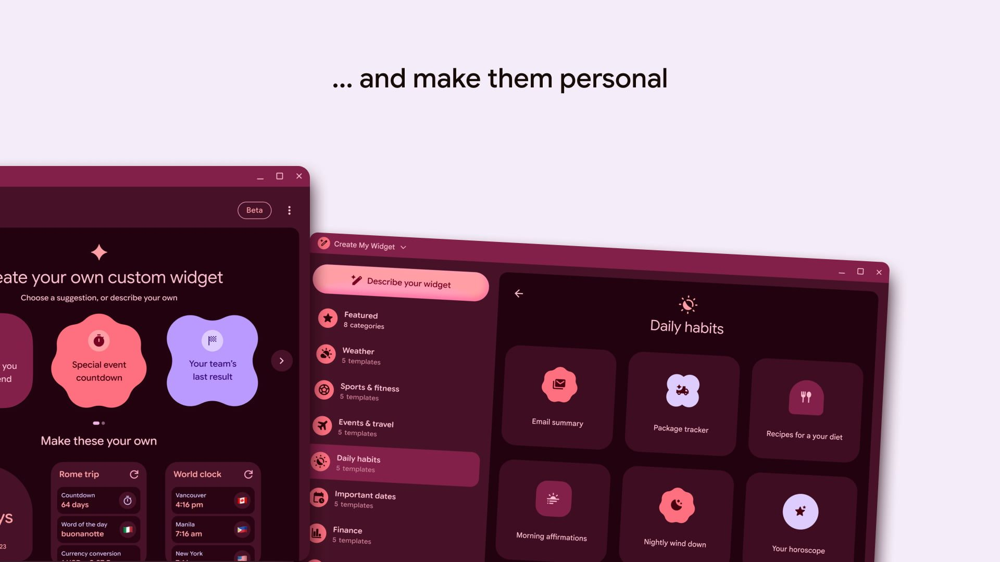
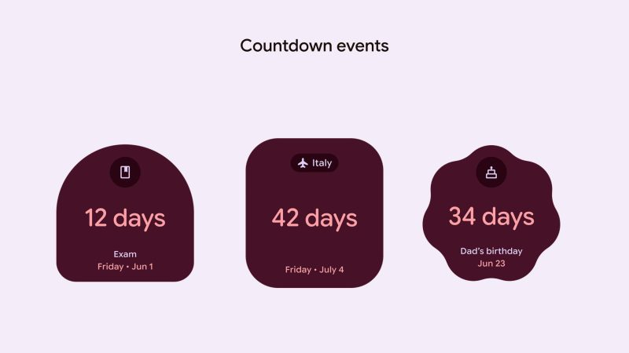
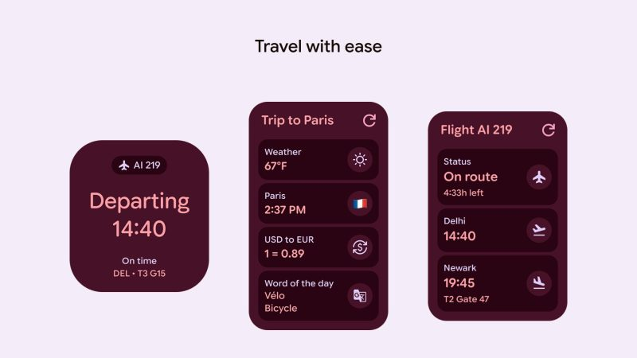
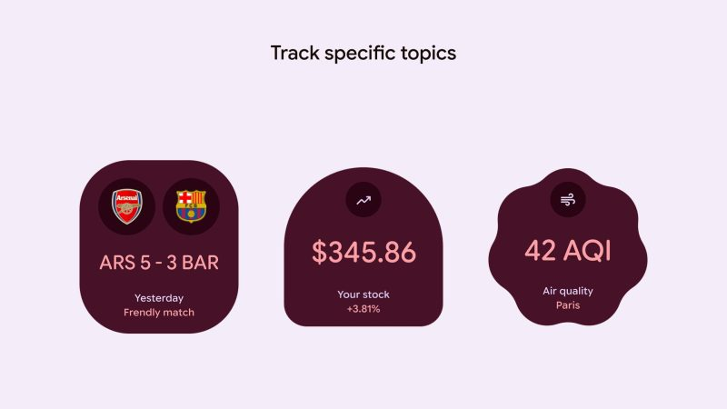

Create My Widget, la herramienta de Google para generar widgets personalizados, debutará a principios de octubre en los Googlebook, los nuevos portátiles con Android. Antes del lanzamiento, su ficha en Play Store deja ver cómo será la interfaz, tanto en esos equipos como en los teléfonos Android, según detalla 9to5Google.

## Create My Widget en el móvil: creación guiada por categorías

En los teléfonos, la experiencia es una creación guiada por categorías. Entre las que muestra la ficha están **Combo** (combinar temas distintos o similares), **alertas meteorológicas** (rayos UV, mareas, viento), **reloj mundial** (zonas horarias y cuenta atrás del cambio de hora), **resumen diario** (horóscopo, recetas, curiosidades y afirmaciones), **fechas importantes** (cuenta atrás de cumpleaños, festivos y aniversarios) y **mercados** (bolsa, criptomonedas y divisas).

Cada categoría presenta un carrusel con widgets sugeridos, y siempre queda la opción de describir el widget deseado en el cuadro de texto inferior. El último paso es añadirlo a la pantalla de inicio.

## En los Googlebook: más categorías y plantillas

La interfaz para los Googlebook amplía el repertorio con categorías como meteorología, deporte y forma física, eventos y viajes, hábitos diarios, fechas importantes, finanzas y herramientas y consejos. Cada una incluye varias plantillas que sirven para enseñar al usuario qué es posible crear.

Estos widgets generativos pueden aprovechar las formas de Material 3 Expressive, pensadas para diseños sencillos con poca información.

## Qué cambia para el lector

Hasta ahora, personalizar un widget obligaba a conformarse con lo que ofrecía cada aplicación. Create My Widget invierte el planteamiento: el usuario describe lo que quiere ver y el sistema lo compone. Para quien siga los [Googlebook frente a los Chromebook](/noticias/googlebook-vs-chromebook/), es además una primera muestra de cómo Google quiere diferenciar sus portátiles Android: no solo con hardware nuevo, sino con funciones de personalización que no existen en ChromeOS.

La ficha identifica el paquete como `com.google.android.apps.yourwidget` y la versión actual como la 1.27.983746769.0, centrada en el lanzamiento de los Googlebook. Queda por ver cuándo llegará la creación de widgets al móvil de forma generalizada: por ahora, lo confirmado es el debut de octubre en los portátiles.
