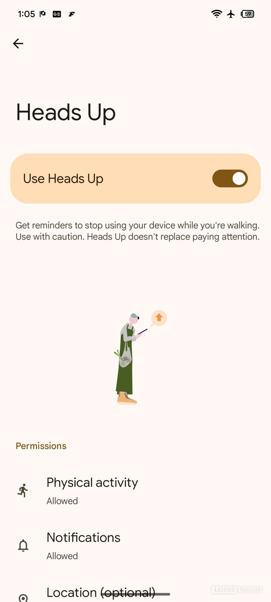
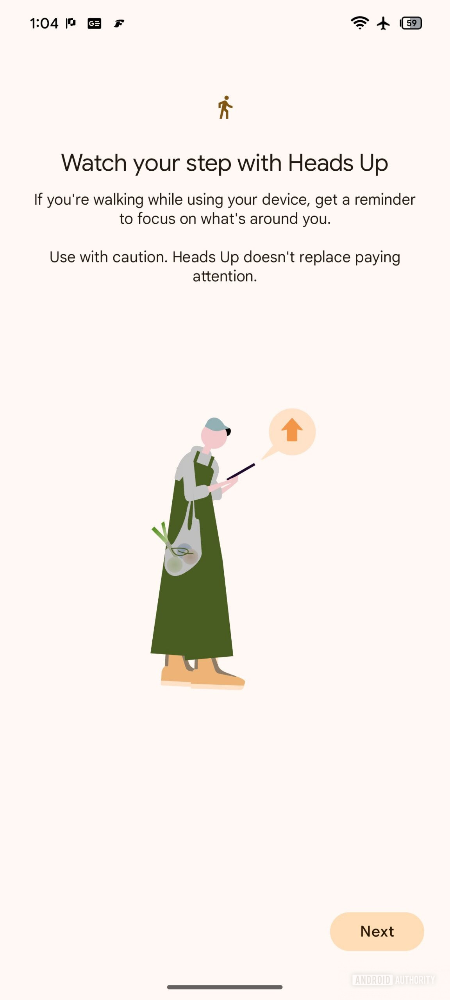
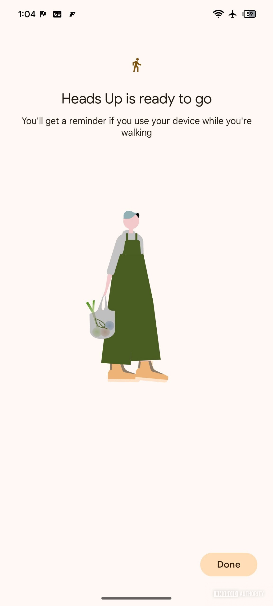
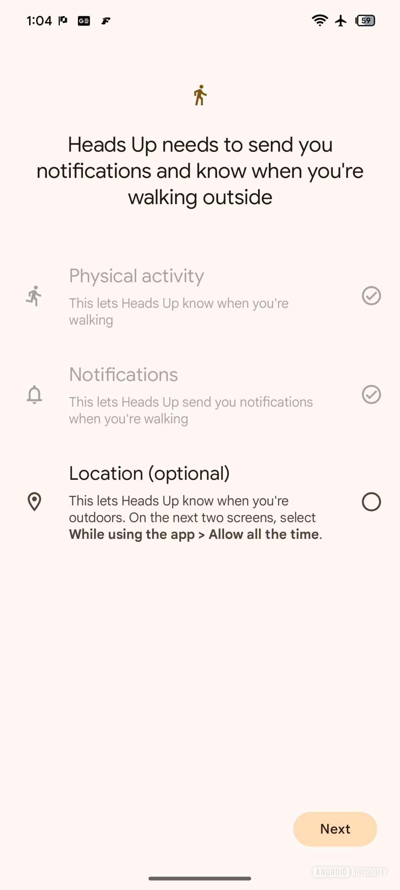

Heads Up, el recordatorio de seguridad que invita a levantar la vista del móvil mientras se camina, apunta a tener los días contados. Así lo sugiere un análisis del código de la aplicación Bienestar Digital (Digital Wellbeing) que el medio Android Authority ha publicado este 24 de septiembre y en el que aparecen los textos con los que Google avisaría a los usuarios del adiós a la función. Conviene subrayarlo desde el principio: no es un anuncio oficial ni una retirada confirmada, sino trabajo en curso detectado dentro de la app.

## Qué ha encontrado el análisis de APK

El hallazgo procede de una versión beta de Bienestar Digital, la 1.48.975819457, según detalla Android Authority. Dentro de sus recursos de texto aparecen dos cadenas nuevas que anticipan un aviso de despedida:

```
⚠️ Walking detection is going away soon
Be careful while walking
```

La primera corresponde al cuerpo del mensaje («la detección de caminata desaparecerá pronto») y la segunda al encabezado que acompañaría a esa alerta. Ambas apuntan a una notificación que se mostraría dentro de la propia aplicación. Lo que no aparece por ningún lado es una fecha, un calendario de retirada ni una explicación del motivo.

Este tipo de análisis del APK rastrea funciones que todavía no se han publicado, pero basadas en código en desarrollo. Es una herramienta útil para anticiparse a los cambios de Android, aunque también conviene leerla con cautela: una función vista en una beta puede llegar a la versión estable, quedarse a medias o acabar descartándose por completo. Un ejemplo reciente es [el límite de caché que Spotify prepara para su app de Android](/noticias/spotify-cache-limit-android/), otro caso de función futura destapada desde el código.



## Qué era Heads Up y por qué se retiraría

Heads Up es una función de seguridad que Google introdujo en 2021 dentro de su suite de bienestar digital. Su funcionamiento es sencillo: cuando el sistema detecta que el usuario camina con la pantalla desbloqueada, lanza un recordatorio amable para que mire al frente y preste atención al entorno. La idea es evitar despistes tan concretos como cruzar una calle sin mirar o tropezar con un obstáculo.

Para lograrlo se apoya sobre todo en los sensores de movimiento del teléfono, y de forma opcional en la ubicación, que le permite distinguir si la persona pasea dentro de casa o va por la calle. Aunque nació para los Pixel 2 y posteriores, con el tiempo se fue extendiendo a otros teléfonos Android.



El problema es que reunía varios factores que explican su escasa adopción. Es una función que el usuario debe activar manualmente, está enterrada en los ajustes de Bienestar Digital y el seguimiento continuo por sensores no es precisamente amable con la batería. A eso se suma que esos avisos periódicos, lejos de ayudar, pueden resultar molestos para parte del público. Un cóctel que invita a pensar que la mayoría de la gente ni siquiera sabía que existía.



## Qué cambia para el usuario

Por ahora, nada inmediato. No hay una fecha para la desaparición de Heads Up y Google no ha hecho pública ninguna decisión al respecto, así que la función sigue donde estaba. Si el análisis se confirma y la retirada llega, quien la use de forma habitual tendrá que buscar alternativas o acostumbrarse a guardar el teléfono al caminar.

Para el lector hispanohablante, la lectura práctica es más de contexto que de urgencia: la noticia muestra cómo funciona el ciclo de vida de las funciones de Android, que a veces aparecen con gran despliegue y luego se apagan sin ruido cuando no cuajan. Si en las próximas actualizaciones de Bienestar Digital aparece ese mensaje de despedida, entonces sí habrá que darla por perdida.



En cualquier caso, la recomendación de sentido común no depende de que exista una función llamada Heads Up: mirar al frente y no al móvil mientras se camina por la calle sigue siendo la mejor alerta de seguridad, y esa nadie la va a retirar.
