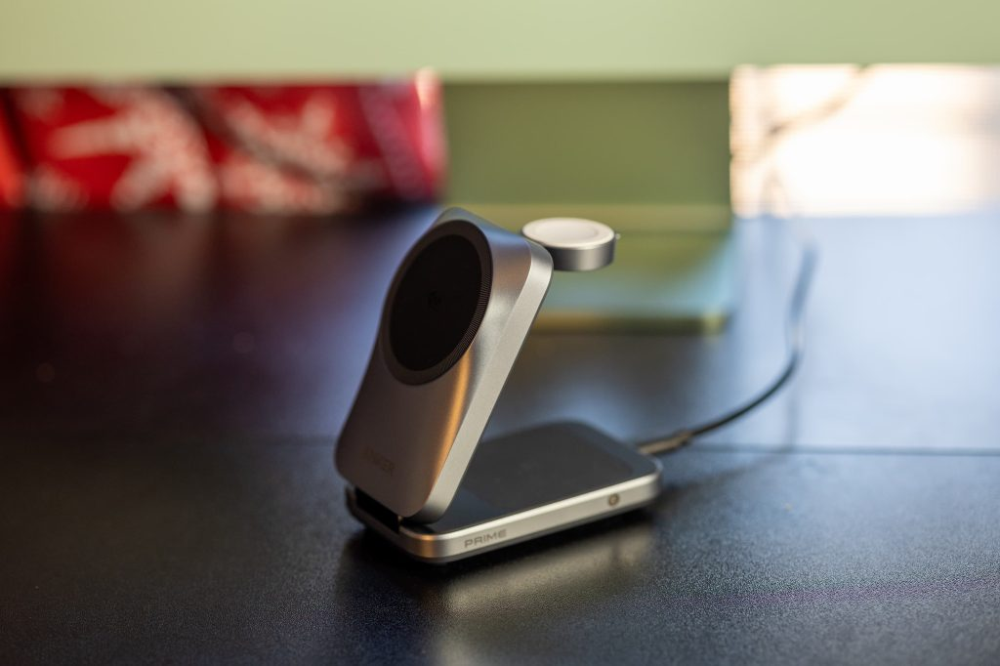
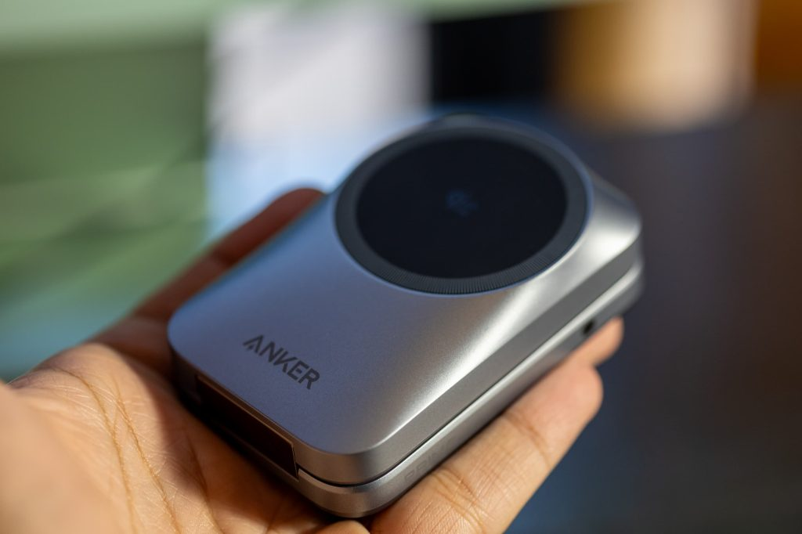
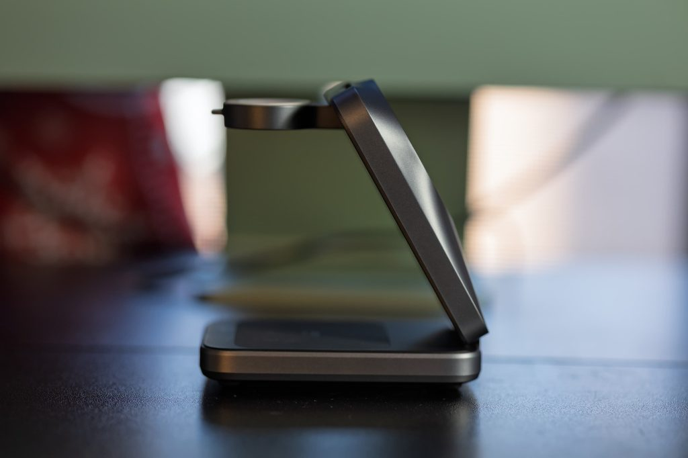

Anker ha puesto a la venta un nuevo cargador inalámbrico 3 en 1 orientado a los viajes. El Prime MagSafe 3 en 1 llega con soporte para Qi2.2, alcanza los 25 W de carga inalámbrica y recurre a refrigeración activa para controlar la temperatura. La firma lo presenta como una alternativa plegable para quienes cargan iPhone, AirPods y Apple Watch a la vez.

## Qué carga el MagSafe 3 en 1 de Anker

El accesorio combina tres puntos de carga en un único soporte: una superficie magnética para el iPhone, una base para los AirPods y un módulo dedicado al Apple Watch. En la caja se incluyen una fuente de alimentación de 45 W y un cable USB-C, con potencia suficiente para alimentar los tres dispositivos de forma simultánea.

Conviene no mezclar dos conceptos que el lenguaje comercial tiende a unificar. Qi2.2 es el estándar de carga inalámbrica con perfil magnético, mientras que MagSafe es el sistema de imanes de Apple. En la práctica, el primero es el que habilita los 25 W de velocidad que el segundo aprovecha en los iPhone compatibles, del iPhone 16 en adelante. Según 9to5Mac, el soporte carga un iPhone 18 Pro hasta el 50 % en 27 minutos.

## Impresiones de uso: tamaño, ventilador y calor

El principal argumento del producto es su portabilidad. En su prueba, 9to5Mac lo compara con el MagSafe Duo que Apple retiró: conserva una vocación viajera muy parecida, pero suma dos ventajas, ya que se puede usar como soporte vertical y carga tres dispositivos en lugar de dos.

La refrigeración activa, es decir, un ventilador integrado, se ha vuelto casi obligatoria en los cargadores de 25 W, y este no es una excepción. En manos del autor, ese sistema permite cargar el iPhone con rapidez sin el sobrecalentamiento que a veces lastra la carga inalámbrica de alta potencia. La fuente también destaca el módulo del Apple Watch, con un mecanismo de muelle: queda recogido dentro del cuerpo cuando el accesorio está plegado y, al desplegarlo, basta pulsarlo hacia abajo para que salte hacia fuera.

## Precio y disponibilidad

El Anker Prime MagSafe 3 en 1 está disponible en Amazon con entrega Prime por 99 dólares, en acabados negro y blanco. Esa cifra corresponde al mercado estadounidense; la compañía no ha anunciado por ahora un precio para Europa, así que no procede traducirla a euros.

Quien además necesite recargar el portátil o la tableta durante un viaje puede complementar el conjunto con la [Power Bank Anker Prime de 26.250 mAh y 300 W](/noticias/anker-prime-power-bank-300w/), que ya cubrimos en este portal y que resuelve la carga de batería, mientras que este soporte se ocupa de la inalámbrica.

