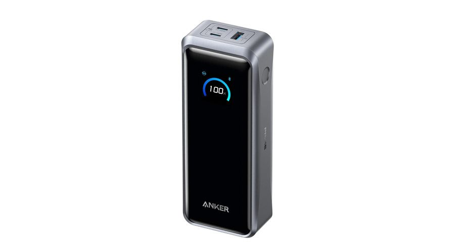
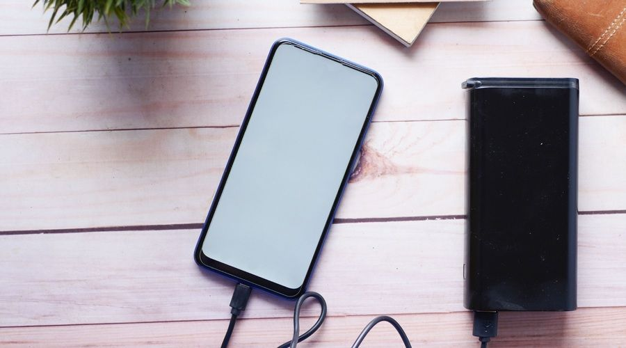

La Anker Prime Power Bank es una batería externa de gama alta pensada para quienes trabajan con varios equipos a la vez: ofrece 26.250 mAh de capacidad y una potencia combinada de hasta 300 W, suficiente para alimentar al mismo tiempo un portátil, una tableta y un teléfono móvil. El análisis publicado por Topes de Gama la presenta como una alternativa de corte profesional, con pantalla inteligente y recarga ultrarrápida, aunque con un tamaño y un precio alejados de las baterías convencionales.

## 300 W repartidos en tres puertos para equipos exigentes

El principal argumento de esta Anker Prime es la potencia. Incorpora dos conexiones USB-C de hasta 140 W cada una y un puerto USB-A de hasta 22,5 W, con una entrega máxima conjunta de 300 W. En la práctica, eso permite cargar dos portátiles compatibles con carga de alta potencia por USB-C mientras el tercer puerto alimenta el móvil, y también resulta útil para tabletas, consolas portátiles o cámaras durante un viaje.

La batería es compatible con USB Power Delivery 3.1 y utiliza el sistema PowerIQ 4.0 para distribuir la energía entre los dispositivos conectados. Conviene tener en cuenta que alcanzar los 140 W por puerto exige un equipo compatible y un cable USB-C adecuado, un matiz importante para los [portátiles de alto consumo que superan los 200 W](/noticias/thin-gaming-laptops-215w/): la batería da margen de sobra, pero el cable y el equipo deben estar a la altura.

## Capacidad al límite del embarque y recarga en minutos

Los 26.250 mAh equivalen a 99,75 Wh, una cifra justo por debajo del límite habitual de 100 Wh que las aerolíneas aplican a las baterías externas en el equipaje de mano. Eso significa que, en la mayoría de los vuelos, se puede llevar sin autorización especial, aunque siempre conviene revisar las condiciones de la compañía antes de embarcar.

En autonomía, la capacidad da para recargar varias veces un teléfono o para aportar una carga adicional considerable a un portátil, si bien el aprovechamiento real depende de la eficiencia y de la potencia demandada. Donde más sorprende es al recargarse ella misma: con sus dos conexiones USB-C admite una entrada combinada de hasta 250 W, con la que recupera alrededor del 50 % en unos 13 minutos y la carga completa en entre 46 y 59 minutos según las pruebas citadas por el medio. Para lograrlo hacen falta dos cargadores USB-C de alta potencia y cables compatibles, y existe además una base de carga magnética específica de Anker que se vende por separado.

## Pantalla, aplicación y precio de la Anker Prime: a quién le compensa

El diseño es un bloque rectangular de acabado oscuro, de unos 16 × 6,3 × 3,8 centímetros y alrededor de 600 gramos: cabe en una mochila, pero no en un bolsillo. La pantalla frontal muestra el porcentaje restante y la potencia que entrega o recibe cada conexión, una información valiosa cuando hay varios dispositivos enchufados y se quiere comprobar que la carga rápida funciona como debe.

La batería incorpora además conectividad Bluetooth y es compatible con la aplicación de la marca, desde la que se consultan el nivel de carga y la potencia por dispositivo y se configuran modos de carga. El sistema ActiveShield 4.0 supervisa la temperatura durante las sesiones para mantener el funcionamiento bajo control.

Con un precio que ronda los 199,99 euros en PcComponentes y Amazon en el momento de publicarse el análisis, no es una compra para quien solo necesite cargar el móvil de vez en cuando. Tiene sentido para profesionales y viajeros que trabajen fuera de casa con equipos exigentes y aprovechen sus conexiones USB-C de alta potencia durante jornadas largas, según la valoración del medio de origen.
