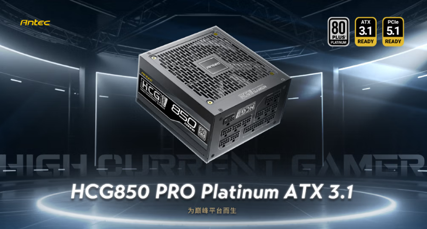
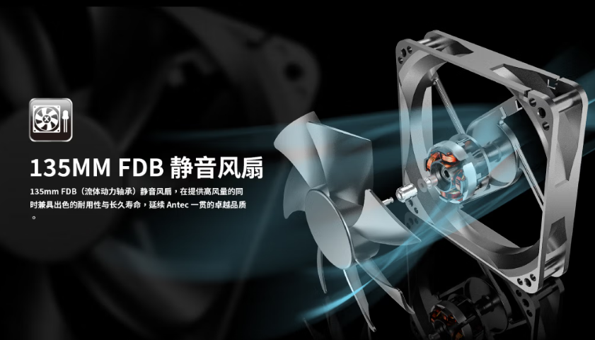
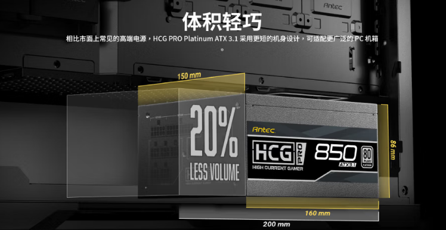

Antec ha presentado su nueva serie de fuentes de alimentación HCG Pro Platinum, una gama con diseño ATX 3.1 y conector PCIe 5.1 nativo, arquitectura totalmente modular y certificación 80 Plus Platino. La familia se ofrece en tres potencias —850, 1000 y 1200 W— y parte de los 1069 yuanes en el mercado chino, según informa MyDrivers.

## Diseño interno y eficiencia de la serie HCG Pro Platinum

Las fuentes miden 160 x 150 x 86 mm y se basan en el diseño PhaseWave de la marca, que combina PFC activo de nivel servidor con topología de puente completo LLC, rectificación síncrona y conversión DC-DC. El conjunto cuenta con la certificación 80 Plus Platino, lo que reduce el calor generado por los componentes y las pérdidas de energía, aunque ya existen sellos aún más exigentes como el de [la primera fuente ATX con certificación 80 PLUS Ruby de FSP](/noticias/fsp-fuente-80-plus-ruby-850w/).

En el apartado de componentes, la serie emplea condensadores totalmente japoneses con tolerancia de 105 °C, admite una entrada de voltaje amplia de 100 a 240 V y ofrece un único raíl de 12 V de alta corriente. El cableado es completamente modular con acabado texturizado, pensado para facilitar el montaje y dejar una estética más limpia dentro de la caja.

## Refrigeración silenciosa y protecciones CircuitShield

La refrigeración corre a cargo de un ventilador de 135 mm con rodamiento hidráulico FDB, compatible con la tecnología Zero RPM Manager de parada inteligente, que detiene el giro con cargas bajas para reducir el ruido sin comprometer la durabilidad.

En seguridad, la serie incorpora el sistema CircuitShield con siete mecanismos de protección: contra sobrecorriente (OCP), sobretensión (OVP), cortocircuito (SCP), sobrepotencia (OPP), subtensión (UVP), sobretensiones transitorias (SIP) y funcionamiento sin carga (NLO). Según el fabricante, este conjunto garantiza un rendimiento estable en cargas de trabajo exigentes.

## Potencias disponibles y precio

La familia HCG Pro Platinum se comercializa en versiones de 850, 1000 y 1200 W, con un precio de partida de 1069 yuanes en China a través de JD.com. Por ahora no se han comunicado precios ni fechas para el mercado europeo, por lo que los usuarios interesados en renovar su fuente con vistas a gráficas de última generación con conector de 12 V deberán esperar al anuncio oficial para España.
