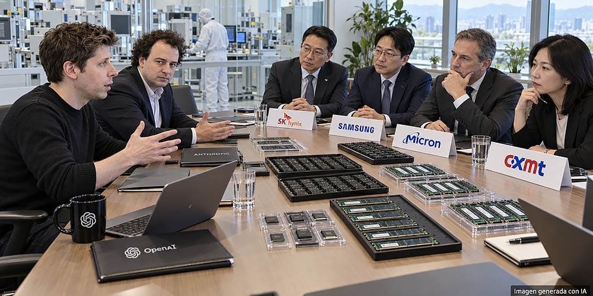

A los gigantes de la inteligencia artificial ya no les basta con comprar tarjetas gráficas o alquilar capacidad en centros de datos: ahora quieren asegurarse la memoria directamente en origen. Según una previsión de la consultora Edgewater Research, recogida por medios asiáticos, Anthropic y OpenAI empezarán a negociar el suministro de memoria con los fabricantes a partir de 2027, un movimiento que las colocaría frente a frente con AMD, NVIDIA, Qualcomm e Intel en la puja por la producción disponible.

Conviene matizar desde el principio: se trata de una estimación sobre sus próximos movimientos, no de contratos anunciados con volúmenes confirmados. Pero el cambio de estrategia que plantea resulta coherente con la carrera actual por controlar cada eslabón de la infraestructura de la IA.

## Qué prevé el informe sobre la memoria: un 20 % de compra directa y una demanda comparable a la de NVIDIA

La consultora calcula que Anthropic adquiriría directamente alrededor del 20 % de la memoria que necesita en 2027, con la intención de elevar ese porcentaje en 2028. La cifra requiere contexto: no significa que la compañía vaya a quedarse con una quinta parte de la producción mundial, sino con una quinta parte de sus propias necesidades, que ya son enormes.

La demanda de DRAM atribuida a Anthropic alcanzaría entre 40.000 y 50.000 millones de unidades equivalentes de 1 Gb, una escala que las informaciones comparan con la de NVIDIA. Tampoco se trata de miles de millones de chips físicos: es una forma normalizada de expresar la capacidad total de memoria que la empresa necesitaría movilizar.

El razonamiento detrás del movimiento es sencillo. Hasta ahora, al contratar capacidad de cálculo, buena parte de estas negociaciones quedaba en manos de los proveedores de hardware e infraestructura. Si los desarrolladores de IA asumen un control cada vez mayor sobre sus aceleradores y sus centros de datos, asegurarse la memoria por su cuenta se convierte en un paso lógico, sobre todo cuando un corte de suministro puede frenar una expansión de miles de millones.

## Más rivales por la misma memoria: Samsung, SK hynix y Micron ganan poder

Aquí es donde la noticia toca al resto de la industria. La entrada de Anthropic y OpenAI como compradores directos sumaría dos rivales de gran tamaño a la puja por la capacidad de Samsung, SK hynix y Micron, junto a AMD, NVIDIA, Qualcomm e Intel. Cada compañía tiene productos, necesidades y fórmulas de compra distintas —no todas negocian exactamente el mismo chip—, pero todas beben de la misma capacidad de fabricación.

Para los tres grandes fabricantes de memoria, sumar compradores de este calibre reforzaría su posición negociadora. Para quienes necesitan asegurarse suministro, significaría encontrarse con más competidores dispuestos a comprometer dinero y contratos a largo plazo. La presión sobre la [HBM, cuyo precio medio podría subir otro 42 % en 2027](/noticias/hbm-precio-sube-42/), ya muestra hacia dónde apunta la tensión.

## Qué significa para quien quiera ampliar su PC

La memoria de un acelerador de IA no es un módulo DDR5 de sobremesa, y conviene no mezclar ambos mercados. Sin embargo, las decisiones sobre inversión y capacidad de producción pueden trasladar la presión de un segmento a otro: las obleas y las fábricas son las mismas.

Cambiar quién compra no crea demanda adicional por sí solo. El problema aparece si la expansión de la IA supera la oferta disponible de los fabricantes. En ese escenario, ampliar la memoria del equipo podría salir todavía más caro, y la factura no la pagarían precisamente los modelos de lenguaje. Para el lector español que esté pensando en renovar o ampliar su PC, el mensaje práctico es el de siempre en un mercado tensionado: seguir la evolución de los precios antes de comprar y no dar por sentado que la RAM barata volverá pronto.
