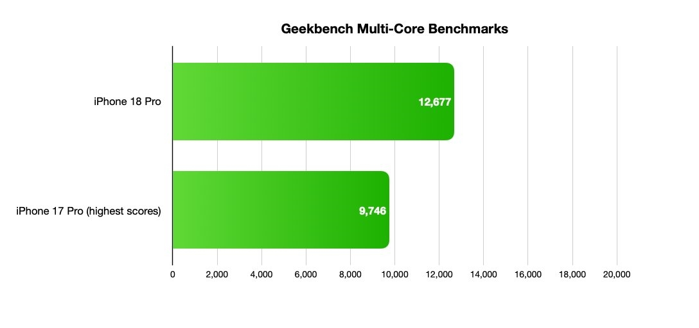
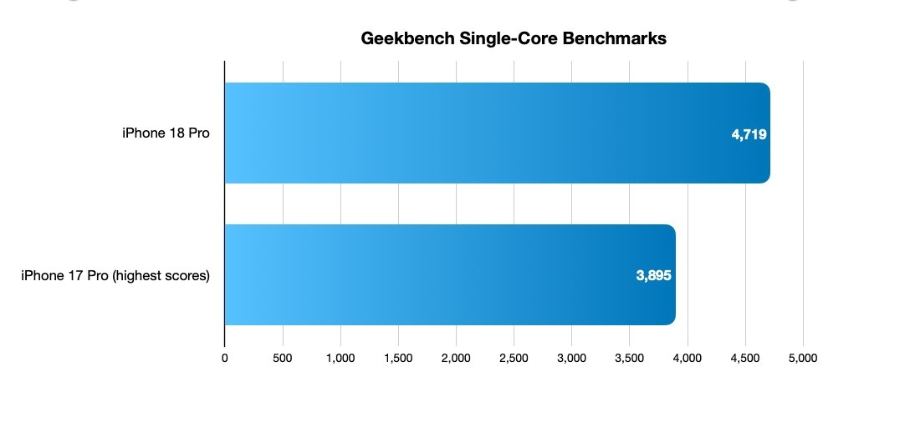

A pocos días de la llegada oficial de los nuevos iPhone 18 Pro y iPhone 18 Pro Max, el chip que los impulsa ya tiene cifras públicas. El A20 Pro ha aparecido en la base de datos de Geekbench 6 y las primeras mediciones completas dibujan una generación con mejoras muy notables, especialmente en el apartado gráfico, según recoge el medio chino MyDrivers.

Los resultados colocan al iPhone 18 Pro con una puntuación de 4.719 en un solo núcleo y 12.677 en multinúcleo. El iPhone 18 Pro Max, por su parte, registra 4.725 y 12.575 en las mismas pruebas. La diferencia entre ambos es mínima, y tiene sentido: los dos montan el mismo procesador de seis núcleos, con una frecuencia máxima de CPU en torno a los 4,93 GHz y sin diferencias de hardware en la gestión de rendimiento. Es decir, esta vez el modelo de pantalla grande no sale beneficiado frente al estándar.

| Prueba (Geekbench 6) | iPhone 18 Pro | iPhone 18 Pro Max |
| --- | --- | --- |
| Un núcleo | 4.719 | 4.725 |
| Multinúcleo | 12.677 | 12.575 |

## Una salto de CPU poco habitual

El dato más interesante aparece al comparar con el A19 Pro de los iPhone 17 Pro. Según las mediciones filtradas, el A20 Pro mejora el rendimiento de un solo núcleo entre un 21 % y un 23 %, mientras que en multinúcleo el salto llega al 27 %–28 %. Son cifras altas para una generación de móvil, donde lo habitual en los últimos años ha sido avanzar en eficiencia más que en potencia bruta. MyDrivers lo describe como el mayor incremento de CPU de las dos últimas generaciones de chips de la serie A.

Conviene recordar que se trata de resultados de ingeniería y de plataformas de terceros, no de una demostración controlada en un laboratorio propio. Aun así, la coincidencia entre distintas entradas de la base de datos y la magnitud del salto invitan a pensar que la mejora es real y no un artefacto de medición.

## La GPU, el apartado que más crece

Si la CPU sorprende, la gráfica lo hace todavía más. El A20 Pro estrena una GPU de siete núcleos, uno más que los seis del A19 Pro, y en la prueba Metal de Geekbench 6 la mejora se sitúa entre el 38 % y el 40 %. En términos prácticos, la generación anterior necesitaría recortar cerca de un tercio su rendimiento gráfico para igualar a la nueva.

El dato encaja casi a la perfección con lo que Apple anunció en la presentación: la compañía prometió una GPU hasta un 40 % más rápida que la del A19 Pro, y las pruebas independientes rozan ese techo. Es un detalle relevante porque disipa la sospecha habitual de que las cifras oficiales están infladas. Para el usuario, esto se traduce en juegos más exigentes, funciones de inteligencia artificial local y edición de vídeo con más margen, aunque en móvil la gráfica no se exprime igual que en un PC.

## El calor, el verdadero caballo de batalla

Más potencia plantea siempre la misma pregunta: ¿aguanta el ritmo o se queda sin aliento al cabo de unos minutos? Apple ha respondido rediseñando el empaquetado del chip e incorporando una cámara de vapor mucho mayor. Según los datos oficiales, la superficie de disipación del iPhone 18 Pro triplica la del iPhone 17 Pro, con una estructura interna de agua desionizada en circulación que ayuda a evacuar el calor cuando el procesador trabaja a pleno rendimiento.

Es la parte menos vistosa del anuncio y, probablemente, la que más note quien juegue o use aplicaciones profesionales durante periodos largos. El rendimiento sostenido —no el pico de un benchmark de treinta segundos— es lo que separa a un móvil que promete de uno que cumple. Si el nuevo sistema de refrigeración funciona como asegura la compañía, el A20 Pro podría mantener sus cifras máximas durante más tiempo antes de bajar revoluciones, algo que en la generación anterior era un punto débil.

Para el comprador hispanohablante, el mensaje es claro: la brecha entre el iPhone 18 Pro y el Pro Max ya no está en el rendimiento, sino en el tamaño de pantalla y la batería. Quien busque la máxima potencia gráfica no necesita irse al modelo grande. Y quien tenga un iPhone 17 Pro, salvo por el salto en gráficos y el mejor control térmico, encontrará pocos motivos para actualizar de inmediato.
