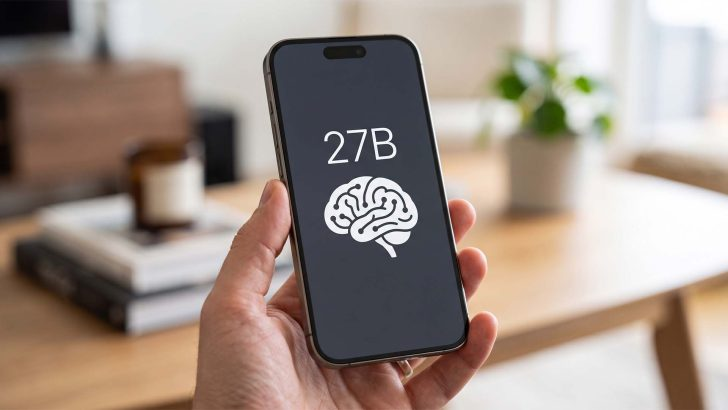
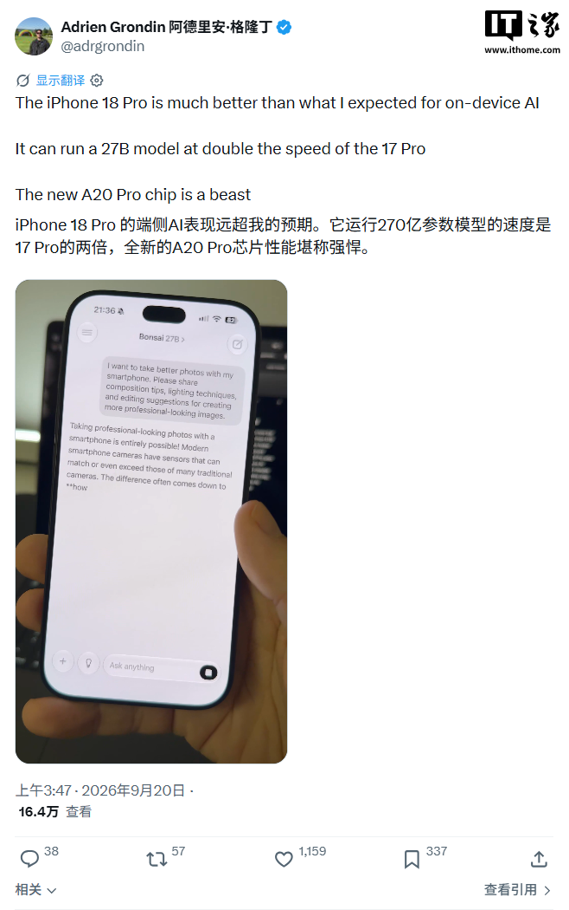

El A20 Pro de los iPhone 18 Pro ha dado una nueva muestra de lo que puede hacer la inteligencia artificial sin salir del teléfono. En una demostración difundida en X por el usuario Adrien Grondin, un iPhone 18 Pro ejecuta el modelo Bonsai 27B —27 000 millones de parámetros— íntegramente en el dispositivo y genera tokens a aproximadamente el doble de velocidad que un iPhone 17 Pro con chip A19 Pro. La grabación, recogida por medios como Wccftech e IT之家, muestra una generación fluida y sin pausas perceptibles, un comportamiento poco habitual en modelos de ese tamaño dentro de un teléfono.

## El doble motor neuronal, primera vez en Apple Silicon

El responsable directo de esa mejora es el nuevo motor neuronal del A20 Pro. Por primera vez en la historia de Apple Silicon, el chip integra un motor neuronal de doble bloque con 16 núcleos cada uno, una arquitectura pensada específicamente para cargas de trabajo de IA y que, según los datos que se manejan, supera en rendimiento a cualquier SoC anterior de la compañía. En tareas específicas de NPU, su rendimiento máximo llega a colocarse por encima de la GPU de siete núcleos del propio chip.

A ese motor se suma la memoria. Tanto el iPhone 18 Pro como el iPhone 18 Pro Max montan 12 GB de LPDDR5X con bus de 96 bits, una configuración sensiblemente más rápida que la de los iPhone 17 Pro. Con ambas piezas trabajando juntas, el ancho de banda de memoria unificada alcanza los 115,2 GB/s, un caudal que en la práctica se traduce en que el modelo pueda ir leyendo y escribiendo sus pesos sin que la velocidad de generación se desplome.

## El límite real: la memoria, no la potencia

La demostración también deja al descubierto el principal cuello de botella de la IA local en móvil. Bonsai es un modelo con cuantización de 1 bit, lo que le permite funcionar sin problemas en equipos con solo 4 GB de memoria y moverse con total soltura en terminales de 8 o 12 GB. El problema surge con su sucesor: la versión de Bonsai 2 con cuantización de 2 bits resulta demasiado grande para caber por completo en la memoria del iPhone 18 Pro, lo que obliga a un intercambio constante de datos y provoca una caída de rendimiento.

Es precisamente la duda que planteaban algunos usuarios en X: si Bonsai 2 ya está disponible, ¿tiene sentido seguir usando el Bonsai original? La respuesta, aunque incómoda, es que en el iPhone 18 Pro sigue siendo la mejor opción para aprovechar el hardware del A20 Pro. El episodio dibuja el techo actual de la inferencia en el dispositivo: no lo marca la capacidad de cómputo del chip, que va sobrada, sino cuántos parámetros caben en la memoria del teléfono.

## Qué significa para el usuario

Para quien use funciones de IA en el móvil, el mensaje es que los modelos grandes ya no necesitan pasar por la nube. Poder ejecutar offline un modelo de 27 000 millones de parámetros abre la puerta a asistentes más capaces, mayor privacidad y menos dependencia de la conexión, aunque de momento con modelos optimizados para consumir muy poca memoria.

La otra cara es que el salto de generación solo exprime todo su potencial con la configuración de 12 GB. La propia demostración apunta a que el siguiente paso lógico pasa por ampliar la memoria en los próximos modelos de iPhone, ya que es la única vía para dar cabida a modelos más densos y complejos. Hasta entonces, la ventaja del A20 Pro en IA local se moverá dentro de los límites que le impongan esos 12 GB.
