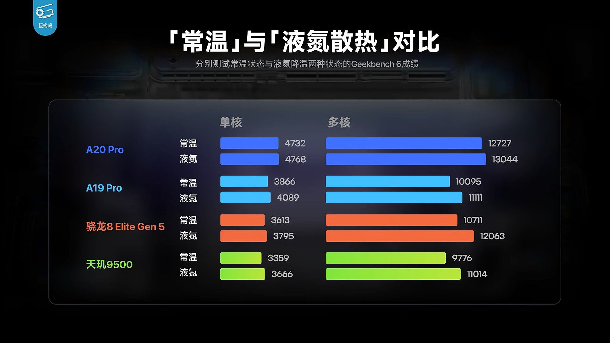

La refrigeración por nitrógeno líquido es el recurso más agresivo que existe para exprimir un chip: baja la temperatura muy por debajo de lo que cualquier dispositivo de consumo podría alcanzar y, en teoría, deja al descubierto todo el rendimiento que el silicio es capaz de dar. Aplicada al A20 Pro de Apple, esa lupa no encontró casi nada nuevo. Según el análisis del canal Geekerwan, el chip de 2 nm apenas mejoró un 0,76 % en un solo núcleo y un 2,49 % en multinúcleo al pasar del aire ambiente al nitrógeno líquido.

La cifra, por debajo del 3 %, es la más baja de todos los procesadores comparados en la misma prueba, y no es una señal de debilidad: apunta a que Apple ya había resuelto por otra vía el problema que el nitrógeno líquido suele destapar. Esa vía es el **empaquetado** del chip y la nueva cámara de vapor.

## Qué es el empaquetado de un chip y por qué cambia la disipación

Cuando se habla de un procesador, lo habitual es mirar los nanómetros del transistor o el número de núcleos. Pero un chip no es solo su capa de silicio lógico: es un conjunto de piezas que deben convivir dentro de la misma carcasa. El **empaquetado** es precisamente eso, la forma en que el dado de silicio se monta junto al resto de componentes y se conecta al circuito impreso.

Un detalle que parece menor lo cambia todo: dónde va la memoria. El A20 Pro estrena un empaquetado personalizado denominado **WMCM** (*Wafer-Level Multi-Chip Module*), en el que la memoria DRAM se coloca **al lado** del dado principal en lugar de apilarse encima, como ocurría en generaciones anteriores. Ese cambio de posición tiene dos consecuencias directas para el calor.

- La memoria deja de ser una tapa que atrapa el calor del procesador. Antes, la DRAM apilada actuaba como una manta térmica: cuanto más caliente estaba el chip, más difícil era evacuar esa energía.
- El dado queda con más superficie libre y más margen térmico (*thermal headroom*), de modo que puede trabajar a frecuencias altas durante más tiempo antes de que el sistema intervenga para protegerse.

A eso se suma una cámara de vapor de mayor tamaño, que reparte el calor por una superficie más amplia en lugar de concentrarlo en un punto. El resultado es un chip que ya no depende tanto de refrigeración externa para rendir al máximo, y eso es justo lo que el nitrógeno líquido se encargó de demostrar.

## Los números del experimento

El test de Geekerwan midió el rendimiento en Geekbench 6 a temperatura ambiente y con refrigeración por nitrógeno líquido, y comparó la diferencia entre varios procesadores de gama alta. El A20 Pro es el que menos gana con el enfriamiento extremo, mientras que los rivales con empaquetados más convencionales sí notaron el cambio.

| Procesador | Mejora en un núcleo | Mejora en multinúcleo |
| --- | --- | --- |
| A20 Pro | 0,76 % | 2,49 % |
| A19 Pro | 5,77 % | 10,06 % |
| Snapdragon 8 Elite Gen 5 | — | 12,62 % |
| Dimensity 9500 | 9,14 % | 12,66 % |

El contraste con el A19 Pro es el más elocuente: el chip del año pasado, con un empaquetado más antiguo y menos eficaz, ganó más de un 10 % en multinúcleo cuando se le quitó el calor de encima. El A20 Pro, en cambio, apenas se movió, porque ya rendía cerca de su techo con la disipación normal del teléfono. El mayor beneficiado fue el **Dimensity 9500** de MediaTek, que subió un 9,14 % en un núcleo y un 12,66 % en multinúcleo, seguido de cerca por el Snapdragon 8 Elite Gen 5 en la prueba multihilo con un 12,62 %.

Conviene leer estos números con matices. Geekbench 6 es una prueba de ráfaga corta: mide el pico de rendimiento en un instante, no lo que el teléfono sostiene durante una partida larga. Precisamente por eso el dato importa tanto: si el A20 Pro ya está cerca de su límite en una prueba corta, significa que casi todo su margen disponible depende de la disipación y no de una frecuencia desbloqueada por frío extremo.

## Qué significa para el usuario

Para quien compra un móvil, la lección es que el envoltorio del chip importa tanto como el chip. Un procesador que no necesita nitrógeno líquido para dar su mejor cifra es un procesador que, en la práctica, rinde de forma más predecible: menos caídas de rendimiento cuando el teléfono se calienta, menos recortes de frecuencia en sesiones largas y una experiencia más estable en juegos exigentes o edición de vídeo.

El empaquetado WMCM y la cámara de vapor son, en ese sentido, la parte menos visible de la nueva generación de Apple y, probablemente, la que más note quien use el teléfono al límite. La otra cara de la moneda es que el margen de mejora por refrigeración es cada vez menor: cuando el silicio ya se acerca a su techo, las siguientes ganancias tendrán que venir de la arquitectura y del proceso de fabricación, no de enfriarlo más.
