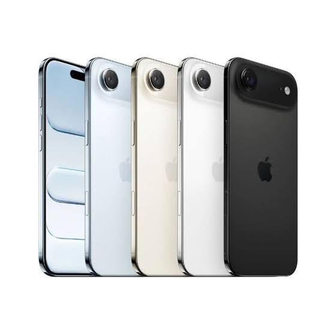

Apple presentó el 9 de septiembre sus nuevos iPhone 18 Pro y iPhone 18 Pro Max, pero el anuncio que más ha llamado la atención no está en las especificaciones, sino en la etiqueta de precio. La compañía subió 100 dólares el costo de casi toda su línea de teléfonos, y no solo de los modelos recién llegados: los iPhone que mantiene en catálogo también se encarecieron, sin recibir ningún cambio de hardware que lo justifique.

Los nuevos tope de gama arrancan en 1.199 dólares el iPhone 18 Pro y 1.299 dólares el iPhone 18 Pro Max, ambos 100 dólares por encima de los iPhone 17 Pro que reemplazan y que ya han sido descontinuados. La subida se extiende al resto del catálogo: el iPhone 16 pasa a 799 dólares, el iPhone 17e a 699, el iPhone 17 a 899 y el iPhone Air a 1.099. En todos los casos, el incremento es de 100 dólares respecto al precio anterior.

| Modelo | Precio nuevo | Precio anterior | Variación |
| --- | --- | --- | --- |
| iPhone 18 Pro | 1.199 USD | 1.099 USD | +100 USD |
| iPhone 18 Pro Max | 1.299 USD | 1.199 USD | +100 USD |
| iPhone 16 | 799 USD | 699 USD | +100 USD |
| iPhone 17e | 699 USD | 599 USD | +100 USD |
| iPhone 17 | 899 USD | 799 USD | +100 USD |
| iPhone Air | 1.099 USD | 999 USD | +100 USD |

## El origen: la escasez de memoria que arrastra la IA

El momento de la subida no es casual. Coincide con una escasez de DRAM que ya es un fenómeno de toda la industria, alimentada en gran medida por la demanda de los centros de datos de inteligencia artificial, que absorben buena parte de la oferta de memoria. El consejero delegado de Apple, Tim Cook, ya había comparado la situación con una "inundación de cien años" y advirtió que la compañía no puede seguir absorbiendo como antes el aumento de los costos de memoria y almacenamiento.

El movimiento de Apple es, en realidad, la misma presión que llevan meses sufriendo los fabricantes de PC y los integradores de sistemas, donde los precios de la DRAM y de los SSD no dejan de subir. La diferencia es que Apple negocia volúmenes enormes y suele tener un poder de compra que pocos igualan. Que ni siquiera ella haya podido esquivar el golpe dice bastante sobre la magnitud del problema.

## Qué cambia para el usuario

Para el comprador, el mensaje es incómodo: no hay mejoras de hardware que expliquen el sobreprecio en los modelos antiguos. Quien estuviera pensando en un iPhone 16 o un iPhone Air como opción más económica se encuentra con que la brecha con la generación nueva se ha estrechado. La subida castiga especialmente al que busca un terminal de gama media-alta, justo el segmento donde la relación precio-prestaciones solía ser más atractiva.

Vale la pena mirar esto con perspectiva de mercado. Si la memoria sigue tensionada por la IA, es razonable esperar que el encarecimiento no se quede solo en Apple: portátiles, equipos de sobremesa y tarjetas gráficas ya lo están notando. Para el lector hispanohablante, la lectura práctica es que comprar hardware con memoria —sea un móvil o un PC— difícilmente será más barato en los próximos meses. Si había una compra planificada, adelantarla puede salir a cuenta; si no, quizá convenga estirar el equipo actual un poco más.

La noticia deja una pregunta abierta: ¿bajarán los precios cuando la oferta de memoria se normalice, o estos ajustes llegarán para quedarse? La historia reciente de la industria sugiere que las subidas suelen quedarse y las bajadas tardan mucho más en aparecer.
