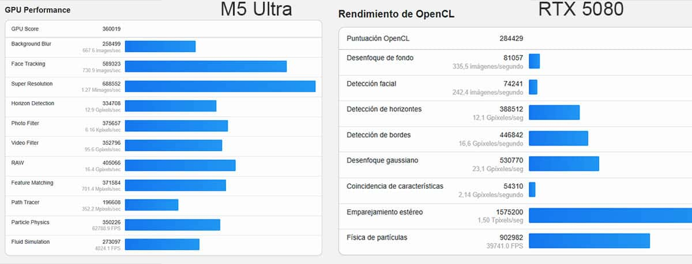

Un nuevo resultado de la GPU del Apple M5 Ultra ha aparecido en la base de datos pública de Geekbench. Se trata de una prueba de Geekbench 7 en su apartado Metal, registrada el 16 de septiembre de 2026 desde un Mac Studio identificado como Mac17,15. El equipo monta el chip M5 Ultra con una CPU de 36 núcleos (12 de alto rendimiento y 24 adicionales), una frecuencia base de 4,60 GHz y 256 GB de memoria unificada, con macOS 27.0.

La puntuación total es de 360.019 puntos en Metal. Es una cifra alta, pero conviene enmarcarla antes de sacar conclusiones: se trata de una única entrada subida a una base de datos pública, no de una prueba de laboratorio controlada, y Apple todavía no ha publicado resultados oficiales de este apartado.

## Un 41 % por encima del M3 Ultra

El dato con el que sí se puede comparar el resultado es el de la generación anterior. Una muestra del M3 Ultra registrada en el mismo benchmark Metal de Geekbench 7 obtiene 255.009 puntos, de modo que el M5 Ultra quedaría alrededor de un 41 % por encima. Es una mejora notable y coherente con el salto que Apple prometió al presentar el chip.

| Prueba (Geekbench 7, Metal) | M5 Ultra | M3 Ultra |
| --- | --- | --- |
| Puntuación GPU | 360.019 | 255.009 |
| Diferencia | — | ≈ +41 % |

La lectura por subpruebas también deja cifras llamativas: 688.552 puntos en superresolución, 589.323 en seguimiento facial, 405.066 en procesado RAW y 350.226 en simulación de partículas. Son tareas de cómputo gráfico y de imagen, no escenas de juego, y ese matiz importa para interpretar el resultado.

## La comparación con la RTX 5080, con pinzas

Varias publicaciones han presentado estos días el resultado como una victoria del M5 Ultra sobre la GeForce RTX 5080. El titular es llamativo, pero la comparación tiene un problema de base: no se trata de la misma prueba. La GPU de Apple se mide aquí con Metal, mientras que las tarjetas de NVIDIA registran sus resultados en Geekbench con CUDA, OpenCL o Vulkan, y las puntuaciones obtenidas por esas rutas no son equivalentes entre sí.

En una comparación alojada en la propia base de datos de Geekbench, una RTX 5080 medida con CUDA sobre un equipo de sobremesa alcanza 438.758 puntos, alrededor de un 22 % más que el M5 Ultra. La lectura por subpruebas, sin embargo, es mucho más matizada: la GPU de Apple gana en detección de horizontes, filtro de foto, procesado RAW y simulación de partículas, mientras que la RTX 5080 se impone con claridad en desenfoque de fondo, seguimiento facial, superresolución, trazado de rutas y simulación de fluidos. La conclusión razonable no es que el chip de Apple sea más rápido en general, sino que se mueve en la liga de una GPU de gama alta de escritorio en cargas creativas concretas.

## Un benchmark sintético no es rendimiento en juegos

Conviene recordar qué mide realmente Geekbench. Es un benchmark sintético: ejecuta tareas aisladas de cómputo gráfico e imagen y devuelve una puntuación media, pero no reproduce el comportamiento de un juego real, con sus motores, su trazado de rayos y sus controladores optimizados. Por eso las cifras varían tanto según la ruta que se use —CUDA, OpenCL, Vulkan o Metal— y por eso los fabricantes eligen con cuidado qué prueba enseñan. Tampoco es lo mismo una puntuación puntual que el rendimiento sostenido bajo carga durante horas.

Para el lector hispanohablante, lo relevante no es tanto el duelo contra una tarjeta de PC como la evolución dentro de la propia familia de Apple: la brecha gráfica entre el M5 Ultra y el M3 Ultra es amplia, y eso beneficia a quien use el Mac Studio para edición, render o modelos de IA en local. El modelo probado forma parte de la configuración que parte de 6.799 dólares, con envíos previstos a partir del 22 de septiembre. Si lo que se busca es jugar, la comparación con una GPU dedicada de sobremesa seguirá pendiente de pruebas reales, no de un resultado filtrado.
