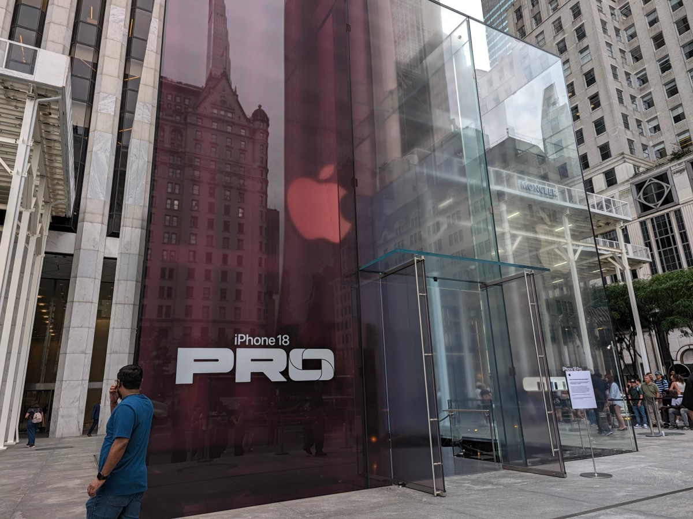
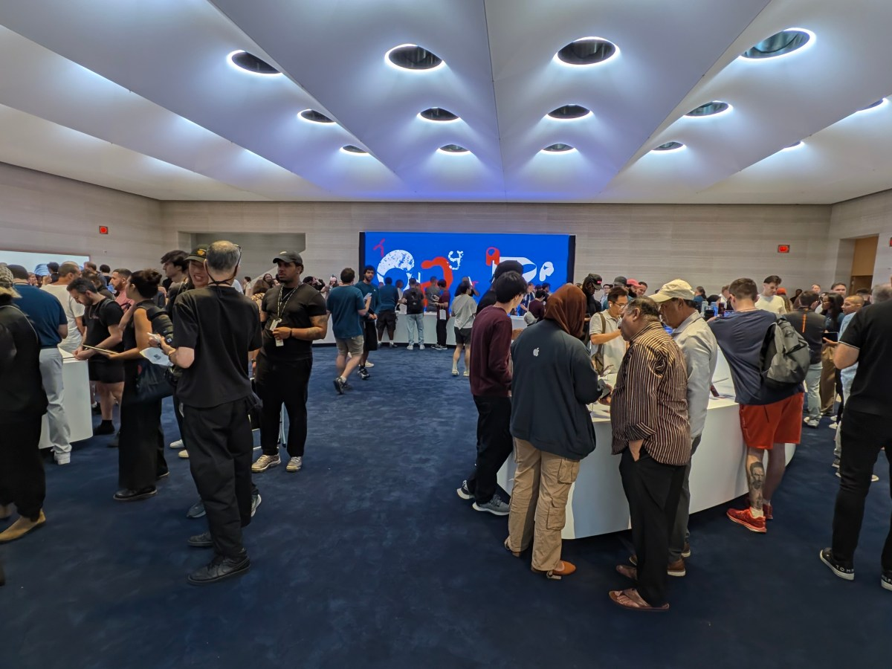
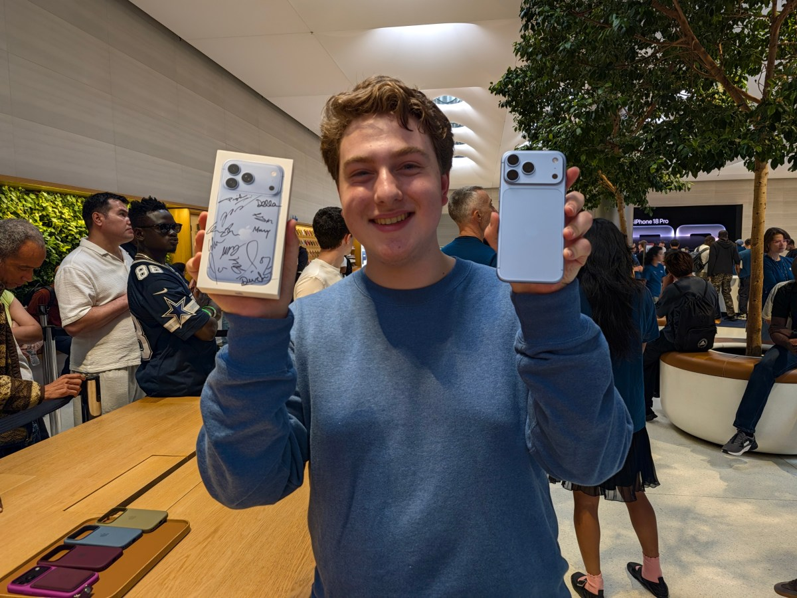
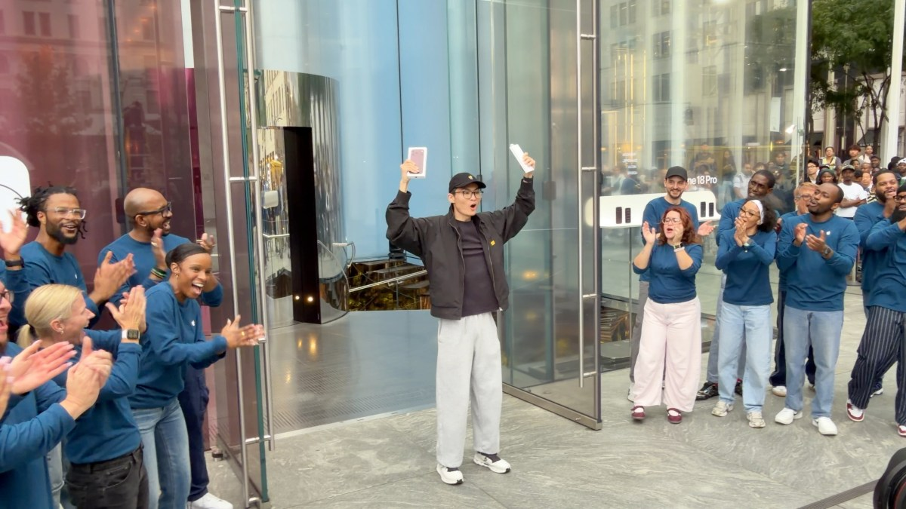
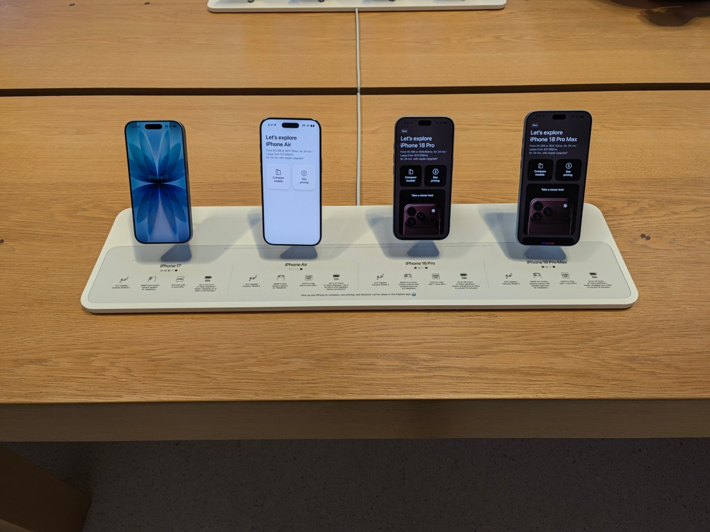

El nuevo consejero delegado de Apple, John Ternus, recibió el viernes a los compradores del iPhone 18 Pro y del iPhone 18 Pro Max en la tienda insignia de la compañía en la Quinta Avenida de Nueva York. Se trata de la primera gran puesta de largo de un producto bajo su mandato y, según el análisis de CNET, probablemente no sea la única en lo que resta de año.

Ternus, que antes ocupaba el puesto de vicepresidente sénior de ingeniería de hardware, adoptó un tono cercano: se hizo selfies, estrechó manos y firmó cajas de teléfonos para los cientos de personas que habían reservado el nuevo iPhone o un Apple Watch. El medio estadounidense describe incluso una escena relajada, con el directivo riéndose con suavidad cuando un cliente dejó caer por accidente su iPhone 17 Pro Max sobre el suelo de cemento al entrar en la tienda.

## Un estreno con aire de fiesta

La tienda amaneció decorada con una mezcla de colores granate y azul, y el azul glaciar fue uno de los tonos favoritos entre los primeros compradores. Dentro, el ambiente se parecía más al de una celebración: una cabina de DJ frente a una gran alfombra azul que servía de expositor para los nuevos teléfonos, los Apple Watch Series 12 y Watch Ultra 4, y los AirPods 5.

Entre los asistentes, CNET recoge el testimonio de Dallen Frutchey, de 18 años y procedente de Virginia, que acudía por cuarta vez a una apertura de esta tienda y que ya había coincidido con el anterior consejero delegado, Tim Cook. Sobre la caída accidental de su teléfono anterior comentó: «Está bien, tiene un pequeño golpe, no está roto; gracias, Ceramic Shield». Frutchey también valoró el cambio de liderazgo: «Me entusiasma que alguien que está en los detalles de los productos trabaje ahora en esto».

La primera persona en salir de la tienda fue Harry Sun, de 21 años y vecino de Nueva Jersey, que se llevó un teléfono granate y lucía un pin de la serie *Ted Lasso* de Apple TV. El segundo de la fila, Eric Morgan, había viajado desde Guatemala para comprar varios teléfonos destinados a su familia.

En uno de los extremos del local, en lo que antes era la zona de demostración del HomePod, la compañía instaló una pequeña exposición fotográfica con imágenes tomadas con el iPhone 18 Pro. Según CNET, queda por ver si esa superficie acabará ocupada por productos nuevos durante los próximos meses.

## Lo que podría venir después

Uno de los datos más relevantes que menciona el artículo es que Apple repetirá este tipo de lanzamiento en tienda con el iPhone Duo, que saldrá a la venta el 23 de octubre y será su primera incursión en el terreno de los teléfonos plegables. A partir de ahí, el texto entra en el terreno de la especulación: CNET señala que la reducción del espacio dedicado al HomePod podría anticipar un relanzamiento del altavoz, ahora que el nuevo asistente Siri con inteligencia artificial llega al iPhone 15 Pro y modelos posteriores.

El medio también recoge los rumores que apuntan a un iPhone 18 no Pro y a una posible segunda generación del iPhone Air para la próxima primavera. De confirmarse, esos lanzamientos podrían consolidar un evento anual a comienzos de año, separado de los modelos premium que Apple suele presentar en septiembre. Conviene subrayar que estas últimas afirmaciones son conjeturas y no anuncios oficiales de la compañía.

La alineación vigente la forman, de izquierda a derecha, el iPhone 17, el iPhone Air, el iPhone 18 Pro y el iPhone 18 Pro Max, a los que se suman el iPhone 17E y el iPhone 16.

## Por qué importa al comprador

Más allá del color de moda o de la anécdota del teléfono que se cae, el artículo de CNET plantea una idea de fondo: el calendario de novedades de Apple podría dejar de concentrarse en una sola cita anual. Para el comprador hispanohablante, eso significa que la decisión de renovar móvil será cada vez menos una cuestión de «esperar a septiembre» y más un cálculo sobre qué formato y qué gama conviene a cada uno.

Si se cumplen las previsiones que recoge el medio, los próximos meses traerán un plegable, posibles renovaciones en el catálogo doméstico y una eventual segunda tanda de iPhone fuera de temporada. Todo ello bajo la gestión de Ternus, cuyo primer día al frente de la compañía ya estuvo marcado por los productos de hardware, su terreno de origen.
