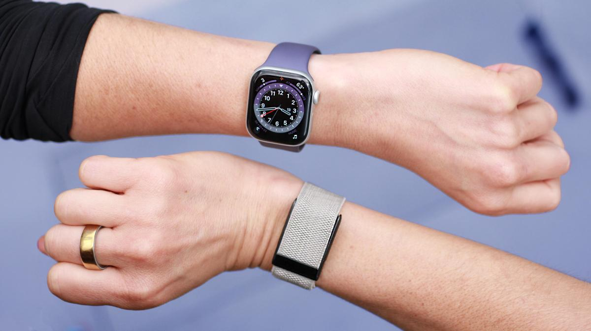
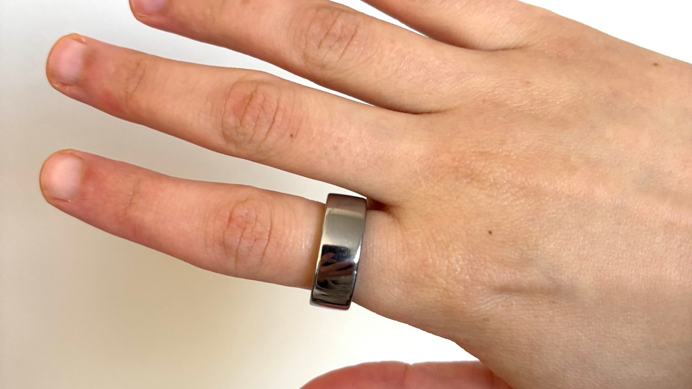

Apple estaría desarrollando una pulsera de fitness **sin pantalla** con un formato similar al de Whoop, según un informe de Bloomberg firmado por Mark Gurman que recoge CNET. No se trata de un anuncio oficial: la compañía no ha confirmado nada y, de confirmarse, el producto no llegaría antes de 2028. El filtrador sostiene que Apple lleva meses investigando esta categoría de wearables y que ya maneja prototipos, pero que todavía no ha decidido si los convertirá en un producto a la venta.

## Una pulsera sin pantalla con banda textil y ADN del Vision Pro

Según Gurman, los prototipos combinan una **banda de tejido fino** con un **módulo de cómputo equipado con sensores**. En el proyecto habría participado el equipo de hardware de Vision, el mismo que trabajó en las gafas Vision Pro de la compañía. Aun así, el informe insiste en que Apple no ha tomado una decisión de lanzamiento, pese al interés que habrían mostrado el presidente ejecutivo Tim Cook y el vicepresidente sénior de Servicios y Salud, Eddy Cue.

Un portavoz de Apple no respondió de inmediato a la solicitud de comentarios de CNET, por lo que todas estas afirmaciones deben leerse como un rumor y no como una hoja de ruta confirmada.

El contexto competitivo ayuda a entender el movimiento. Este tipo de pulseras recoge datos de salud con sus sensores y los envía por Bluetooth a la aplicación del móvil, sin mostrar nada en la muñeca. Solo en lo que va de año han aparecido la **Fitbit Air de Google**, la **Garmin CIRQA** y la **Amazfit Helio Strap Pro**. Precisamente [Garmin lanzó el 22 de septiembre su primera pulsera sin pantalla y sin cuota mensual](https://www.techspain24.com/noticias/garmin-cirqa-screenless-band/), con un enfoque muy parecido: renunciar a la pantalla para no depender de una suscripción. Que Apple estudie ahora un producto así apunta a que la categoría, lejos de ser un experimento aislado, se está consolidando como segmento propio.

## Por qué el formato sin pantalla gana terreno

Para el usuario, la ausencia de pantalla tiene ventajas concretas que el propio informe pone en contexto. Al no haber display, no se gasta batería en iluminarlo, lo que suele traducirse en más autonomía. Además, estos dispositivos tienden a ser **menos voluminosos**, resultan más cómodos para dormir —algo clave si se quieren medir las fases del sueño— y pasan más desapercibidos, un punto a favor de quien no quiere que su wearable sea lo primero que llame la atención.

La jugada encajaría con el rumbo reciente de Apple en salud. La compañía presentó una **aplicación Salud rediseñada** cuyas nuevas funciones llegarán al público a lo largo de este año, entre ellas una puntuación de preparación (readiness) y una edad de salud (Health Age) que funcionan de forma parecida al recovery score y al Healthspan de Whoop. El anillo Oura también ofrece una puntuación de preparación y una edad cardiovascular. Si Apple diera el paso, todo apunta a que Siri y Apple Intelligence tendrían un peso importante: el asistente podría registrar datos de salud por voz y responder preguntas, igual que ya hacen alternativas como Luna Band.

## Qué cambia para el lector

Por ahora, nada inmediato: no hay fecha, ni precio, ni confirmación de Apple, y el propio informe condiciona el lanzamiento a una decisión que la compañía aún no ha tomado. Lo relevante es la señal de mercado: si hasta la firma de Cupertino explora una pulsera sin pantalla, es probable que en los próximos años veamos más opciones de este tipo y precios más competitivos.

Quien hoy busque un wearable para controlar su salud sin distracciones tiene alternativas reales y sin necesidad de esperar a Apple, como la propia CIRQA de Garmin o los modelos de Whoop, Fitbit y Amazfit. Conviene, eso sí, revisar si cada una exige suscripción para acceder a sus métricas: es la diferencia que más afecta al bolsillo a largo plazo.
