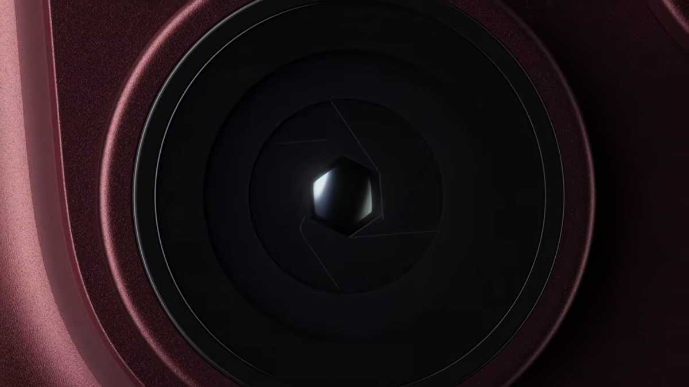
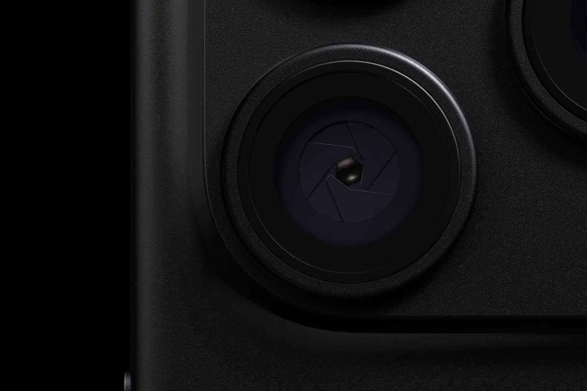

En un contexto en el que la inteligencia artificial genera imágenes cada vez más difíciles de distinguir de una fotografía real, Apple ha presentado Reference Image, una función que, en palabras de la compañía, «establece un nuevo estándar para la fotografía digital verificable». La idea es sencilla de explicar: al activar el modo, la cámara captura datos del sensor con una marca de tiempo segura, que después se pueden revelar y consultar en la app Fotos como una imagen de referencia inalterable. Según la periodista de Tech Advisor Emma Rowley, autora de este análisis de opinión, se trata de una garantía digital de que una imagen es una fotografía real, tomada por un sensor del iPhone en un momento concreto.

*Los nuevos módulos de cámara del iPhone 18 Pro. Imagen: Apple.*

## Qué es Apple Reference Image y qué significa que una foto sea verificable

El problema que aborda esta tecnología no es nuevo: cualquiera que pase tiempo en internet se ha preguntado alguna vez si una imagen o un vídeo es real o ha sido generado con IA. Existen distintas formas de intentar averiguarlo —buscar defectos en el render, como dedos o textos mal resueltos, revisar marcas de agua como SynthID o recurrir a herramientas de detección—, pero resulta mucho más difícil demostrar que una imagen es auténtica. Y hay situaciones en las que esa prueba es necesaria.

La dimensión del fenómeno ayuda a entender por qué los fabricantes se lo toman en serio. Según los datos que cita el artículo, los teléfonos inteligentes son responsables del 92,5 % de todas las fotografías que se toman, y esas imágenes se usan para actividades cotidianas muy variadas: comprar y vender en aplicaciones, citas online, documentación social, periodismo ciudadano y activismo. A medida que se multiplican las imágenes falsificadas, desde perfiles falsos hasta paquetes dañados o multitudes inventadas, la autora considera positivo que las grandes marcas de móviles hayan empezado a desarrollar métodos para verificar fotos, aunque sea como un primer paso.

*La cámara de apertura variable del iPhone 18 Pro. Imagen: Apple.*

## El estándar abierto de Google y la apuesta cerrada de Apple

La función de Apple no llega a un terreno virgen. Google ya ofrece fotografía verificada desde la gama Pixel 10 mediante el estándar C2PA, una especificación técnica abierta que inserta metadatos firmados criptográficamente en la imagen en el momento de la captura. La compañía está extendiendo además la tecnología C2PA al vídeo en los Pixel 8, 9 y 10. Apple, en cambio, ha optado por una solución propia y no por el estándar abierto, algo que, como señala la autora, era previsible dado el habitual argumento de la privacidad.

Según Rowley, no hay motivos para dudar de que el sistema de Apple sea fiable, pero conviene reconocer sus límites. El primero es de alcance: hoy Reference Image solo funciona en el sensor principal del iPhone 18 Pro y del iPhone 18 Pro Max.

En el caso de los Pixel, el proceso es automático: en un Pixel 10, cada foto JPEG tomada con la aplicación de cámara predeterminada incorpora metadatos C2PA por defecto. En los iPhone compatibles, en cambio, la función viene desactivada y hay que ir a **Ajustes**, entrar en **Cámara** y activar **Reference Image**. Compartir y visualizar imágenes de referencia es algo más complejo, y Apple publica una guía completa al respecto en su web de soporte.

## Disponibilidad: ni la Unión Europea ni China

El segundo límite es geográfico, y afecta directamente al lector español. Reference Image no está disponible como modo de cámara en la Unión Europea ni en China, un detalle que conviene tener presente antes de buscar la opción en un iPhone comprado en España.

La restricción no es total. Los usuarios de la UE con iOS 27, iPadOS 27 y macOS 27 sí pueden revelar y consultar imágenes de referencia, y en China es posible visualizar las que se hayan compartido con ellos. Lo que no pueden hacer, de momento, es capturarlas. El contraste con Google vuelve a ser revelador: la tecnología del fabricante estadounidense debería estar ampliamente disponible por adherirse a un estándar abierto y por venir en dispositivos de las dos últimas generaciones en todo el mundo.

## Por qué importa aunque no la vayas a usar

Que el alcance sea limitado no resta valor a lo que esta función representa. Rowley defiende que, más allá de su utilidad práctica inmediata, el valor de Apple Reference Image está en dar visibilidad a que esta tecnología existe y en contribuir a que se normalice la fotografía verificable. El artículo apunta además a una adopción considerable: una encuesta de 4.000 personas citada por Investing.com encontró que el 53 % pensaba actualizarse a un iPhone 18 Pro o Pro Max ese año, y Apple habría recibido más de 7 millones de pedidos de los modelos iPhone 18 Pro solo en China, según PhoneArena.

La propia disponibilidad amplía el impacto: si la opción se estrena solo en el sensor principal del iPhone 18 Pro y Pro Max, pero esos modelos concentran buena parte de las ventas, el número de usuarios con acceso a la verificación crece más de lo que sugiere su condición de función secundaria. Para el lector hispanohablante, el resumen es claro: es una función pequeña, discreta y silenciosa, pero apunta a un cambio de fondo en la manera de demostrar que una foto es real. Y si el debate sobre la [fotografía computacional en el iPhone](/noticias/iphone-photos-focal-length/) o las funciones de cámara del [iPhone 18 Pro](/noticias/iphone-18-pro-variable-aperture-hands-on/) ya te interesaban, esta es la cara menos visible del mismo asunto.
