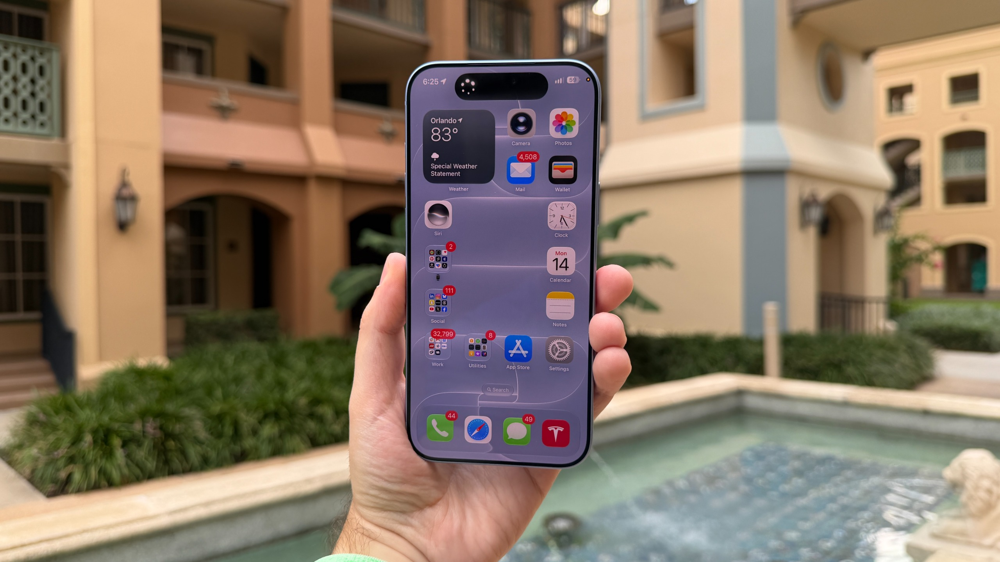
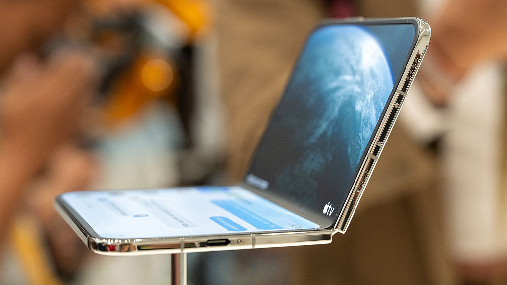
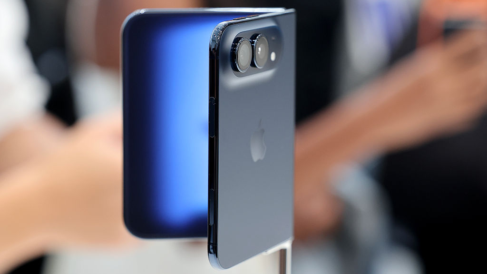
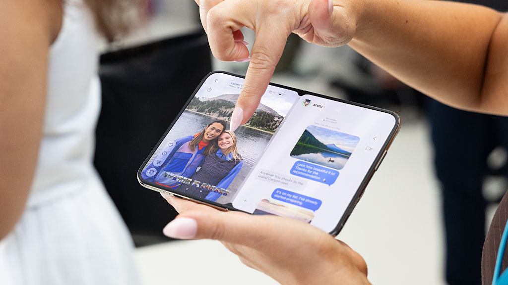

A pocas semanas de que el iPhone Duo llegue a las tiendas —el envío está previsto para el 23 de octubre—, Apple ha empezado a explicar en detalle las decisiones de ingeniería de su primer teléfono plegable. El encargado de hacerlo ha sido Tom Marieb, el nuevo vicepresidente de ingeniería de hardware de la compañía, un puesto que hasta ahora ocupaba el actual consejero delegado, John Ternus. En una entrevista grupal celebrada en la sede de Apple en Londres y recogida por TechRadar, Marieb repasó dos frentes que considera decisivos: la resistencia de la pantalla y, sobre todo, el comportamiento de la bisagra.

## «Me da escalofríos ver una lámina en un iPhone»

El directivo no esquivó una de las costumbres más extendidas entre los usuarios de iPhone. Preguntado por la dureza del cristal Ceramic Shield 2, Marieb dejó una frase que resume su postura: «En lo personal, cuando veo que alguien le pone una lámina protectora a su iPhone, siento un escalofrío, porque nos esforzamos mucho por hacer pantallas frontales bonitas». Según explicó, el objetivo del equipo era desarrollar recubrimientos capaces de resistir tanto los arañazos como el desgaste por uso continuado, dos propiedades que, en muchos materiales, tienden a oponerse.

«Podríamos haberlo hecho más resistente a los arañazos, pero habría sido algo menos resistente al desgaste. Buscamos que aguante bien ambas cargas a lo largo del tiempo», añadió. Ceramic Shield 2 debutó con la gama iPhone 17 y vuelve este año en el iPhone 18 Pro; también recubre la pantalla frontal del iPhone Duo.

Marieb sostuvo además que Apple no diseña sus pruebas con estándares militares antiguos, sino a partir del uso real: «Intentamos comprimir cinco años de vida —o incluso más— en un par de semanas de ensayos». Ese trabajo, afirmó, es lo que les permitió anticipar que las mejoras del cristal se notarían con el tiempo.

## Una bisagra que Apple quiere que suene a coche de gama alta

El plato fuerte de la conversación fue la bisagra. «Es algo de lo que estoy especialmente orgulloso y nos llevó mucho tiempo resolverlo», dijo Marieb. El reto, explicó, era conseguir un mecanismo que resultara sólido tanto al cerrar como al abrir el teléfono, y que no diera sensación de fragilidad pese al grosor del dispositivo.

La solución pasó por ajustar con detalle el perfil de par (torque) de la bisagra. El directivo comparó la sensación buscada con la de la puerta de un automóvil de alta gama: un cierre firme que transmita al usuario que el producto está bien construido y es seguro de usar. En la posición intermedia, el objetivo era que la pantalla se mantuviera estable sin caer por su propio peso, algo que calificó como uno de los puntos en los que más tiempo invirtieron.

Cabe enmarcar aquí una advertencia: cuando Apple afirma que el comportamiento de su bisagra es superior al de otros plegables ya comercializados, se trata de una valoración de la propia compañía, no de una medición independiente. Lo que sí es un dato objetivo es la resistencia al agua: el iPhone Duo llega con certificación IP68, un nivel que TechRadar sitúa por encima del Galaxy Z Fold 8. Aun así, conviene recordar que las marcas suelen medir el desgaste con criterios propios, y que la durabilidad real solo se comprueba con meses de uso.

## El acabado mate, la carta de Apple contra el pliegue

La otra gran preocupación en un plegable es la marca que deja el doblez en la pantalla. El iPhone Duo incorpora un panel de 7,6 pulgadas con acabado nano-texture, similar al cristal antirreflejos que Apple ofrece en algunos MacBook, pero con la dificultad añadida de que aquí debe doblarse.

Marieb defendió que ese tratamiento no es solo estético. «Al mirar una pantalla brillante, su especularidad hace muy fácil detectar diferencias de topología. Elegimos el acabado mate, además de por su belleza, porque es más indulgente con los cambios que se producen con el tiempo», argumentó. Y añadió un reto a los presentes: «Que nos pidan cuentas por eso, por favor».

En paralelo, el equipo de diseño de Apple —el propio Ternus, la vicepresidenta de diseño industrial Molly Anderson y el vicepresidente de interfaz humana Steve Lemay— explicó en otra entrevista que el Duo toma como referencia un cuaderno de papel: mantiene una proporción de 1:1,4 idéntica al abrirlo y al cerrarlo, cercana a un folio A5, y recuerda a un pasaporte cuando está plegado. La idea de fondo es que el software acompañe el gesto y que la pantalla interna no se sienta como un dispositivo distinto, sino como una prolongación de la externa.

## Qué significa para el lector

El mensaje que Apple quiere instalar es claro: el iPhone Duo no es un plegable frágil y, por tanto, no necesita que el usuario le añada capas de protección. Es una postura con interés comercial —colocar un accesorio encima de la pantalla va contra el diseño que la compañía vende—, pero también una promesa verificable: si el acabado mate o la bisagra envejecen mal, será el propio usuario quien lo note en unos meses.

Para quien esté sopesando un plegable, la lección trasciende a Apple. Las bisagras y los recubrimientos son cada vez mejores, pero la prueba de fuego no es la demostración sobre una mesa, sino el día a día. Que la compañía invite públicamente a exigirle responsabilidad es una señal razonable; que el resultado acompañe durante años es algo que, por ahora, solo el tiempo puede confirmar.
