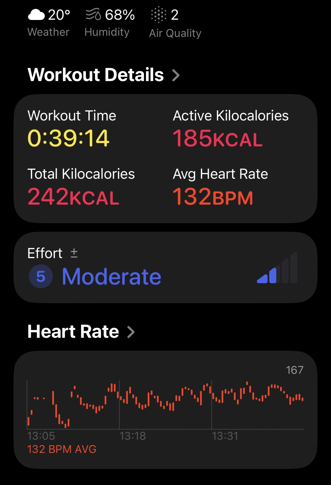
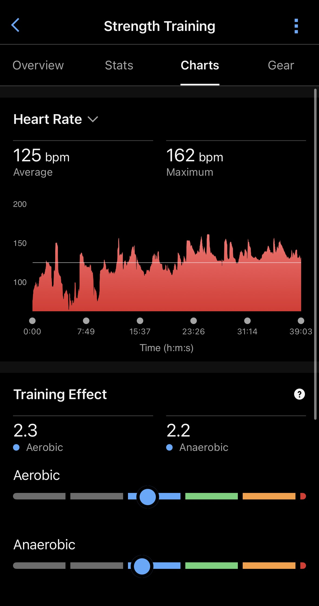

El Apple Watch Series 12 y el Garmin Fenix 9 Pro presumen de llevar la medición de frecuencia cardiaca en muñeca a un nuevo nivel, así que TechRadar los puso a competir de la forma más directa posible: un reloj en cada muñeca durante la misma sesión de gimnasio. El pulso salió razonablemente parecido, pero el cálculo de calorías contó dos historias muy distintas.

## Qué pasó en la prueba del Series 12 y el Fenix 9 Pro

El redactor de TechRadar estrenó su unidad de análisis del Apple Watch Series 12 con una sesión de fuerza de 40 minutos, registrando el mismo entrenamiento en paralelo con un Garmin Fenix 9 Pro en la otra muñeca. En esta ocasión no había banda pectoral de referencia disponible, de modo que la comparativa es directa entre los dos relojes, no contra un patrón eléctrico.

El contexto elevaba las expectativas. Apple atribuye al Series 12 y al Ultra 4 la medición de pulso más precisa de sus relojes gracias a un nuevo sistema de sensores con una matriz LED rediseñada, que según la compañía mide la frecuencia cardiaca activa y en reposo con mucha más frecuencia que las generaciones anteriores. Enfrente, el Fenix 9 Pro monta el sensor Elevate V5 de Garmin, que en pruebas anteriores del propio medio se había mantenido a unos 5 ppm de media de un Apple Watch Ultra 3.

El resultado en pulso medio fue de 125 ppm según Apple frente a 132 ppm según Garmin: siete puntos de diferencia, justo por encima del umbral de 5 ppm que el autor considera irrelevante. La sorpresa mayor llegó con el gasto energético: Garmin estimó 340 kcal y Apple 242 kcal, una brecha de 88 kcal en la misma sesión.

## Por qué importa una brecha de 88 kcal

Que dos relojes discrepen en calorías no es, en sí, una anomalía: el propio artículo recuerda un trabajo publicado este año en la revista *PLOS One* según el cual las diferencias de algoritmos y diseño de sensores introducen una variabilidad adicional, con estudios comparativos que recogen errores de más del 20 % en el gasto energético entre modelos populares. Lo llamativo es que la diferencia de 88 kcal de esta prueba queda por encima de ese margen del 20 %, lo que la convierte en un dato a vigilar más que en un simple redondeo.

Con el pulso, el autor se muestra prudente: su hipótesis es que, a medida que use más ambos relojes, sus algoritmos se ajustarán y las lecturas se acercarán. También anuncia la prueba que falta para cerrar el círculo: repetir la comparativa frente a una banda pectoral Polar H10, el patrón eléctrico habitual en este tipo de verificaciones. Hasta entonces, la conclusión es provisional y limitada a una única sesión de fuerza, la disciplina que tradicionalmente más cuesta a los sensores ópticos de muñeca por la tensión muscular del brazo.

## Qué cambia para el lector

Para quien entrena con reloj, la lección práctica es doble. Primero, la frecuencia cardiaca de ambos dispositivos se movió en un rango parecido y útil para controlar la intensidad, con una desviación pequeña aunque medible. Segundo, el gasto calórico sigue siendo una estimación de cada fabricante, no una medición directa: si las calorías guían la dieta o el balance energético, conviene tomar un único dispositivo como referencia y atender a su constancia en el tiempo antes que comparar cifras absolutas entre marcas.

Quien siga de cerca al modelo de Garmin puede ampliar con [la decisión de Garmin de renunciar al microLED en el Fenix 9 Pro](/noticias/garmin-fenix-9-pro-microled-skip/), donde se explica su apuesta por la autonomía y el AMOLED. Según TechRadar, el Series 12 se someterá a más pruebas en sesiones más largas y frente a otros rivales para comprobar si sus promesas de precisión se sostienen.
