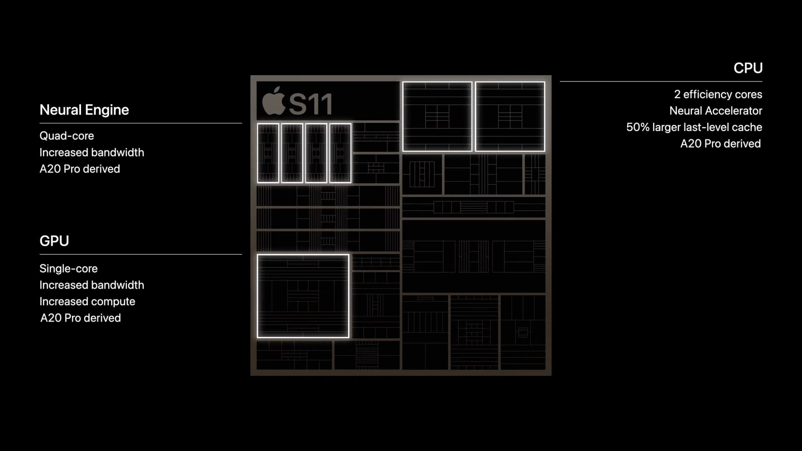
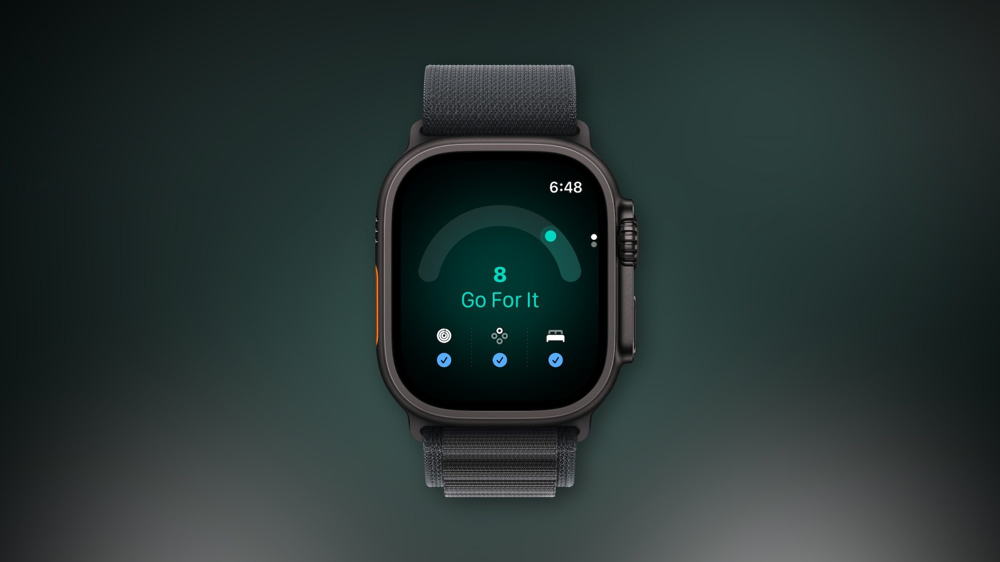

El Apple Watch Series 12 lleva una semana en las muñecas de los primeros compradores y empiezan a llegar los balances de uso real. El más detallado lo firma 9to5Mac: más allá de las dos novedades estrella del anuncio —Siri Recap y el renovado sensor cardíaco—, lo que de verdad marca la diferencia está en la batería, la velocidad y un par de exclusivas de software.

## Batería y carga: el cambio que más se nota

Sobre el papel, Apple mantiene la autonomía oficial en 24 horas de uso normal, la misma cifra del Series 11. Pero en la práctica diaria, la experiencia cuenta otra historia: el reloj aguanta la jornada completa más la noche de seguimiento del sueño, y la recarga pasa a hacerse por la mañana, al levantarse. El dato que lo hace posible lo confirma la propia Apple: 15 minutos de carga aportan hasta 12 horas de uso, un 50 % más que la generación anterior.

El autor venía de usar un WHOOP para el sueño porque compaginar seguimiento nocturno y carga en el Series 11 era un incordio: cargaba un rato antes de acostarse y otra vez al despertar. Con el Series 12 ese rompecabezas desaparece. El análisis de WIRED en España coincide en el diagnóstico —la batería sigue siendo de 24 horas— y en la conclusión: la carga rápida es la mejora más útil del reloj.

Detrás de esa soltura está el nuevo chip S11, que según 9to5Mac también se deja notar en la fluidez general del sistema, sobre todo al usar Siri, mucho más rápida que en generaciones anteriores.

## Salud continua en el Series 12 y exclusivas de software

El otro gran bloque de la primera semana es la salud. El Series 12 estrena un sistema de sensores rediseñado que mide la frecuencia cardíaca cada cinco segundos durante todo el día, incluso en movimiento, frente a las lecturas espaciadas de los modelos anteriores. La variabilidad de la frecuencia cardíaca (VFC) se calcula hasta 24 veces más a menudo, con lecturas de VFC de recuperación y VFC general.

Con esos datos se alimenta Readiness, la nueva puntuación de 0 a 10 que resume actividad reciente, carga de entrenamiento, sueño y constantes vitales para indicar si el cuerpo pide descanso o está listo para entrenar. Es la respuesta de Apple a la puntuación de recuperación de WHOOP o Garmin, y de momento es exclusiva del Series 12. Eso sí: necesita al menos siete días de datos de sueño antes de mostrar su primer resultado, así que quien lo estrene esta semana aún no la habrá visto completa. Para los modelos anteriores, en TechSpain24 ya explicamos [cómo tener una puntuación de readiness en un Apple Watch antiguo paso a paso](/noticias/readiness-score-apple-watch-antiguo/).

La segunda exclusiva es más modesta pero muy celebrada: una complicación de podómetro con el recuento de pasos siempre visible, que ya analizamos en [Apple Watch Series 12 y Ultra 4 añaden los pasos en vivo a la esfera](/noticias/apple-watch-series-12-fitness-feature/). El autor cree que podría llegar a relojes anteriores, porque el dato ya existe, pero de momento solo está en el Series 12.

## Qué cambia para el lector: precio, funciones pendientes y a quién compensa

Hay tres matices importantes antes de decidir. Primero, las funciones de inteligencia de audio que motivaron parte del interés —Siri Recap y Live Rewind— aún no están disponibles: Apple las lanzará en beta a lo largo del año, según confirmó en su presentación. Segundo, el diseño apenas cambia y los marcos son incluso un poco más gruesos que en el Series 10 y 11, algo que con esferas de fondo negro pasa desapercibido; a cambio, los modelos de aluminio estrenan Ceramic Shield 2, más resistente a los arañazos.

Tercero, el precio y el salto generacional: en España parte de 449 euros y está a la venta desde el 18 de septiembre. Si se viene de un Series 8 o anterior, el salto en pantalla, sensores y carga es notable; desde un Series 11, la decisión depende de cuánto se valoren las mediciones continuas y la puntuación de disposición. La conclusión de la primera semana es que no es un año de diseño, sino de fondo: el Series 12 no se distingue a simple vista, pero es de las actualizaciones anuales más sólidas desde el Series 4.
