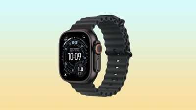

El Apple Watch Ultra 3 ha vuelto a marcar su precio más bajo en Amazon Estados Unidos: la versión negra con correa Ocean ha caído a 599,97 dólares, 199 menos que sus 799 habituales. La rebaja, recogida por MacRumors, llega justo después del lanzamiento del Apple Watch Ultra 4 y tiene pinta de liquidación para vaciar almacenes.

## Qué ha pasado con el Apple Watch Ultra 3

A principios de semana Amazon ya había aplicado ese mismo recorte de 199 dólares al Ultra 3, pero la oferta desapareció en cuestión de horas. Ahora el descuento ha regresado en el modelo negro con correa Ocean negra, de nuevo en torno a los 599,97 dólares, lo que iguala el mínimo histórico del reloj.

No es la única configuración rebajada: el Ultra 3 negro con correa Milanese Loop (talla grande) también baja 199 dólares, hasta los 699,97 frente a los 899 de tarifa. Las fechas de entrega, eso sí, ya se están deslizando hacia octubre en algunas variantes, señal de que el inventario disponible es limitado.

El movimiento coincide con las primeras rebajas del recién llegado Ultra 4, que Amazon ofrece en varios acabados por 779,99 dólares en lugar de 799. Como ya contamos en [las primeras rebajas del Ultra 4 en Amazon](/noticias/apple-watch-ultra-4-airpods-pro-3-deals/), la nueva generación apenas se ha estrenado con descuentos modestos, mientras la anterior se desploma para dejarle sitio.

## Por qué importa

Es el patrón clásico de cambio generacional: cuando Apple presenta un sucesor, la distribución liquida el modelo saliente y aparecen los mejores precios de su ciclo de vida. La rebaja ya había sido anticipada por otros medios de ofertas —9to5Toys detectó la misma liquidación de 199 dólares en la configuración Ocean unos días antes—, así que no es un error de precio aislado sino una campaña de vaciado de stock.

Para el comprador la disyuntiva es clara: el Ultra 3 sigue siendo un reloj de gama alta con caja de titanio de 49 mm, GPS y datos móviles, pero renuncia a las novedades del Ultra 4. Quien valore el hardware más reciente pagará unos 180 dólares más por el nuevo modelo; quien busque el mejor precio por un Ultra, difícilmente verá el 3 más barato que ahora.

## Qué cambia para el lector

La oferta es puntual y limitada a Amazon Estados Unidos: los precios de este tipo de liquidaciones fluctúan a lo largo del día y las unidades se agotan sin aviso, así que conviene comprobar el precio final antes de pagar. Los lectores en España deben revisar su tienda local de Amazon, donde estas campañas estadounidenses no siempre se replican ni al mismo precio.

Si interesa el modelo nuevo en su lugar, merece la pena comparar antes las [diferencias entre el Ultra 2 y el Ultra 4](/noticias/apple-watch-ultra-2-vs-ultra-4-guide/) para decidir si el salto generacional justifica el sobreprecio frente a esta liquidación del Ultra 3.
